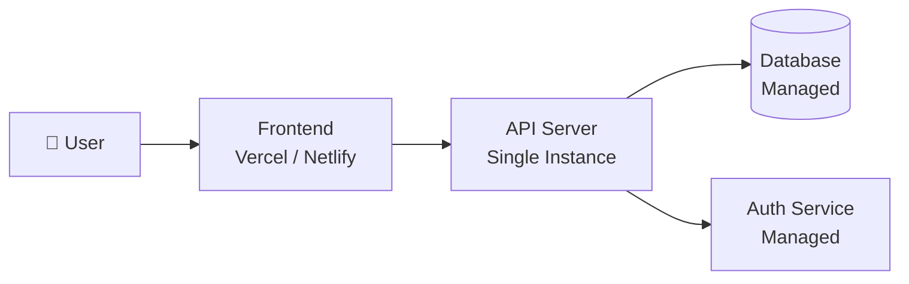
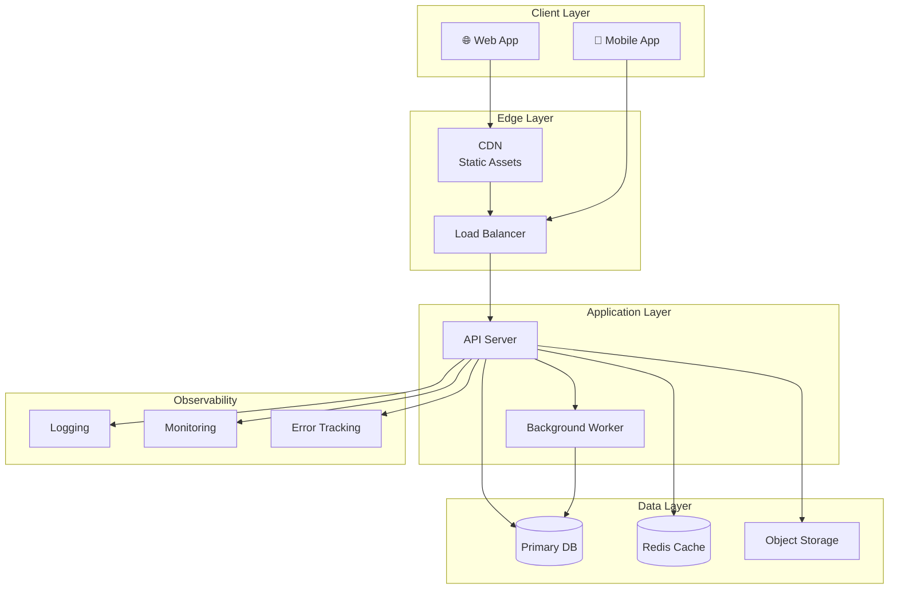
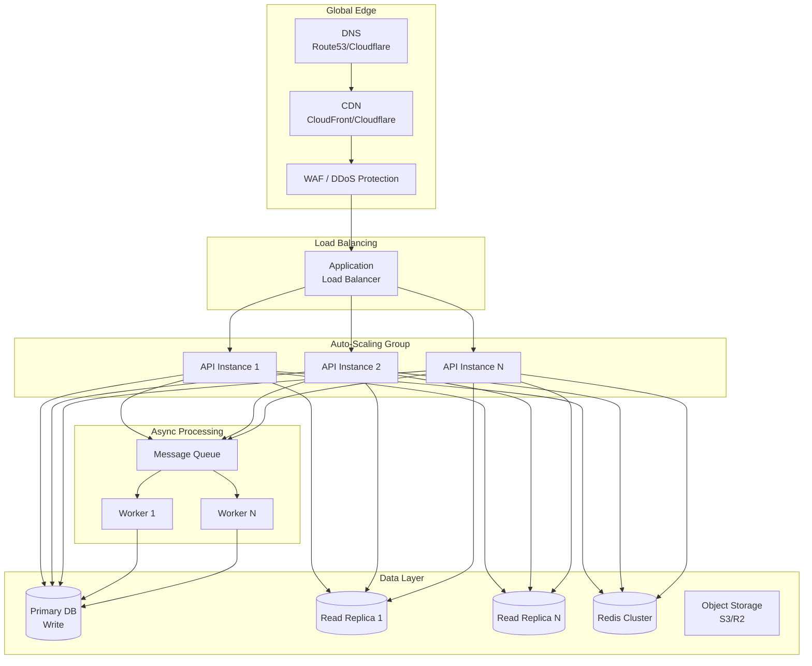

# Scalable Architecture Skill

## Purpose

Design a system architecture that evolves through three phases — from a minimal MVP to a fully scaled production system — with Mermaid diagrams at each phase.

## When to Use

- During the architecture phase of `/generate-plan`
- When the user wants to redesign or rethink system architecture
- During `/update-project` or `/add-feature` when architecture changes are needed

## Architecture Phases

### Phase 1: Test / MVP

**Goal**: Fastest path to a working prototype for validation.

Design principles:
- **Monolithic** — single service, single database
- **Managed services** — use PaaS/BaaS to avoid ops overhead
- **Minimal infrastructure** — free tiers where possible
- **No premature optimization** — simplicity over performance

Typical MVP stack pattern:
```
User → Frontend (Vercel/Netlify) → API (single server) → Database (managed)
```

Mermaid diagram template:


### Phase 2: Production

**Goal**: Reliable, secure, production-grade system.

Design principles:
- **Separate concerns** — frontend, API, background jobs
- **Security** — HTTPS, auth, input validation, rate limiting
- **Reliability** — backups, health checks, error tracking
- **Observability** — logging, monitoring, alerting

Additions over MVP:
- SSL/TLS everywhere
- Database backups (automated)
- Error tracking (Sentry or similar)
- Structured logging
- CI/CD pipeline
- Staging environment

Mermaid diagram template:


### Phase 3: Scale

**Goal**: Handle 10x–100x growth with horizontal scaling.

Design principles:
- **Horizontal scaling** — multiple API instances behind load balancer
- **Database scaling** — read replicas, connection pooling, possibly sharding
- **Caching strategy** — multi-layer caching (CDN → application → database)
- **Async processing** — message queues for heavy/slow operations
- **Microservices** (if justified) — break out high-traffic or distinct domains

Additions over Production:
- Auto-scaling groups
- Database read replicas
- Message queue (Redis, SQS, RabbitMQ)
- CDN for all static + cacheable content
- Rate limiting & DDoS protection
- Multi-region consideration

Mermaid diagram template:


## Process

1. **Read `overview.md`, `research.md`, and `tech-stack.md`** for full context
2. **Ask the user**:
   - Expected number of users at launch?
   - Growth expectations (6 months, 1 year, 3 years)?
   - Budget constraints for infrastructure?
   - Any regulatory/compliance requirements (data residency, etc.)?
3. **Design each phase** with appropriate Mermaid diagrams
4. **Explain the transition triggers** — what metrics/events should prompt moving from Phase 1→2→3

   > **Reasoning Approach**: Use the `sequentialthinking` MCP tool when designing each phase. Reason through component choices step by step — evaluate how Phase 1 decisions (e.g., monolithic API) constrain or enable Phase 2/3 evolution (e.g., microservice extraction). Use revision thoughts when a later-phase requirement forces reconsidering an earlier-phase choice.

5. **Present to the user** and iterate based on feedback

## Output Format

Write to `projects/<project-slug>/architecture.md`:

```markdown
# Architecture: <Project Name>

## Overview
<!-- 1-paragraph architecture philosophy -->

## Phase 1: Test / MVP
### Design Goals
### Architecture Diagram
<!-- mermaid diagram -->
### Components
<!-- description of each component -->
### Estimated Cost: $X/mo

## Phase 2: Production
### Trigger to Transition
<!-- When to move from Phase 1 → Phase 2 -->
### Architecture Diagram
<!-- mermaid diagram -->
### New Components
### Security Measures
### Estimated Cost: $X/mo

## Phase 3: Scale
### Trigger to Transition
<!-- When to move from Phase 2 → Phase 3 -->
### Architecture Diagram
<!-- mermaid diagram -->
### Scaling Strategy
### Performance Optimizations
### Estimated Cost: $X/mo

## Data Architecture
### ERD
<!-- mermaid erDiagram -->
### Key Data Flows

## API Design
### Key Endpoints
### Authentication Flow
<!-- mermaid sequence diagram -->
```

## Important Notes

- Start simple — don't over-engineer Phase 1
- Each phase should be a **natural evolution**, not a rewrite
- Include **cost estimates** for each phase
- Define clear **transition triggers** (e.g., "move to Phase 2 when you have 100+ DAU")
- Use Mermaid for ALL diagrams — no external tools needed
- Consider the user's budget and team size when recommending complexity
