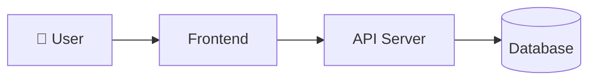
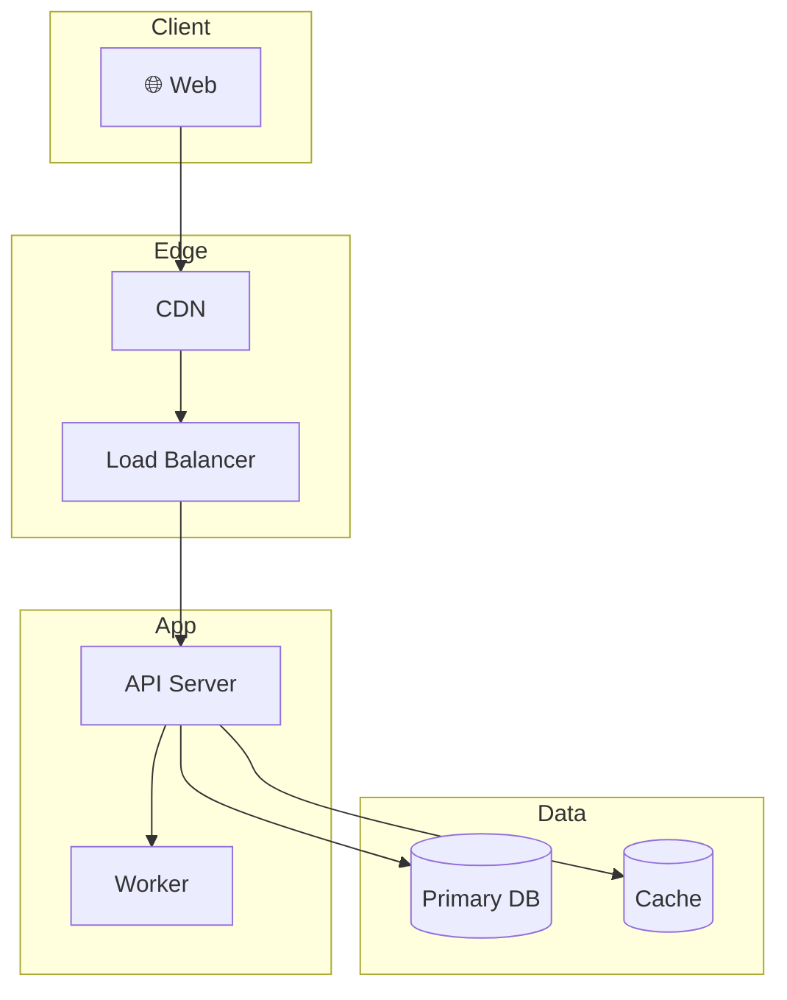
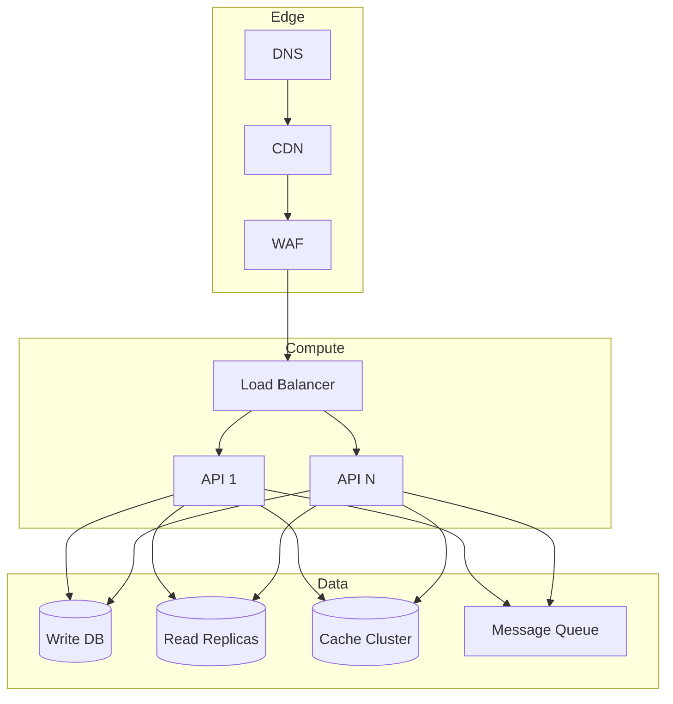
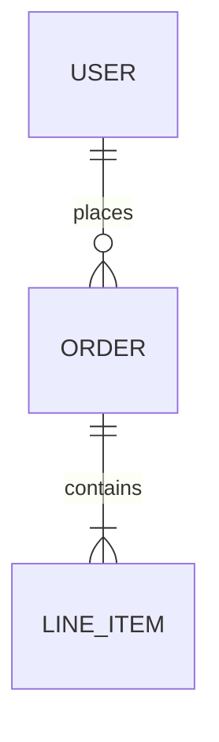

# Architecture: {{PROJECT_NAME}}

## Overview

{{1-paragraph architecture philosophy and approach}}

## Phase 1: Test / MVP

### Design Goals

- Fastest path to a working prototype
- Validate core assumptions
- Minimize infrastructure cost and complexity

### Architecture Diagram

### Components

| Component | Technology | Purpose |
|---|---|---|
| {{component}} | {{tech}} | {{purpose}} |

### Estimated Cost: ~${{X}}/mo

---

## Phase 2: Production

### Trigger to Transition

{{When to move from Phase 1 → Phase 2, e.g. "100+ daily active users"}}

### Architecture Diagram

### New Components

{{What's added over Phase 1}}

### Security Measures

- {{measure 1}}
- {{measure 2}}

### Estimated Cost: ~${{X}}/mo

---

## Phase 3: Scale

### Trigger to Transition

{{When to move from Phase 2 → Phase 3, e.g. "10K+ DAU or response time > 500ms"}}

### Architecture Diagram

### Scaling Strategy

{{How each component scales}}

### Performance Optimizations

- {{optimization 1}}
- {{optimization 2}}

### Estimated Cost: ~${{X}}/mo

---

## Data Architecture

### ERD

### Key Data Flows

{{Description of how data moves through the system}}
