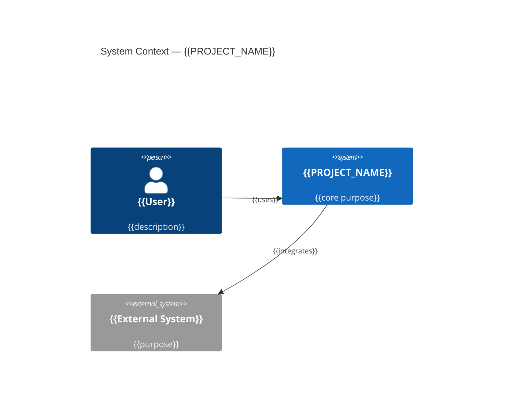
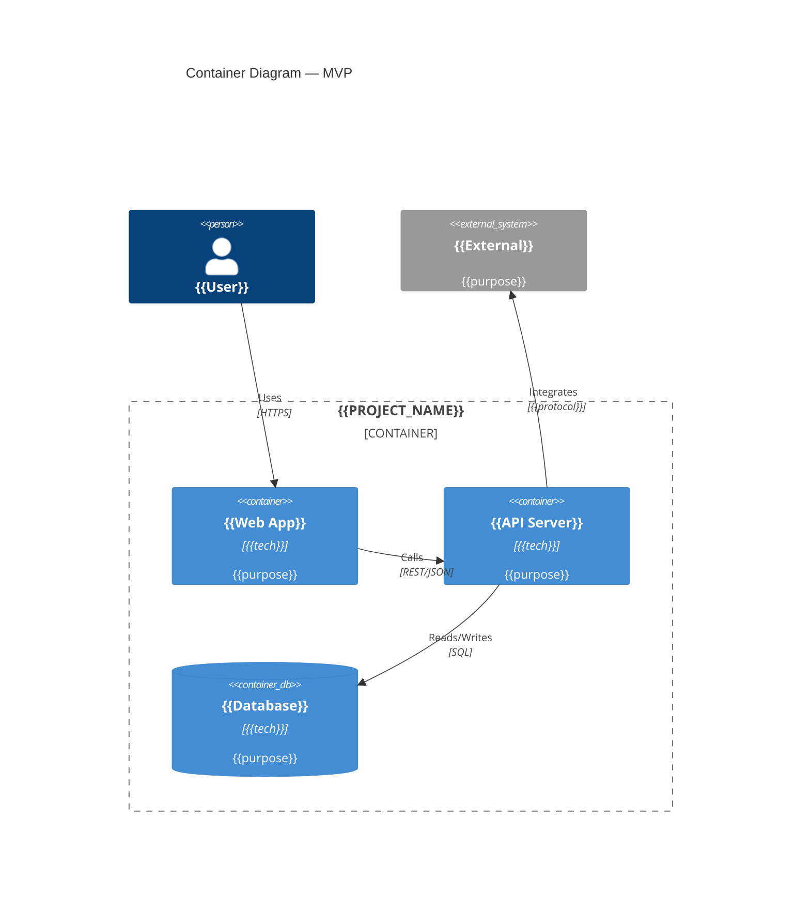
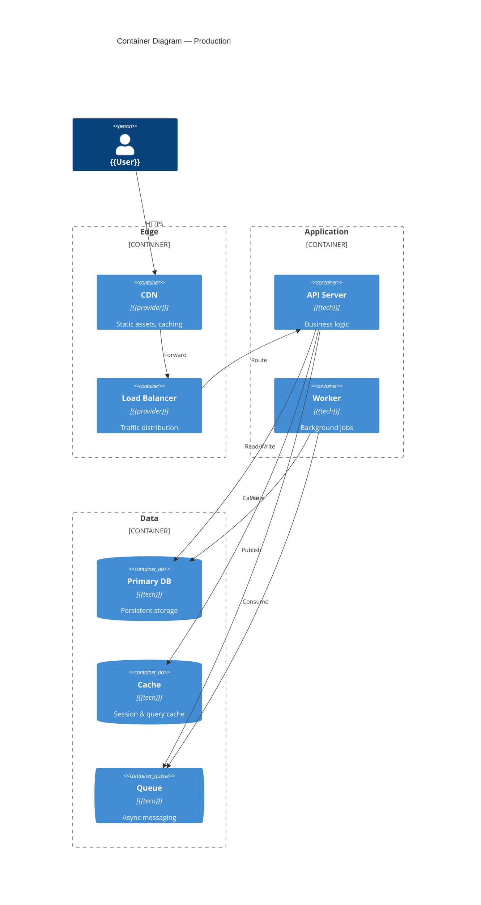
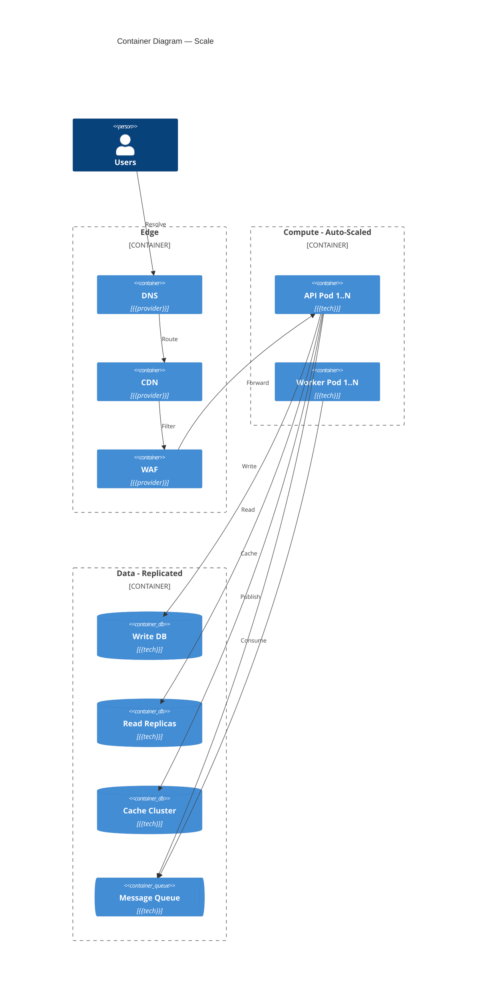
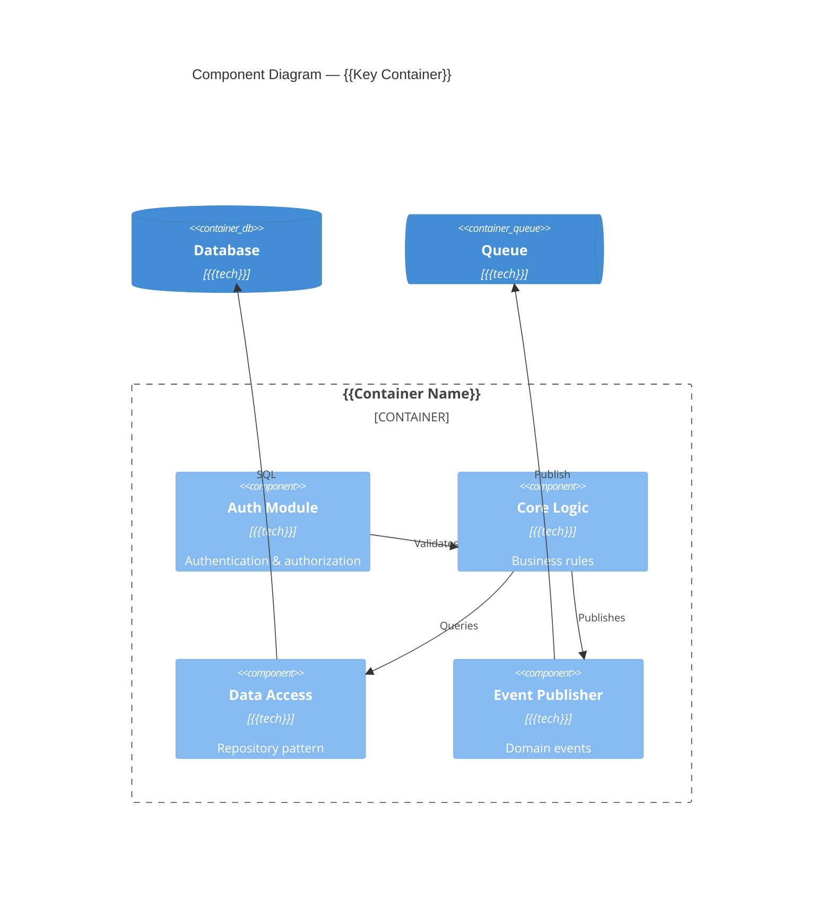
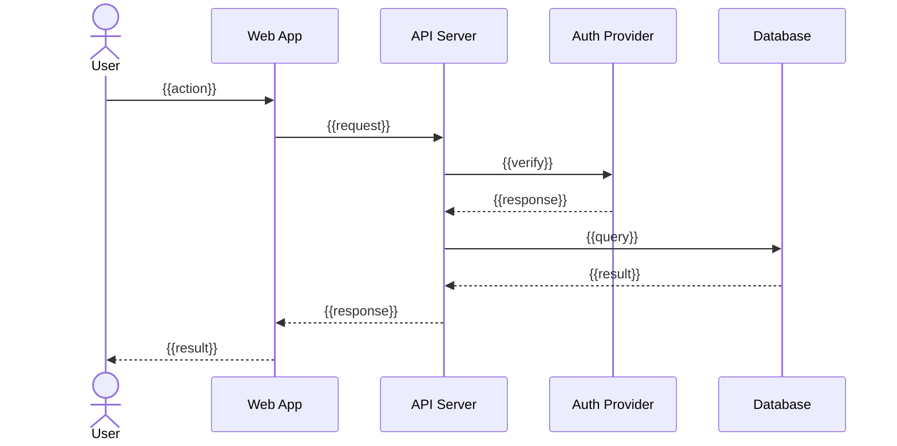
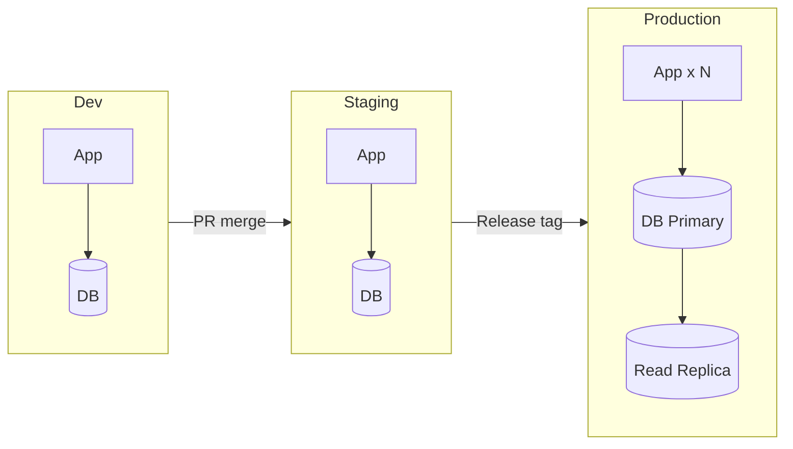

# Architecture: {{PROJECT_NAME}}

## Overview

{{1-paragraph architecture philosophy: monolith vs. services, sync vs. async, cloud-native vs. hybrid, key design principles}}

---

## C4 Level 1: System Context

> How the system fits into the broader environment.



---

## C4 Level 2: Container Diagram

> Major deployable units and how they communicate.

### Phase 1: MVP

**Design Goals**: Fastest path to a working system. Validate core assumptions. Minimize cost.



| Container | Technology | Purpose | Scaling |
|---|---|---|---|
| {{container}} | {{tech}} | {{purpose}} | {{strategy}} |

**Estimated Cost**: ~${{X}}/mo

---

### Phase 2: Production

**Trigger**: {{When to transition, e.g., "100+ DAU or first paying customer"}}



**New over Phase 1**:
- {{addition 1}}
- {{addition 2}}

**Estimated Cost**: ~${{X}}/mo

---

### Phase 3: Scale (🔴 Large only)

**Trigger**: {{When to transition, e.g., "10K+ DAU or p95 > 500ms"}}



**Scaling Strategy**:
- {{how each component scales — horizontal/vertical, auto-scaling triggers}}

**Estimated Cost**: ~${{X}}/mo

---

## C4 Level 3: Component Diagram (Key Containers)

> Internal structure of the most critical container(s).



---

## Sequence Diagrams

### {{Key Flow 1, e.g., "User Authentication"}}



### {{Key Flow 2, e.g., "Data Processing Pipeline"}}

```mermaid
sequenceDiagram
    {{add second key flow}}
```

---

## Security Architecture

### Authentication & Authorization

| Concern | Approach |
|---|---|
| **AuthN** | {{e.g., OAuth 2.0 + PKCE via Auth0}} |
| **AuthZ** | {{e.g., RBAC with role hierarchy}} |
| **API Security** | {{e.g., JWT bearer tokens, rate limiting, CORS}} |
| **Session Management** | {{e.g., httpOnly secure cookies, 24h TTL}} |

### Data Protection

| Layer | Encryption | Standard |
|---|---|---|
| In Transit | TLS 1.3 | {{compliance}} |
| At Rest | AES-256 | {{compliance}} |
| Secrets | {{vault/KMS}} | {{compliance}} |

### Threat Model Summary

| Threat | Impact | Mitigation |
|---|---|---|
| {{threat}} | {{impact}} | {{control}} |

---

## Observability Strategy

| Pillar | Tool | What to Capture |
|---|---|---|
| **Logging** | {{tool}} | Structured logs: request ID, user ID, error traces |
| **Metrics** | {{tool}} | Latency, throughput, error rate, saturation (RED/USE) |
| **Tracing** | {{tool}} | Distributed traces across service boundaries |
| **Alerting** | {{tool}} | SLO breaches, error spikes, resource exhaustion |

### SLO Targets

| Service | SLI | SLO Target |
|---|---|---|
| {{service}} | {{e.g., latency p99}} | {{e.g., < 500ms}} |
| {{service}} | {{e.g., availability}} | {{e.g., 99.9%}} |

---

## Deployment Topology



| Environment | Purpose | Infra | Data |
|---|---|---|---|
| **Development** | Feature development | {{minimal}} | Seed data |
| **Staging** | Integration testing, UAT | {{mirrors prod}} | Anonymized prod data |
| **Production** | Live traffic | {{full scale}} | Real data |

### IaC Approach

{{e.g., Terraform for infrastructure, Docker Compose for local dev, Kubernetes manifests for production}}

---

## Data Architecture

### Entity-Relationship Diagram

```mermaid
erDiagram
    {{ENTITY_A}} ||--o{ {{ENTITY_B}} : "{{relationship}}"
    {{ENTITY_B}} ||--|{ {{ENTITY_C}} : "{{relationship}}"
```

### Key Data Flows

{{Description of how data moves through the system — ingestion, transformation, storage, retrieval, archival}}

---

## API Design

### Key Endpoints

| Method | Path | Description | Auth |
|---|---|---|---|
| {{GET/POST/PUT/DELETE}} | {{/api/v1/resource}} | {{purpose}} | {{required/public}} |

### Response Shapes

```typescript
interface {{EntityName}} {
  {{field}}: {{type}};
}
```

---

## Architecture Decision Records

> Key ADRs are logged in `findings.md`. Below are the most critical ones summarized.

| ADR# | Decision | Status | Rationale |
|---|---|---|---|
| {{ADR-001}} | {{decision}} | ✅ Accepted | {{why}} |
