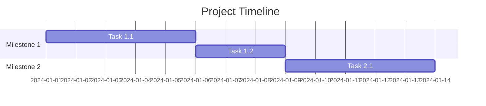

# Implementation Plan: {{PROJECT_NAME}}

## Overview

{{Brief summary of the build plan and overall timeline}}

## Milestones

### Milestone 1: {{Name}} ({{Est. Duration}})

**Goal**: {{What this milestone achieves}}

| # | Task | Effort | Dependencies | Status |
|---|---|---|---|---|
| 1.1 | {{task}} | {{hours/days}} | — | ⬜ |
| 1.2 | {{task}} | {{hours/days}} | 1.1 | ⬜ |

**Definition of Done**:
- [ ] {{criteria 1}}
- [ ] {{criteria 2}}

---

### Milestone 2: {{Name}} ({{Est. Duration}})

**Goal**: {{What this milestone achieves}}

| # | Task | Effort | Dependencies | Status |
|---|---|---|---|---|
| 2.1 | {{task}} | {{hours/days}} | M1 | ⬜ |
| 2.2 | {{task}} | {{hours/days}} | 2.1 | ⬜ |

**Definition of Done**:
- [ ] {{criteria 1}}
- [ ] {{criteria 2}}

---

### Milestone 3: {{Name}} ({{Est. Duration}})

**Goal**: {{What this milestone achieves}}

| # | Task | Effort | Dependencies | Status |
|---|---|---|---|---|
| 3.1 | {{task}} | {{hours/days}} | M2 | ⬜ |

**Definition of Done**:
- [ ] {{criteria 1}}

---

## Timeline

## Assumptions & Constraints

- {{assumption 1}}
- {{constraint 1}}

## Risks

| Risk | Impact | Mitigation |
|---|---|---|
| {{risk}} | {{impact}} | {{strategy}} |
