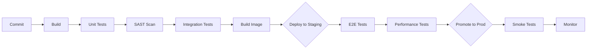

# Implementation Plan: {{PROJECT_NAME}}

## Overview

{{Brief summary: build approach, overall timeline, key constraints, team composition}}

## Dependency Graph

```mermaid
graph LR
    M1[M1: {{name}}] --> M2[M2: {{name}}]
    M1 --> M3[M3: {{name}}]
    M2 --> M4[M4: {{name}}]
    M3 --> M4
```

---

## Milestones

### Milestone 1: {{Name}} ({{Est. Duration}})

**Goal**: {{What this milestone achieves — definition of done in one sentence}}

| # | Task | Effort | Dependencies | Acceptance Criteria | Status |
|---|---|---|---|---|---|
| 1.1 | {{task}} | {{hours/days}} | — | {{how to verify it's done}} | ⬜ |
| 1.2 | {{task}} | {{hours/days}} | 1.1 | {{how to verify}} | ⬜ |
| 1.3 | {{task}} | {{hours/days}} | 1.1 | {{how to verify}} | ⬜ |

**Definition of Done**:
- [ ] {{criteria 1}}
- [ ] {{criteria 2}}
- [ ] All tests passing
- [ ] Code reviewed

---

### Milestone 2: {{Name}} ({{Est. Duration}})

**Goal**: {{What this milestone achieves}}

| # | Task | Effort | Dependencies | Acceptance Criteria | Status |
|---|---|---|---|---|---|
| 2.1 | {{task}} | {{hours/days}} | M1 | {{criteria}} | ⬜ |
| 2.2 | {{task}} | {{hours/days}} | 2.1 | {{criteria}} | ⬜ |

**Definition of Done**:
- [ ] {{criteria 1}}
- [ ] {{criteria 2}}

---

### Milestone 3: {{Name}} ({{Est. Duration}})

**Goal**: {{What this milestone achieves}}

| # | Task | Effort | Dependencies | Acceptance Criteria | Status |
|---|---|---|---|---|---|
| 3.1 | {{task}} | {{hours/days}} | M2 | {{criteria}} | ⬜ |

**Definition of Done**:
- [ ] {{criteria 1}}

---

## Timeline

```mermaid
gantt
    title Project Timeline
    dateFormat YYYY-MM-DD

    section Milestone 1
        Task 1.1 :a1, {{start}}, {{duration}}
        Task 1.2 :a2, after a1, {{duration}}

    section Milestone 2
        Task 2.1 :b1, after a2, {{duration}}
        Task 2.2 :b2, after b1, {{duration}}

    section Milestone 3
        Task 3.1 :c1, after b2, {{duration}}
```

---

## Testing Strategy

| Level | Scope | Tools | Automation | Owner |
|---|---|---|---|---|
| **Unit** | Individual functions, methods | {{tool}} | CI — every commit | Dev |
| **Integration** | Service interactions, API contracts | {{tool}} | CI — every PR | Dev |
| **E2E** | Critical user flows | {{tool}} | Staging — pre-release | QA / Dev |
| **Performance** | Load, stress, soak testing | {{tool}} | Pre-release | Dev / SRE |
| **Security** | SAST, DAST, dependency scanning | {{tool}} | CI — every commit | Dev / Security |

### Test Coverage Targets

| Layer | Minimum Coverage | Notes |
|---|---|---|
| Core business logic | {{X}}% | Critical paths must be covered |
| API endpoints | {{X}}% | Contract tests for all public APIs |
| Integration points | {{X}}% | Mock external services |

---

## DevOps Pipeline



| Stage | Tool | Trigger | SLA |
|---|---|---|---|
| Build | {{tool}} | Every commit | < 5 min |
| Test | {{tool}} | Every PR | < 10 min |
| Security Scan | {{tool}} | Every PR | < 5 min |
| Deploy to Staging | {{tool}} | Merge to main | < 5 min |
| Deploy to Production | {{tool}} | Release tag / manual | < 10 min |

### Release Strategy

{{e.g., Blue/Green, Canary, Rolling — describe the approach and rollback procedure}}

### Environment Promotion

```
dev → staging → production
```

---

## Technical Debt Register

> Known shortcuts taken for MVP speed. Each has a remediation plan.

| # | Shortcut | Reason | Remediation | Priority | Target Milestone |
|---|---|---|---|---|---|
| TD-001 | {{shortcut}} | {{why it was taken}} | {{how to fix}} | P1/P2/P3 | M{{N}} |

---

## Assumptions & Constraints

### Assumptions
- {{assumption 1 — if this proves wrong, what changes}}
- {{assumption 2}}

### Constraints
- {{constraint 1}}
- {{constraint 2}}

## Risks

| Risk | Category | Likelihood | Impact | Mitigation | Owner |
|---|---|---|---|---|---|
| {{risk}} | Tech/Ops/Business | Low/Med/High | Low/Med/High | {{strategy}} | {{who}} |
