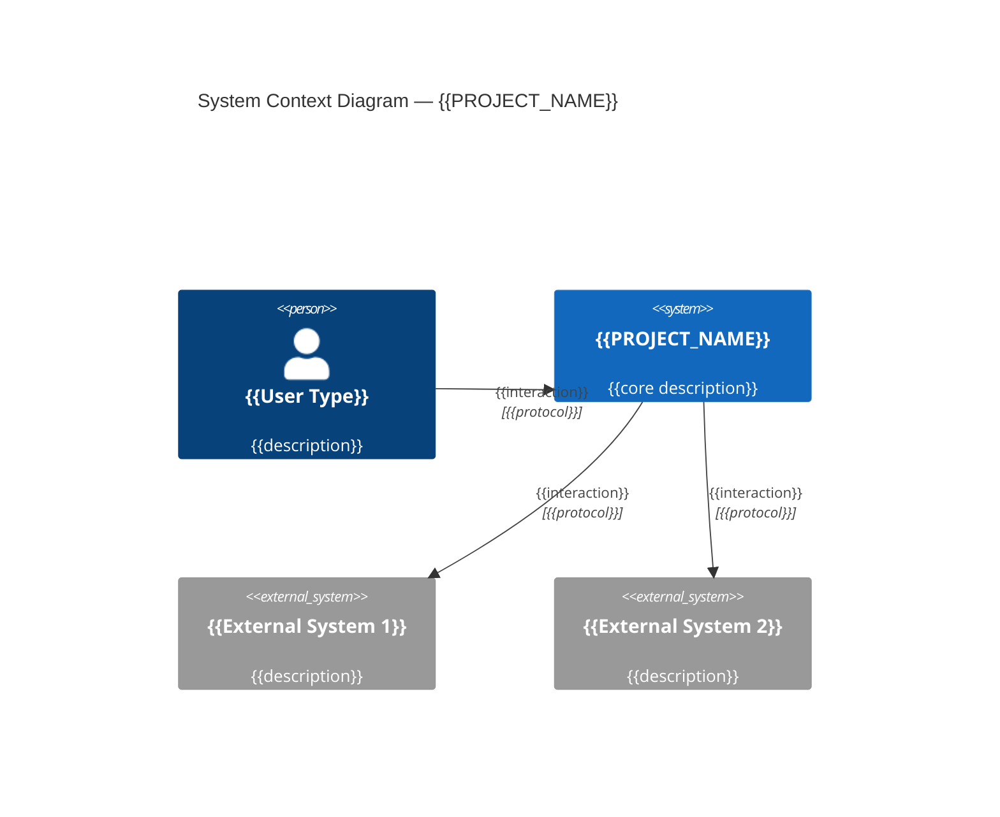

# {{PROJECT_NAME}}

> **Status**: 🟡 Planning
> **Size**: 🟢 Small / 🟡 Medium / 🔴 Large
> **Created**: {{DATE}}
> **Last Updated**: {{DATE}}

## Summary

{{1-paragraph description: what system is being built, for whom, what problem it solves, and the expected business outcome}}

## Problem Statement

{{What problem does this solve? What's the business case? What happens if we don't build it?}}

## Target Users & Stakeholders

### Users

| User Type | Description | Key Needs |
|---|---|---|
| {{type}} | {{description}} | {{needs}} |

### Stakeholder Map (RACI)

| Stakeholder | Role | R/A/C/I | Contact |
|---|---|---|---|
| {{name}} | {{role}} | {{RACI}} | {{contact}} |

## Discovery Answers

| # | Question | Answer |
|---|---|---|
| 🎯 | **North Star**: What is the singular success metric? | {{answer}} |
| 🏗️ | **Existing Systems**: What does this interact with or replace? | {{answer}} |
| 🔌 | **Integrations**: External services/APIs needed? | {{answer}} |
| 💾 | **Data Sovereignty**: Where must data reside? Compliance? | {{answer}} |
| 📦 | **Delivery**: How/where is the result delivered? | {{answer}} |
| 🚫 | **Constraints**: Technology, team, timeline limitations? | {{answer}} |

## Non-Functional Requirements (NFRs)

| NFR | Target | Measurement | Priority |
|---|---|---|---|
| **Performance** | {{e.g., API response < 200ms p95}} | {{how measured}} | {{P1/P2/P3}} |
| **Availability** | {{e.g., 99.9% uptime}} | {{monitoring tool}} | {{P1/P2/P3}} |
| **Scalability** | {{e.g., support 10K concurrent users}} | {{load testing}} | {{P1/P2/P3}} |
| **Security** | {{e.g., SOC2 compliant, encrypted at rest}} | {{audit/scan}} | {{P1/P2/P3}} |
| **Data Retention** | {{e.g., 90-day hot, 1-year archive}} | {{policy}} | {{P1/P2/P3}} |
| **Recovery** | {{e.g., RPO 1hr, RTO 4hr}} | {{DR test}} | {{P1/P2/P3}} |

## System Context Diagram (C4 Level 1)

## Integration Inventory

| External System | Direction | Protocol | Auth Method | Data Format | SLA | Status |
|---|---|---|---|---|---|---|
| {{system}} | In / Out / Both | REST / gRPC / WS / SFTP | OAuth / API Key / mTLS | JSON / XML / CSV | {{SLA}} | ✅ Confirmed / ⚠️ TBD |

## Key Features (MVP)

- [ ] {{Feature 1}} — {{brief description}}
- [ ] {{Feature 2}} — {{brief description}}
- [ ] {{Feature 3}} — {{brief description}}

## Scope Boundaries

> What this project is **NOT**. Hard limits to prevent scope creep.

- ❌ {{thing this project will NOT do}}
- ❌ {{out-of-scope feature}}
- ❌ {{explicitly excluded capability}}

## Existing System Landscape

{{Description of current state: what systems exist, what this project replaces or extends, migration considerations}}

## Ideas & Future Scope

{{Raw ideas, v2 features, things captured during planning but not in MVP}}

## Version History

| Version | Date | Summary |
|---|---|---|
| Initial | {{DATE}} | Project created |
