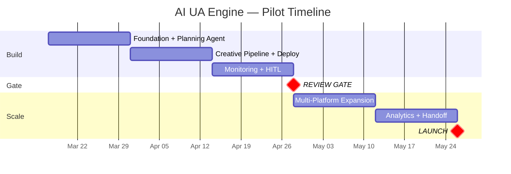

# Business Proposal: AI Agentic UA Engine

> **Prepared by**: Solutions Architect (AI-assisted)
> **Date**: 2026-03-13
> **Audience**: Leadership / Stakeholders
> **Export**: Run `/plan-export` to generate .docx version

---

## Executive Summary

We propose building an **AI-powered User Acquisition Engine** that automates the full advertising cycle — from campaign planning to creative production, deployment, and real-time optimization — across Facebook, Google, and TikTok.

The system replaces manual, repetitive UA workflows with AI agents that make data-driven decisions 24/7, while keeping humans in control of high-risk budget decisions.

**Bottom line**: This engine can **reduce creative production costs by 50-70%**, **compress campaign launch time from weeks to minutes**, and **improve ROAS by 15-25%** — starting with a 10-week, $5K pilot on TikTok.

---

## The Problem

| Challenge | Current State | Business Impact |
|---|---|---|
| **Slow campaign launches** | 2-4 weeks to go from idea to live ad | Missed market windows, slow reaction to trends |
| **Expensive creative production** | Manual design for each variant | High cost, low testing volume (5-10/week) |
| **Reactive optimization** | Managers check dashboards daily | 4-24 hour reaction to anomalies, wasted spend |
| **Rising UA costs** | CPI increasing 20-30% YoY | Margins shrinking without ROAS improvement |
| **Talent bottleneck** | Need 3-5 UA people per game | Hard to scale to more titles |

---

## The Solution

An AI engine built on 3 layers:

```
┌──────────────────────────────────────────────────────────┐
│                   AI Agentic UA Engine                    │
│                                                          │
│  ┌──────────────┐  ┌─────────────┐  ┌────────────────┐  │
│  │ n8n          │  │ Dify        │  │ OpenClaw       │  │
│  │ Orchestrator │──│ AI Brain    │──│ API Gateway    │  │
│  │ (Workflows)  │  │ (Agents)    │  │ (Connections)  │  │
│  └──────────────┘  └─────────────┘  └────────────────┘  │
│                                                          │
│  ┌────────────────────────────────────────────────────┐  │
│  │          Existing AppsFlyer Data Pipeline           │  │
│  │    (Real-time attribution, user data, revenue)      │  │
│  └────────────────────────────────────────────────────┘  │
└──────────────────────────────────────────────────────────┘
```

### What the AI Does

| Pillar | Before (Manual) | After (AI Engine) |
|---|---|---|
| **Planning** | UA manager analyzes spreadsheets, sets budgets | AI agent analyzes AppsFlyer data, generates optimized campaign plans |
| **Creative** | Designers create 5-10 variants manually | AI generates 50-100 variants using GenAI tools (Creatify, OpenArt.ai) |
| **Deployment** | Manual upload to each ad platform | Automated deployment to TikTok, Facebook, Google in minutes |
| **Monitoring** | Check dashboards 1-2x daily | AI monitors 24/7, auto-pauses bad ads, alerts on anomalies |
| **Optimization** | Weekly manual adjustments | Continuous AI-driven optimization with human approval for big changes |

### Safety: Human-in-the-Loop

The AI doesn't operate unchecked. Three tiers of control:

| Tier | AI Authority | Example |
|---|---|---|
| 🟢 **Full Auto** | AI acts immediately | Pause underperforming ads, scale budget ≤20% |
| 🟡 **Semi-Auto** | AI recommends, human approves via Slack | New campaigns, budget changes >20% |
| 🔴 **Human Only** | Human decides entirely | Total budget allocation, brand direction |

---

## Expected Impact

| Metric | Current | With AI Engine | Improvement |
|---|---|---|---|
| Campaign launch time | 2-4 weeks | < 2 days (15 min automated) | **95%+ faster** |
| Creative variants per week | 5-10 | 50-100 | **10x more testing** |
| Production costs | Baseline | -50% to -70% | **Significant savings** |
| ROAS | Baseline | +15% to +25% | **Higher returns** |
| Anomaly reaction time | 4-24 hours | < 1 hour | **20x faster** |
| UA headcount per game | 3-5 people | 1-2 people | **60% reduction** |

---

## Investment & Timeline

### 10-Week Pilot Plan



### Cost Breakdown

| Category | Pilot (10 weeks) | Monthly (Production) | Annual (Scaled) |
|---|---|---|---|
| Engineering | Internal (1-2 FTE) | Internal | Internal |
| Ad spend (TikTok pilot) | $5,000 | $8-20K/mo | $100-600K/yr |
| LLM API costs | ~$50 | ~$50-150/mo | ~$600-1,800/yr |
| GenAI tool subscriptions | Free tiers | ~$60/mo | ~$720/yr |
| Infrastructure | $0 (local dev) | ~$100/mo | ~$1,200/yr |
| **Total (excl. ad spend)** | **~$50** | **~$310/mo** | **~$4,320/yr** |

> **Key insight**: The engine costs ~$4,300/year to operate (excluding ad spend). Even a 1% ROAS improvement on $100K annual ad spend would save $1,000+ — the system pays for itself with minimal improvement.

### ROI Projection

| Scenario | Annual Ad Spend | ROAS Improvement | Additional Revenue | ROI |
|---|---|---|---|---|
| Conservative | $100K | +10% | +$10K | 2.3x |
| Target | $300K | +20% | +$60K | 14x |
| Optimistic | $600K | +25% | +$150K | 35x |

*Plus: headcount savings of 2-3 FTE per game × salary*

---

## Risk Management

| Risk | Likelihood | Mitigation |
|---|---|---|
| AI makes bad budget decisions | Low | 6 anti-hallucination guardrails enforce hard limits |
| AI-generated creatives underperform | Medium | Quality gate + A/B test before scaling |
| Ad platform blocks automation | Low | Official APIs only, comply with ToS |
| System downtime disrupts campaigns | Low | Manual fallback always available |
| Pilot doesn't show lift | Medium | Review Gate at Week 6 — pivot before further investment |

---

## Why Now?

1. **AI-generated creatives are mainstream** — 30-40% of top publishers already use GenAI
2. **UA costs rising 20-30% YoY** — automation is the only way to maintain margins
3. **We already have the data infrastructure** — AppsFlyer pipeline gives us real-time signals
4. **Team has the skills** — n8n and Dify experience means fast time-to-value
5. **Low-risk pilot** — $5K investment validates the approach before committing

---

## Decision Requested

**Approve the 10-week pilot** to validate the AI UA Engine on 1 game (Total Football) with TikTok Ads.

| What We Need | From Whom |
|---|---|
| Engineering allocation (1-2 FTE, 10 weeks) | Engineering Lead |
| TikTok Ads pilot budget ($500/week × 10 weeks) | Marketing / Finance |
| API keys for TikTok, GenAI tools | UA Team |
| Weekly 1-hour review sessions | UA Manager |
| Production server access (Week 5+) | DevOps / IT |

**Success criteria at Week 6 Review Gate**:
- AI-managed campaigns achieve comparable or better CPI vs. manual
- Creative production is ≥5x faster
- System operates reliably with <1hr anomaly response

If the gate passes → expand to Facebook and Google (Sprints 4-5).
If it doesn't → lessons learned documented, minimal investment lost.

---

## Appendix: Key Documents

| Document | Contents |
|---|---|
| [Overview](./overview.md) | Requirements, NFRs, integrations, HITL framework |
| [Research](./research.md) | Build-vs-buy analysis, API feasibility, PoCs |
| [Tech Stack](./tech-stack.md) | Technology evaluations with ADR-format decisions |
| [Architecture](./architecture.md) | C4 diagrams, data contracts, security, deployment |
| [Implementation Plan](./implementation-plan.md) | Sprint tasks, Gantt chart, milestones |
| [Technical Handoff](./handoff.md) | Developer-ready setup guide |
| [Findings](./findings.md) | All 15 ADRs, risk log, session notes |

> 💡 **Tip**: Run `/plan-export` to export this proposal as a formatted .docx for presentation.
