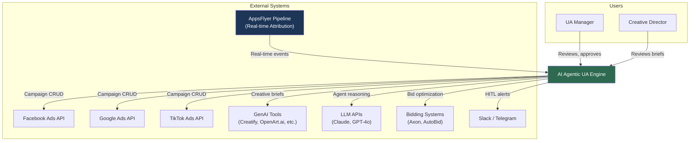
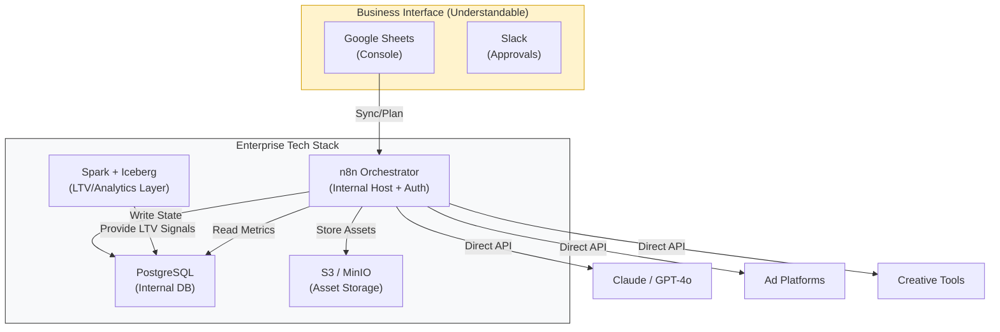
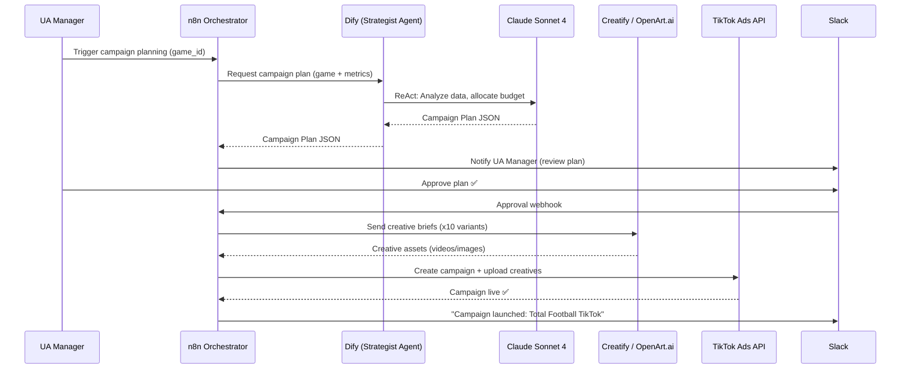
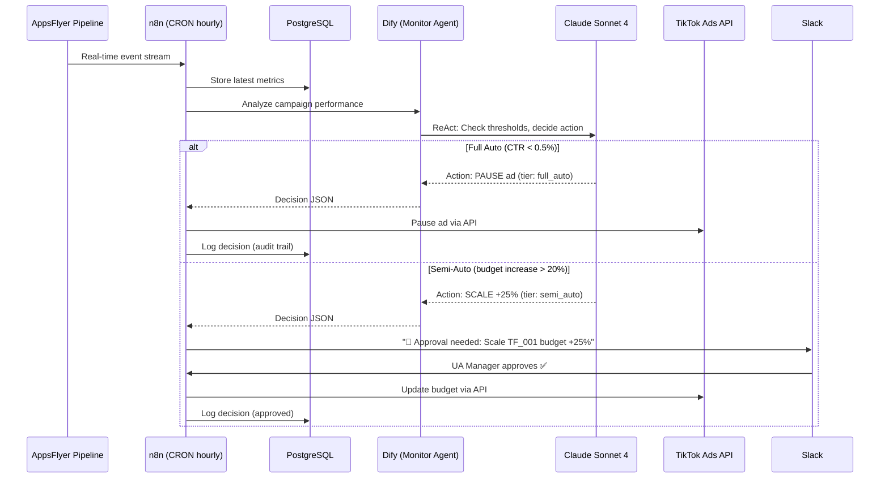

# Architecture: AI Agentic UA Engine

> **Architect**: Solutions Architect (AI-assisted)
> **Date**: 2026-03-13
> **Status**: Complete

## Data Contracts (Data-First)

### Campaign Plan (n8n ↔ Google Sheets ↔ PostgreSQL)
```json
{
  "game_id": "total-football",
  "platform": "tiktok",
  "budget": { "daily": 71, "total": 500 },
  "audience": { "geos": ["TH", "VN", "ID"], "interests": ["sports"] },
  "status": "planned"
}
```

### AI Decision (Enterprise Audit Log)
- **Primary**: Internal PostgreSQL (`ua_engine.agent_decisions` table)
- **Mirror**: Google Sheets "Action Log" tab for UA team visibility

### Creative Storage (Internal S3 / MinIO)
```json
{
  "id": "creative_001",
  "url": "https://media.internal.com/creatives/tf/001.mp4",
  "s3_path": "s3://ads-assets/tf/creative_001.mp4",
  "performance": { "roas": 2.8, "ltv_lift": 12.5 }
}
```

---

## C4 Level 1: System Context



---

## C4 Level 2: Container Diagram (Enterprise-Integrated)



---

## C4 Level 3: Key Components

### n8n Orchestrator — Workflow Components

| Workflow | Trigger | Input | Output | Frequency |
|---|---|---|---|---|
| **Campaign Planning** | Manual / CRON (weekly) | Game config + AppsFlyer data | Campaign Plan JSON → Dify | On-demand |
| **Creative Production** | Webhook (from Dify) | Creative Brief JSON | Media files → File Storage | On-demand |
| **Platform Deployment** | Webhook (from production) | Creative assets + campaign config | API calls to ad platforms | On-demand |
| **Spend Data Pull** | CRON (6hr/12hr) | Ad platform credentials | Spend data → PostgreSQL | 2-4x/day |
| **Monitor Trigger** | CRON (hourly peak / 4hr off-peak) | AppsFlyer events | Agent Decision → audit log | Hourly / 4hr |
| **Token Refresh** | CRON (daily) | Stored tokens | Refreshed tokens | Daily |
| **HITL Notification** | Webhook (from Dify) | Agent decision (semi-auto tier) | Slack message + approval buttons | On-demand |
| **Daily Summary** | CRON (daily 9am) | PostgreSQL audit logs | Slack digest message | Daily |

### Dify AI Brain — Agent Components

| Agent | Strategy | Knowledge Base | Input | Output |
|---|---|---|---|---|
| **Campaign Strategist** | ReAct (Reason-Act-Observe) | Historical campaigns, benchmarks, brand guidelines | Game ID + AppsFlyer metrics | Campaign Plan JSON |
| **Campaign Monitor** | ReAct | Performance thresholds, HITL rules | AppsFlyer real-time events + spend data | Agent Decision JSON |
| **Creative Analyst** | Chain-of-Thought | Creative performance history, winning patterns | Creative metadata + performance data | Tags + pattern insights |

---

## Sequence Diagrams

### Flow 1: Campaign Planning & Launch



### Flow 2: Automated Monitoring & Optimization



---

## Security Architecture

| Layer | Control | Implementation |
|---|---|---|
| **Credentials** | API keys encrypted at rest | n8n credentials vault (AES-256) |
| **LLM Access** | API key rotation | Quarterly rotation, Dify environment variables |
| **Database** | Network isolation | PostgreSQL on internal Docker network only |
| **n8n UI** | Authentication | n8n built-in auth (email + password) |
| **HITL** | Authorized users only | Slack workspace access controls |
| **Budget Guardrails** | Deterministic rules (not LLM) | Hard-coded limits in n8n workflows: daily cap, % change cap |
| **Audit Trail** | All AI decisions logged | PostgreSQL `agent_decisions` table — immutable append-only |
| **Token Management** | Auto-refresh workflows | n8n CRON job checks token expiry, triggers refresh |

### Anti-Hallucination Guardrails

| Guardrail | Type | Rule |
|---|---|---|
| Daily budget ceiling | Hard limit | AI cannot set daily budget > $X (configured per game) |
| Budget change cap | Percentage | Auto-actions limited to ≤20% change. >20% requires HITL |
| Minimum data threshold | Data quality | Agent must have ≥24hr of data before making optimization decisions |
| Confidence scoring | LLM output | Agent must include confidence score (0-1). Actions below 0.7 require HITL |
| Double-check pattern | Validation | n8n validates Dify's JSON output against schema before executing any API call |
| Rollback capability | Safety net | All campaign changes logged with pre-change state for instant rollback |

---

## Observability Strategy

| Signal | Source | Storage | Alert |
|---|---|---|---|
| **Workflow execution** | n8n execution history | n8n internal DB | Slack on failure |
| **Agent decisions** | Dify → PostgreSQL | `agent_decisions` table | Slack daily digest |
| **API errors** | n8n error handler | PostgreSQL `api_errors` table | Slack immediate |
| **Rate limit hits** | Redis counters | Redis → n8n dashboard | Slack if >80% capacity |
| **Budget anomalies** | n8n guardrail checks | PostgreSQL | Slack immediate |
| **Token expiry** | n8n CRON check | n8n credentials vault | Slack 48hr warning |
| **System health** | Docker health checks | — | Slack on container restart |

### SLOs (Service Level Objectives)

| SLO | Target | Measurement |
|---|---|---|
| Workflow success rate | >99% | n8n executions succeeded / total |
| Agent response time | <30 seconds | Dify API call latency |
| Campaign launch time | <15 minutes | Workflow start to ad platform confirmation |
| Anomaly detection | <1 hour | AppsFlyer event to agent decision |
| HITL approval SLA | <4 hours | Slack alert to human response |

---

## Deployment Topology

### Development (Local)

```yaml
# docker-compose.yml
services:
  n8n:        # Port 5678
  dify-api:   # Port 5001
  dify-web:   # Port 3000
  postgres:   # Port 5432 (internal)
  redis:      # Port 6379 (internal)
  openclaw:   # Port 8080
volumes:
  postgres_data:
  redis_data:
  n8n_data:
  creative_assets:
```

### Production (Company Server)

```
┌─────────────────────────────────────────────┐
│              Docker Swarm                    │
│                                             │
│  ┌─────────┐  ┌──────────┐  ┌──────────┐  │
│  │  n8n    │──│  Dify    │──│ OpenClaw │  │
│  │  :5678  │  │  :5001   │  │  :8080   │  │
│  └────┬────┘  └────┬─────┘  └────┬─────┘  │
│       │            │              │         │
│  ┌────┴────────────┴──┐   ┌──────┴─────┐  │
│  │   PostgreSQL       │   │   Redis    │  │
│  │   (internal only)  │   │ (internal) │  │
│  └────────────────────┘   └────────────┘  │
│                                             │
│  📁 /data/creatives (volume mount)          │
└─────────────────────────────────────────────┘
         │
    ───── HTTPS (n8n UI only) ────→ UA Manager
```

### Environment Matrix

| Setting | Dev | Production |
|---|---|---|
| n8n EXECUTIONS_MODE | regular | queue |
| DB backup | None | Daily pg_dump |
| Redis persistence | None | AOF enabled |
| Creative storage | Local disk | Mounted volume |
| LLM | Claude Sonnet 4 | Claude Sonnet 4 |
| HITL channel | Test Slack channel | Production Slack channel |
| Ad platform | Sandbox / test accounts | Production accounts |

---

## Architecture by Phase

| Phase | What Ships | Architecture Impact |
|---|---|---|
| **MVP (Sprint 1-2)** | Planning Agent + TikTok deploy | n8n + Dify + PostgreSQL + Redis (4 containers) |
| **Production (Sprint 3-4)** | Monitoring + HITL + Multi-platform | Add OpenClaw, expand workflows, add audit trail |
| **Scale (Sprint 5+)** | Analytics + LTV bidding + full loop | Add creative analytics, integrate Axon/AutoBid |

---

## Cost by Architecture Phase

| Phase | Containers | Estimated Infra | LLM API | Total |
|---|---|---|---|---|
| MVP | 4 | $0 (local) | ~$5/mo | ~$5/mo |
| Production | 6 | $50-100/mo | ~$50-150/mo | ~$100-250/mo |
| Scale (10 games) | 6 | $200-500/mo | ~$300-500/mo | ~$500-1000/mo |
