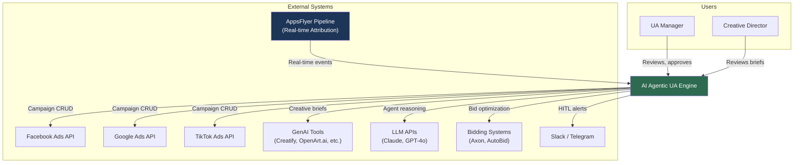
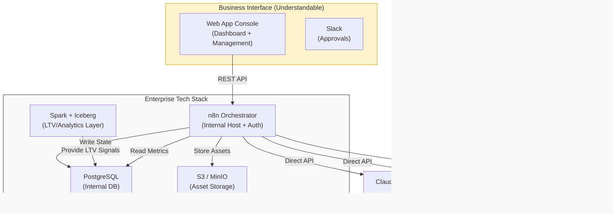
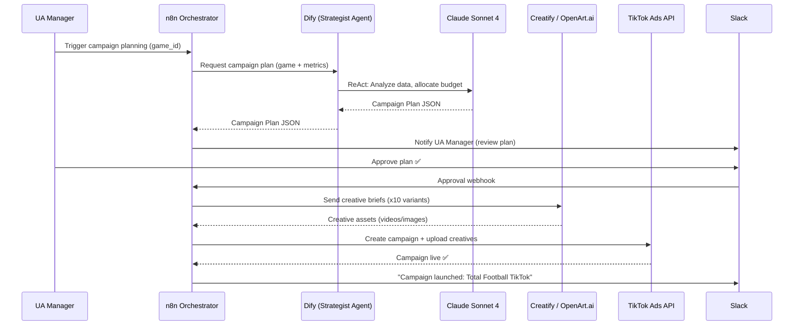
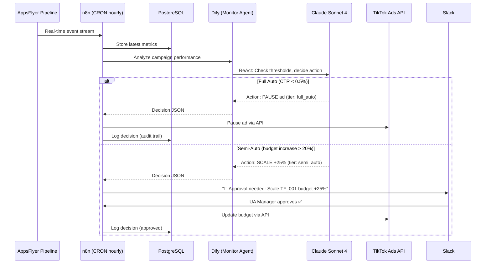
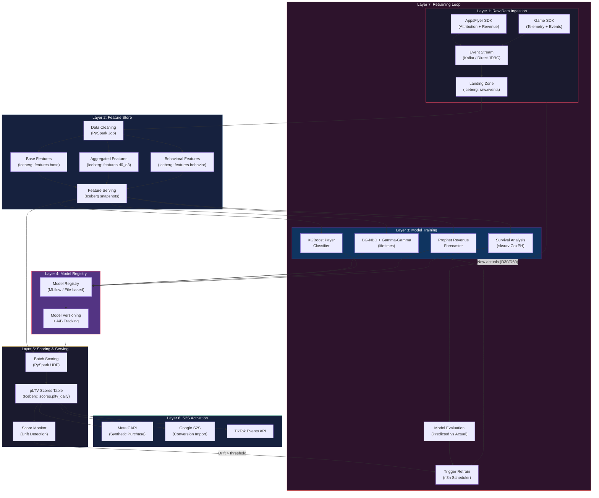
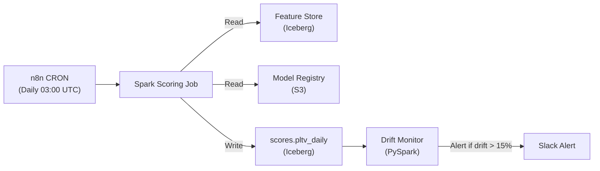
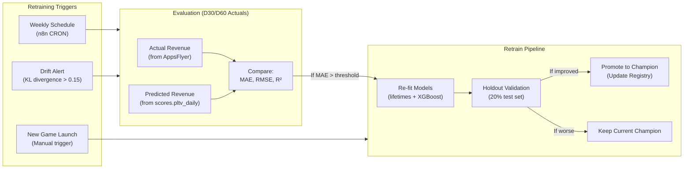
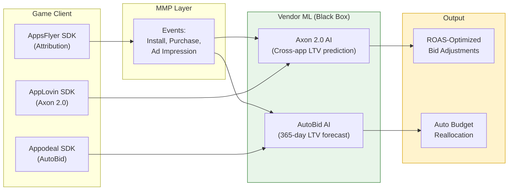

# Architecture: AI Agentic UA Engine

> **Architect**: Solutions Architect (AI-assisted)
> **Date**: 2026-03-13
> **Status**: Complete
> **Data Standards**: [`game-publishing-data-architect`](../../.agents/skills/Analytics%20%26%20Data/game-publishing-data-architect/SKILL.md) skill

## Data Processing Flow

```
DATA SOURCES ──→ ETL ──→ DATA WAREHOUSE ──→ BUSINESS INTELLIGENCE
┌───────────────┐  ┌──────────┐  ┌──────────────────────┐  ┌──────────────┐
│ Marketing     │  │ Extract  │  │ PostgreSQL / Iceberg │  │ Web App      │
│ AppsFlyer     │  │ Transform│  │ Analytics Query      │  │ Console      │
│ In-game Logs  │  │ Load     │  │ & Reporting          │  │ (Dashboards) │
│ Platform SDK  │  │          │  │                      │  │              │
└───────────────┘  └──────────┘  └──────────────────────┘  └──────────────┘
```

## Data Contracts (Data-First)

### Campaign Plan (Web App ↔ n8n ↔ PostgreSQL)
```json
{
  "game_id": "total-football",
  "platform": "tiktok",
  "budget": { "daily": 71, "total": 500 },
  "audience": { "geos": ["TH", "VN", "ID"], "interests": ["sports"] },
  "status": "planned"
}
```

### AI Decision (Enterprise Audit Log)
- **Primary**: Internal PostgreSQL (`ua_engine.agent_decisions` table)
- **Mirror**: Web App Console "Activity Feed" panel for UA team visibility

### Creative Storage (Internal S3 / MinIO)
```json
{
  "id": "creative_001",
  "url": "https://media.internal.com/creatives/tf/001.mp4",
  "s3_path": "s3://ads-assets/tf/creative_001.mp4",
  "performance": { "roas": 2.8, "ltv_lift": 12.5 }
}
```

---

## C4 Level 1: System Context



---

## C4 Level 2: Container Diagram (Enterprise-Integrated)



---

## C4 Level 3: Key Components

### n8n Orchestrator — Workflow Components

| Workflow | Trigger | Input | Output | Frequency |
|---|---|---|---|---|
| **Campaign Planning** | Manual / CRON (weekly) | Game config + AppsFlyer data | Campaign Plan JSON → Dify | On-demand |
| **Creative Production** | Webhook (from Dify) | Creative Brief JSON | Media files → File Storage | On-demand |
| **Platform Deployment** | Webhook (from production) | Creative assets + campaign config | API calls to ad platforms | On-demand |
| **Spend Data Pull** | CRON (6hr/12hr) | Ad platform credentials | Spend data → PostgreSQL | 2-4x/day |
| **Monitor Trigger** | CRON (hourly peak / 4hr off-peak) | AppsFlyer events | Agent Decision → audit log | Hourly / 4hr |
| **Token Refresh** | CRON (daily) | Stored tokens | Refreshed tokens | Daily |
| **HITL Notification** | Webhook (from Dify) | Agent decision (semi-auto tier) | Slack message + approval buttons | On-demand |
| **Daily Summary** | CRON (daily 9am) | PostgreSQL audit logs | Slack digest message | Daily |

### Dify AI Brain — Agent Components

| Agent | Strategy | Knowledge Base | Input | Output |
|---|---|---|---|---|
| **Campaign Strategist** | ReAct (Reason-Act-Observe) | Historical campaigns, benchmarks, brand guidelines | Game ID + AppsFlyer metrics | Campaign Plan JSON |
| **Campaign Monitor** | ReAct | Performance thresholds, HITL rules | AppsFlyer real-time events + spend data | Agent Decision JSON |
| **Creative Analyst** | Chain-of-Thought | Creative performance history, winning patterns | Creative metadata + performance data | Tags + pattern insights |

---

## Sequence Diagrams

### Flow 1: Campaign Planning & Launch



### Flow 2: Automated Monitoring & Optimization



---

## Security Architecture

| Layer | Control | Implementation |
|---|---|---|
| **Credentials** | API keys encrypted at rest | n8n credentials vault (AES-256) |
| **LLM Access** | API key rotation | Quarterly rotation, Dify environment variables |
| **Database** | Network isolation | PostgreSQL on internal Docker network only |
| **n8n UI** | Authentication | n8n built-in auth (email + password) |
| **HITL** | Authorized users only | Slack workspace access controls |
| **Budget Guardrails** | Deterministic rules (not LLM) | Hard-coded limits in n8n workflows: daily cap, % change cap |
| **Audit Trail** | All AI decisions logged | PostgreSQL `agent_decisions` table — immutable append-only |
| **Token Management** | Auto-refresh workflows | n8n CRON job checks token expiry, triggers refresh |

### Anti-Hallucination Guardrails

| Guardrail | Type | Rule |
|---|---|---|
| Daily budget ceiling | Hard limit | AI cannot set daily budget > $X (configured per game) |
| Budget change cap | Percentage | Auto-actions limited to ≤20% change. >20% requires HITL |
| Minimum data threshold | Data quality | Agent must have ≥24hr of data before making optimization decisions |
| Confidence scoring | LLM output | Agent must include confidence score (0-1). Actions below 0.7 require HITL |
| Double-check pattern | Validation | n8n validates Dify's JSON output against schema before executing any API call |
| Rollback capability | Safety net | All campaign changes logged with pre-change state for instant rollback |

---

## Observability Strategy

| Signal | Source | Storage | Alert |
|---|---|---|---|
| **Workflow execution** | n8n execution history | n8n internal DB | Slack on failure |
| **Agent decisions** | Dify → PostgreSQL | `agent_decisions` table | Slack daily digest |
| **API errors** | n8n error handler | PostgreSQL `api_errors` table | Slack immediate |
| **Rate limit hits** | Redis counters | Redis → n8n dashboard | Slack if >80% capacity |
| **Budget anomalies** | n8n guardrail checks | PostgreSQL | Slack immediate |
| **Token expiry** | n8n CRON check | n8n credentials vault | Slack 48hr warning |
| **System health** | Docker health checks | — | Slack on container restart |

### SLOs (Service Level Objectives)

| SLO | Target | Measurement |
|---|---|---|
| Workflow success rate | >99% | n8n executions succeeded / total |
| Agent response time | <30 seconds | Dify API call latency |
| Campaign launch time | <15 minutes | Workflow start to ad platform confirmation |
| Anomaly detection | <1 hour | AppsFlyer event to agent decision |
| HITL approval SLA | <4 hours | Slack alert to human response |

---

## Deployment Topology

### Development (Local)

```yaml
# docker-compose.yml
services:
  n8n:        # Port 5678
  dify-api:   # Port 5001
  dify-web:   # Port 3000
  postgres:   # Port 5432 (internal)
  redis:      # Port 6379 (internal)
  openclaw:   # Port 8080
volumes:
  postgres_data:
  redis_data:
  n8n_data:
  creative_assets:
```

### Production (Company Server)

```
┌─────────────────────────────────────────────┐
│              Docker Swarm                    │
│                                             │
│  ┌─────────┐  ┌──────────┐  ┌──────────┐  │
│  │  n8n    │──│  Dify    │──│ OpenClaw │  │
│  │  :5678  │  │  :5001   │  │  :8080   │  │
│  └────┬────┘  └────┬─────┘  └────┬─────┘  │
│       │            │              │         │
│  ┌────┴────────────┴──┐   ┌──────┴─────┐  │
│  │   PostgreSQL       │   │   Redis    │  │
│  │   (internal only)  │   │ (internal) │  │
│  └────────────────────┘   └────────────┘  │
│                                             │
│  📁 /data/creatives (volume mount)          │
└─────────────────────────────────────────────┘
         │
    ───── HTTPS (n8n UI only) ────→ UA Manager
```

### Environment Matrix

| Setting | Dev | Production |
|---|---|---|
| n8n EXECUTIONS_MODE | regular | queue |
| DB backup | None | Daily pg_dump |
| Redis persistence | None | AOF enabled |
| Creative storage | Local disk | Mounted volume |
| LLM | Claude Sonnet 4 | Claude Sonnet 4 |
| HITL channel | Test Slack channel | Production Slack channel |
| Ad platform | Sandbox / test accounts | Production accounts |

---

## Architecture by Phase

| Phase | What Ships | Architecture Impact |
|---|---|---|
| **MVP (Sprint 1-2)** | Planning Agent + TikTok deploy | n8n + Dify + PostgreSQL + Redis (4 containers) |
| **Production (Sprint 3-4)** | Monitoring + HITL + Multi-platform | Add OpenClaw, expand workflows, add audit trail |
| **Scale (Sprint 5+)** | Analytics + LTV bidding + full loop | Add creative analytics, integrate Axon/AutoBid |

---

## Cost by Architecture Phase

| Phase | Containers | Estimated Infra | LLM API | Total |
|---|---|---|---|---|
| MVP | 4 | $0 (local) | ~$5/mo | ~$5/mo |
| Production | 6 | $50-100/mo | ~$50-150/mo | ~$100-250/mo |
| Scale (10 games) | 6 | $200-500/mo | ~$300-500/mo | ~$500-1000/mo |

---

## pLTV Pipeline Architecture (ADR-016 Extension)

> **Added**: 2026-03-16 — Extends core architecture with two independent pLTV branches

### Branch A: Internal pLTV Pipeline — Production Architecture

#### Overview Diagram



#### Layer 1: Raw Data Ingestion

| Source | Data | Format | Frequency | Destination |
|---|---|---|---|---|
| AppsFlyer SDK | Install, attribution, in-app events, revenue | JSON via Webhook/Pull API | Real-time / Hourly | `raw.appsflyer_events` |
| Game SDK (Internal) | Session start/end, level progress, IAP, ad impressions | JSON via JDBC/Kafka | Real-time | `raw.game_telemetry` |
| Ad Platform APIs | Spend, impressions, clicks, CPI by campaign | JSON via n8n CRON | Every 4 hours | `raw.ad_platform_spend` |

**Iceberg Tables (Landing Zone)**:
```sql
-- raw.appsflyer_events (partitioned by event_date, event_name)
CREATE TABLE raw.appsflyer_events (
    event_id         STRING,
    appsflyer_id     STRING,
    event_name       STRING,    -- install, purchase, af_ad_view
    event_value      DOUBLE,
    event_currency   STRING,
    media_source     STRING,    -- tiktok, facebook, google
    campaign_id      STRING,
    country_code     STRING,
    device_model     STRING,
    install_time     TIMESTAMP,
    event_time       TIMESTAMP,
    event_date       DATE       -- partition key
) USING iceberg
PARTITIONED BY (event_date, event_name);
```

#### Layer 2: Feature Store

Three feature categories, computed daily by PySpark batch job:

**2a. Base Features** (`features.base`) — Per-user identity + first-touch:
| Feature | Description | Source |
|---|---|---|
| `user_id` | Canonical user ID (AppsFlyer ID) | AppsFlyer |
| `install_date` | Day 0 timestamp | AppsFlyer |
| `media_source` | Acquisition channel | AppsFlyer |
| `campaign_id` | Campaign that acquired the user | AppsFlyer |
| `country_code` | User's country | AppsFlyer |
| `device_tier` | Device quality bucket (low/mid/high) | Game SDK |

**2b. D0-D3 Aggregated Features** (`features.d0_d3`) — The prediction window:
| Feature | Description | Computation |
|---|---|---|
| `d0_d3_sessions` | Total sessions in first 3 days | COUNT(session_start WHERE day <= 3) |
| `d0_d3_playtime_min` | Total play time in minutes | SUM(session_duration) |
| `d0_d3_levels_completed` | Progression velocity | COUNT(level_complete) |
| `d0_d3_iap_revenue` | Early monetization signal | SUM(purchase.value WHERE day <= 3) |
| `d0_d3_iap_count` | Purchase frequency | COUNT(purchase WHERE day <= 3) |
| `d0_d3_ad_impressions` | Ad engagement | COUNT(ad_view WHERE day <= 3) |
| `d0_d3_ad_revenue` | Ad monetization | SUM(ad_revenue WHERE day <= 3) |
| `d0_d3_activity_slope` | Engagement trend | REGRESSION_SLOPE(daily_sessions) |
| `d0_d3_max_session_gap_hr` | Churn risk signal | MAX(time_between_sessions) |
| `d0_d3_retention_d1` | Day-1 retention flag | 1 IF session on day 1 ELSE 0 |
| `d0_d3_retention_d3` | Day-3 retention flag | 1 IF session on day 3 ELSE 0 |

**2c. Behavioral Features** (`features.behavior`) — Rolling window for lifetimes:
| Feature | Description | Computation |
|---|---|---|
| `frequency` (x) | Repeat purchase count | COUNT(purchases) - 1 |
| `recency` (t_x) | Days since last purchase | DATEDIFF(last_purchase, install) |
| `T` | Customer age in days | DATEDIFF(NOW(), install) |
| `monetary_value` | Avg transaction value | AVG(purchase.value) |

**Feature Pipeline** (PySpark job, scheduled via n8n CRON):
```python
# feature_pipeline.py — runs daily at 02:00 UTC
from pyspark.sql import SparkSession
from pyspark.sql import functions as F, Window

spark = SparkSession.builder.appName("pltv_features").getOrCreate()

# Read raw events from Iceberg
events = spark.read.table("raw.appsflyer_events")
telemetry = spark.read.table("raw.game_telemetry")

# Compute D0-D3 features per user
d0_d3 = (
    events.filter(F.col("day_since_install") <= 3)
    .groupBy("appsflyer_id")
    .agg(
        F.count(F.when(F.col("event_name") == "session_start", 1)).alias("d0_d3_sessions"),
        F.sum(F.when(F.col("event_name") == "purchase", F.col("event_value"))).alias("d0_d3_iap_revenue"),
        F.count(F.when(F.col("event_name") == "purchase", 1)).alias("d0_d3_iap_count"),
        # ... additional features
    )
)

# Write to Feature Store (Iceberg with snapshot isolation)
d0_d3.writeTo("features.d0_d3").using("iceberg").overwritePartitions()
```

#### Layer 3: Model Training

| Model | Library | Input Features | Output | Training Schedule |
|---|---|---|---|---|
| **BG-NBD** | `lifetimes` | frequency, recency, T | Expected purchase count (12 months) | Weekly |
| **Gamma-Gamma** | `lifetimes` | frequency, monetary_value | Expected monetary value per transaction | Weekly |
| **XGBoost Classifier** | `xgboost` | All D0-D3 features | P(payer in 30 days) | Weekly |
| **Prophet Forecaster** | `prophet` | Daily cohort revenue time series | D7 → D90/D180 revenue curve | Bi-weekly |
| **CoxPH Survival** | `sksurv` | D0-D3 + base features | Hazard ratio for churn | Monthly |

**Combined pLTV Score Calculation**:
```python
# pltv_scorer.py — the core scoring logic
from lifetimes import BetaGeoFitter, GammaGammaFitter
import xgboost as xgb

# Load trained models from registry
bgf = BetaGeoFitter()
bgf.load_model("models/bg_nbd_v{version}.pkl")
ggf = GammaGammaFitter()
ggf.load_model("models/gamma_gamma_v{version}.pkl")
xgb_model = xgb.Booster()
xgb_model.load_model("models/xgb_payer_v{version}.json")

# Score each user
def compute_pltv(user_features):
    # Stage 1: Expected transactions (next 12 months)
    exp_purchases = bgf.predict(
        t=365, frequency=user.frequency,
        recency=user.recency, T=user.T
    )
    # Stage 2: Expected monetary value
    exp_monetary = ggf.conditional_expected_average_profit(
        frequency=user.frequency,
        monetary_value=user.monetary_value
    )
    # Stage 3: Payer probability (boost for non-payers)
    payer_prob = xgb_model.predict(user.d0_d3_features)

    # Combined pLTV
    pltv = exp_purchases * exp_monetary * payer_prob * margin
    return pltv
```

#### Layer 4: Model Registry (File-Based / MLflow Lite)

| Component | Implementation | Storage |
|---|---|---|
| **Model artifacts** | Serialized `.pkl` / `.json` files | S3/MinIO: `s3://models/pltv/` |
| **Versioning** | Timestamp-based: `bg_nbd_v20260316.pkl` | S3 + PG metadata table |
| **Metrics tracking** | MAE, RMSE, AUC per model version | `pg.model_metrics` table |
| **A/B tracking** | Champion vs Challenger via PG flag | `pg.model_registry` table |

```sql
-- pg.model_registry — tracks active model versions
CREATE TABLE model_registry (
    model_name    VARCHAR(100),    -- 'bg_nbd', 'xgb_payer', etc.
    version       VARCHAR(50),
    artifact_path VARCHAR(500),    -- s3://models/pltv/bg_nbd_v20260316.pkl
    status        VARCHAR(20),     -- 'champion', 'challenger', 'retired'
    mae           FLOAT,
    rmse          FLOAT,
    auc           FLOAT,
    trained_at    TIMESTAMP,
    promoted_at   TIMESTAMP
);
```

#### Layer 5: Scoring & Serving (Daily Batch)



**Drift Detection**: Compare distribution of today's pLTV scores against last 7-day rolling average. If KL divergence > threshold OR mean shift > 15%, trigger alert + optional retraining.

#### Layer 6: S2S Activation (Synthetic Events)

| Platform | API | Payload Format | Frequency |
|---|---|---|---|
| **Meta** | Conversions API (CAPI) | `{event: 'Purchase', value: pLTV, currency: 'USD', user_data: {gaid}}` | Batch every 6 hours |
| **Google** | Offline Conversion Import | `{gclid, conversion_value: pLTV, conversion_time}` | Batch daily |
| **TikTok** | Events API v2 | `{event: 'CompletePayment', value: pLTV, content_id: campaign}` | Batch every 6 hours |

**Critical Implementation Detail**: The pLTV score is sent as a `valueToSum` (Meta) / `conversion_value` (Google) in a Standard Purchase event. This is the "Synthetic Event" — the ad platform's bidding algorithm treats it as actual revenue, causing it to bid aggressively for users with high predicted LTV.

#### Layer 7: Continuous Retraining Loop



**Retraining Schedule**:
| Model | Retrain Frequency | Evaluation Window | Promotion Criteria |
|---|---|---|---|
| BG-NBD + Gamma-Gamma | Weekly | D30 actuals vs predicted | MAE improved by >5% |
| XGBoost Payer | Weekly | D30 actual payer status | AUC improved by >2% |
| Prophet Revenue | Bi-weekly | D60 cohort revenue curve | MAPE improved by >5% |
| CoxPH Survival | Monthly | D90 actual churn status | C-index improved by >3% |

### Branch B: External Vendor Pipeline



**Integration Points with n8n**:
- n8n monitors vendor performance via dashboard APIs (read-only)
- n8n can adjust campaign-level ROAS targets fed to Axon
- Appodeal AutoBid operates autonomously — n8n receives status webhooks
- All vendor decisions logged to Enterprise PostgreSQL for audit trail
