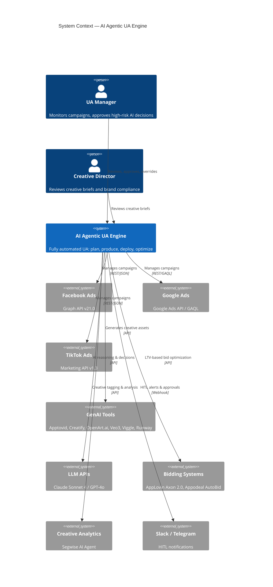

# AI Agentic UA Engine

> **Status**: 🟡 Planning
> **Size**: 🔴 Large
> **Created**: 2026-03-13
> **Last Updated**: 2026-03-13

## Summary

A fully automated AI-powered User Acquisition (UA) engine for a mobile gaming publisher. The system autonomously manages the entire digital advertising lifecycle — from strategic budget planning and AI-generated creative production to automated deployment and real-time optimization — across Facebook, Google, and TikTok ad platforms. It uses a hybrid orchestration architecture (n8n + Dify + OpenClaw) with agentic AI workflows (ReAct strategy) to reduce creative production costs by 50–70%, compress campaign launch time from 2–4 weeks to under 15 minutes, and boost ROAS by 15–25%.

## Key Performance Metrics

| Metric | Abbreviation | Definition | Why It Matters |
|---|---|---|---|
| **Impressions** | — | Total number of times your ad was displayed on a screen, regardless of clicks | Measures raw visibility and reach of ad delivery |
| **Reach** | — | Total number of **unique individuals** who saw your ad | Unlike impressions, reach counts each person once — shows true audience size |
| **Click-Through Rate** | **CTR** | % of people who clicked your ad out of total who saw it | Low CTR = creative or messaging isn't resonating with the audience |
| **Conversion Rate** | **CVR** | % of users who complete a desired action (install, purchase, sign-up) after clicking | Measures how effectively your landing page or app store listing converts interest into action |
| **Cost Per Install** | **CPI** | Cost of acquiring one app install | The primary cost efficiency metric for mobile UA — lower CPI = more installs per dollar |
| **Return on Ad Spend** | **ROAS** | Revenue generated for every $1 spent on advertising | A ROAS of 2.0x means $2 revenue per $1 spent — the north star for campaign profitability |
| **Customer Lifetime Value** | **CLV / LTV** | Total predicted revenue a customer will generate throughout their entire relationship | For profitable UA, LTV must be significantly higher than CPI — this ratio drives all bidding strategy |

> **Key Relationship**: `LTV > CPI` = Profitable acquisition. The AI engine optimizes for **maximizing LTV/CPI ratio** across all campaigns.

## Problem Statement

Rising User Acquisition costs combined with increasing data privacy restrictions (iOS ATT/IDFA, SKAdNetwork) are eroding profitability for mobile gaming publishers. Manual campaign management requires 3–5 UA personnel per game, creative production cycles are slow (2–4 weeks), and anomaly response times average 4–24 hours — far too slow for competitive gaming UA. Current processes test only 5–10 creative variants per week, leaving massive optimization potential on the table.

## Target Users & Stakeholders

### Users

| User Type | Description | Key Needs |
|---|---|---|
| UA Manager | Campaign strategist overseeing ad performance | Dashboard visibility, HITL approval gates, override capability |
| Creative Director | Manages creative brief quality and brand consistency | Creative brief review, brand guideline enforcement |
| Data Analyst | Monitors KPIs, builds reports, validates AI decisions | Data access, audit trails, performance dashboards |
| Finance / Controller | Budget oversight and cost control | Spending limits, budget guardrails, ROI reporting |
| AI Agents (System) | Autonomous agents executing the operational loop | API access, decision thresholds, knowledge base |

### Stakeholder Map (RACI)

| Stakeholder | Role | R/A/C/I | Contact |
|---|---|---|---|
| Head of UA | Business owner | A | — |
| UA Manager | Day-to-day operator | R | — |
| CTO / Tech Lead | Architecture approval | A/C | — |
| Data Team | Analytics & data pipeline | R/C | — |
| Finance | Budget & compliance | C/I | — |
| Executive Team | Strategic direction | I | — |

## Discovery Answers

| # | Question | Answer |
|---|---|---|
| 🎯 | **North Star**: Singular success metric | **ROAS improvement of 15–25%** with sustained creative production cost reduction of 50–70% |
| 🏗️ | **Existing Systems**: What does this interact with or replace? | Replaces manual UA workflows. Integrates with existing ad accounts on Facebook, Google, TikTok. Leverages existing game analytics & CRM data |
| 🔌 | **Integrations**: External services/APIs? | Facebook Marketing API (Graph v21.0), Google Ads API (GAQL), TikTok Marketing API (v1.3), Apify (scraping), Slack/Telegram webhooks, LLM APIs (Claude Sonnet 4 / GPT-4o), AppLovin Axon 2.0, Appodeal AutoBid, Segwise AI, 6 GenAI tools |
| 💾 | **Data Sovereignty**: Compliance? | Southeast Asia market. Ad platform ToS compliance. No PII storage beyond platform requirements. IDFA/ATT privacy compliance |
| 📦 | **Delivery**: How/where is the result delivered? | Self-hosted system (n8n + Dify + OpenClaw). Notifications via Slack/Telegram. Dashboards for monitoring. Creative assets stored in cloud storage |
| 🚫 | **Constraints**: Limitations? | API rate limits across 3 platforms. Token refresh management. LLM hallucination risk on budget decisions. Team has n8n/Dify experience |

## Non-Functional Requirements (NFRs)

| NFR | Target | Measurement | Priority |
|---|---|---|---|
| **Performance** | Campaign launch < 15 minutes (automated), < 2 days (full pipeline) | End-to-end latency measurement | P1 |
| **Availability** | 99.5% uptime for monitoring loop (24/7 operation) | Health check monitoring | P1 |
| **Scalability** | 50–100 creative variants per week (up from 5–10) | Creative output counter | P1 |
| **Monitoring Frequency** | Hourly metric pulls during peak, every 4h off-peak | Cron job execution logs | P1 |
| **Anomaly Reaction** | < 1 hour response to performance anomalies (down from 4–24h) | Alert-to-action timestamp | P1 |
| **Security** | API credentials secured (tokens, OAuth2, developer keys) | Secret management audit | P2 |
| **Data Integrity** | All AI decisions logged with audit trail (Web App + PostgreSQL) | Audit log completeness | P1 |
| **Recovery** | RPO 1hr, RTO 4hr for monitoring workflows | DR test | P2 |
| **Budget Safety** | AI cannot exceed budget thresholds without HITL approval | Budget guardrail enforcement | P1 |

## System Context Diagram (C4 Level 1)

## Integration Inventory

| External System | Direction | Protocol | Auth Method | Data Format | SLA | Status |
|---|---|---|---|---|---|---|
| Facebook Ads API | Both | REST (Graph API v21.0) | Long-lived Access Token + App | JSON | Rate limited | ✅ Confirmed |
| Google Ads API | Both | REST / GAQL | OAuth2 + Developer Token + MCC | JSON | Rate limited | ✅ Confirmed |
| TikTok Marketing API | Both | REST (v1.3) | Access Token + App | JSON (Access-Token header) | Rate limited | ✅ Confirmed |
| Apify | In | REST | API Key | JSON | — | ✅ Confirmed |
| Web App Console | Internal | REST | Internal Auth (SSO) | JSON | — | ✅ Planned |
| Slack / Telegram | Out | Webhook | Webhook URL | JSON | — | ✅ Confirmed |
| Claude Sonnet 4 / GPT-4o | Both | REST | API Key | JSON | — | ✅ Confirmed |
| AppLovin Axon 2.0 | Both | REST | API Key | JSON | — | ⚠️ TBD |
| Appodeal AutoBid | Both | REST | API Key | JSON | — | ⚠️ TBD |
| Segwise AI | In | REST | API Key | JSON | — | ⚠️ TBD |
| Apptovid | Out→In | REST | API Key | JSON / Media | — | ✅ Confirmed |
| Creatify | Out→In | REST | API Key | JSON / Media | — | ✅ Confirmed |
| OpenArt.ai | Out→In | REST | API Key | JSON / Media | — | ✅ Confirmed |
| Veo3 (Google) | Out→In | REST | API Key | JSON / Media | — | ✅ Confirmed |
| Viggle AI | Out→In | REST | API Key | JSON / Media | — | ⚠️ TBD |
| Runway Gen-4 | Out→In | REST | API Key | JSON / Media | — | ⚠️ TBD |

## Human-in-the-Loop (HITL) Framework

| Tier | Actions | Trigger | Approval |
|---|---|---|---|
| 🟢 **Full Auto** | Pause ads with CTR below threshold; Scale budget ≤20% for top performers; Refresh fatigued creatives; Shift budget between ad sets within same campaign | Performance rules | None — AI acts freely |
| 🟡 **Semi-Auto** | Launch new campaigns; Expand to new markets/geos; Reallocate budget >30%; Test entirely new audience segments | AI recommends → Slack/Telegram alert | Human approval within defined SLA |
| 🔴 **Human Only** | Set total budget ceilings; Define brand direction & guidelines; Approve new game titles for UA; Strategic market entry decisions | UA Manager / Executive | Manual decision |

## Key Features (MVP)

- [ ] **Campaign Strategist Agent** — AI analyzes historical data, allocates budgets, defines audiences, writes creative briefs (JSON output)
- [ ] **Creative Production Pipeline** — n8n routes briefs to 6 GenAI tools, mass-produces 50–100 variants/week
- [ ] **Auto-Deployment** — n8n pushes creatives to Facebook/Google/TikTok with proper specs and UTM tagging
- [ ] **LTV-Based Bidding** — Integration with AppLovin Axon 2.0 and Appodeal AutoBid for predictive bidding
- [ ] **Campaign Monitor Agent** — Hourly metric pulls, anomaly detection, auto-pause/scale within guardrails
- [ ] **Creative Anatomy Tagging** — AI video analysis to tag visual elements (emotion, character, CTA, color) correlated with CPI/ROAS
- [ ] **HITL Approval System** — Slack/Telegram notifications for semi-auto decisions with approval workflow
- [ ] **Audit Trail** — All AI decisions logged to Web App Console (backed by PostgreSQL) with timestamp, reasoning, and outcome

## Scope Boundaries

- ❌ Not building a custom ad-serving platform (using existing Facebook/Google/TikTok)
- ❌ Not replacing game analytics / attribution (MMP stays external — e.g., Adjust, AppsFlyer)
- ❌ Not handling in-app monetization or IAP optimization
- ❌ Not building a game development pipeline
- ❌ Not managing organic user acquisition (social, ASO, community)
- ❌ Not handling app store optimization (ASO)

## Existing System Landscape

This is a **greenfield build**. The team currently runs UA manually:
- Creative production: In-house design team + freelancers (2–4 week cycles)
- Campaign management: Manual setup via Facebook Ads Manager, Google Ads UI, TikTok Ads Manager
- Performance monitoring: Manual checking, Excel/Sheets-based reporting
- Budget allocation: Weekly meetings, manual adjustments
- The team has experience with **n8n** and **Dify** from smaller automation projects

## Ideas & Future Scope

- Multi-game portfolio optimization (cross-game budget allocation)
- Playable ad generation (interactive HTML5 ads)
- Influencer campaign automation
- Organic/paid attribution blending
- Custom MMP integration for deeper funnel analysis
- Self-learning creative templates based on genre-specific winning patterns

## Version History

| Version | Date | Summary |
|---|---|---|
| Initial | 2026-03-13 | Project created from /plan-new |
