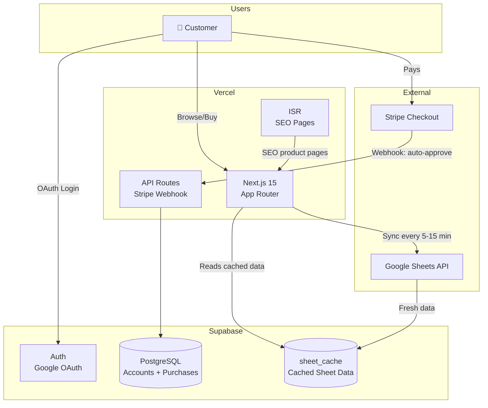
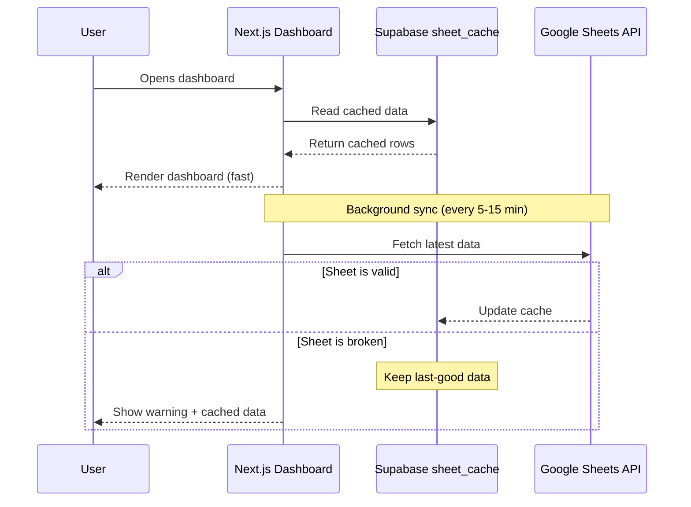
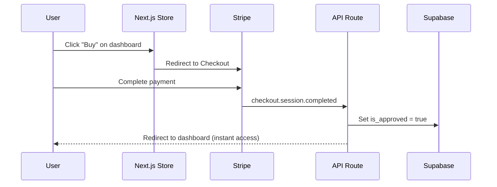
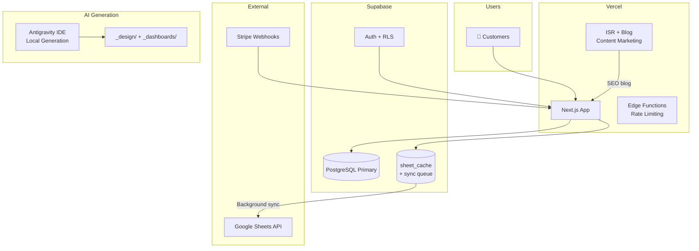
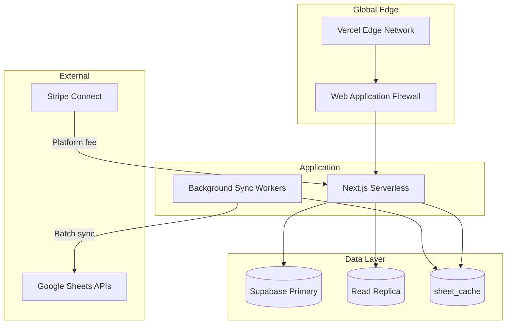
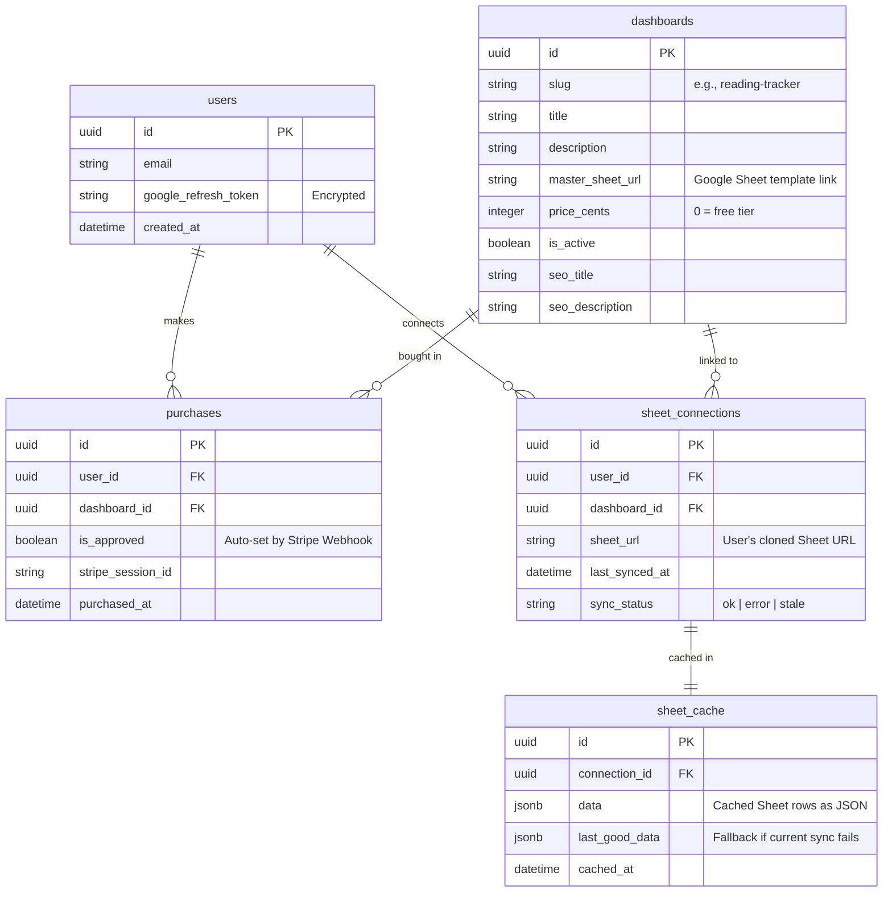

# Architecture: Dashboard Hub

## Overview
Dashboard Hub uses a modern, serverless architecture centered around Next.js on Vercel. The system serves dual purposes: a B2C storefront for selling tracking dashboards, and an admin workspace for generating new dashboard components. User tracking data lives in their personal Google Sheets — the platform caches Sheet data in Supabase for performance and reads/writes through a secure proxy.

## Phase 1: MVP & Storefront Validation

### Design Goals
- **Zero Fixed Cost:** Use Vercel and Supabase free tiers.
- **Data Privacy:** Cache Google Sheets data in Supabase for performance, but user's Sheet remains source of truth.
- **Instant Access:** Stripe Webhooks auto-approve purchases — no manual admin gate.
- **Free Tier:** 1 free dashboard (Habit Tracker) to prove value before asking for payment.

### Architecture Diagram

### Components
- **Next.js App Router**: Storefront rendering, dashboard views, secured API routes, ISR for SEO pages.
- **Auth.js**: Google OAuth with `drive.file` scope. Only accesses Sheets the user explicitly grants.
- **Supabase DB**: User profiles, dashboard catalog, purchases table, AND `sheet_cache` table.
- **sheet_cache**: Cached Google Sheets data. Refreshed every 5-15 minutes or on user demand. Eliminates Google API rate limit issues.
- **Stripe Webhooks**: Listens for `checkout.session.completed` — auto-toggles purchase access. No manual approval.
- **Google Sheets API**: Source of truth for user tracking data. Accessed via background sync, not on every page load.

### Key Data Flows

**Sheet Caching Flow:**

**Purchase Flow:**

### Estimated Cost: $0/mo

---

## Phase 2: Automation & Performance

### Trigger to Transition
- 3+ successful dashboard sales
- Google Sheets sync needs optimization for multiple concurrent users
- SEO traffic warrants dedicated content strategy

### Architecture Diagram

### New Components
- **Google Stitch MCP** (`@_davideast/stitch-mcp`): Visual design layer — generate UI screens from prompts, extract "Design DNA" (fonts, colors, layouts), export React/HTML code. This replaces text-only prompting for dashboard generation.
- **AI Dashboard Generation**: Stitch designs → Design DNA → Antigravity adapts exported React to shadcn/ui + Recharts + Next.js. Google Sheets MCP auto-creates Master Sheet templates.
- **Sync Queue**: Instead of simple cron, a queue-based sync handles multiple users' Sheets efficiently.
- **Blog / Content Marketing**: SEO content pages built with ISR for organic traffic.
- **Edge Functions**: Rate limiting on API routes to prevent abuse.

### Estimated Cost: $45/mo
(Vercel Pro $20 + Supabase Pro $25)

---

## Phase 3: Scale & Multi-Tenancy

### Trigger to Transition
- Thousands of users
- You want to allow other creators to sell dashboards (marketplace model)

### Architecture Diagram

### Scaling Strategy
- **Stripe Connect**: Route payouts to third-party dashboard creators while taking a platform fee.
- **Background Sync Workers**: Batch Sheet sync for all users — keep cache warm proactively.
- **Database Read Replicas**: Handle catalog listings and purchase validation at scale.

### Estimated Cost: $150+/mo

---

## Data Architecture

### ERD (Supabase)

### Key Schema Changes from v1
- **`sheet_connections` table** (NEW): Tracks which user connected which Sheet to which dashboard. Stores sync status.
- **`sheet_cache` table** (NEW): Stores cached Sheet data as JSONB. Includes `last_good_data` for fallback when the user's Sheet is broken/modified.
- **`dashboards.price_cents = 0`**: Enables free tier dashboards (Habit Tracker).
- **`dashboards.seo_title/seo_description`**: SEO metadata per dashboard product page.
- **`purchases.stripe_session_id`**: Links purchase to Stripe session for audit trail.
- **Removed**: manual `is_approved` toggle is now auto-set by Stripe Webhook.
