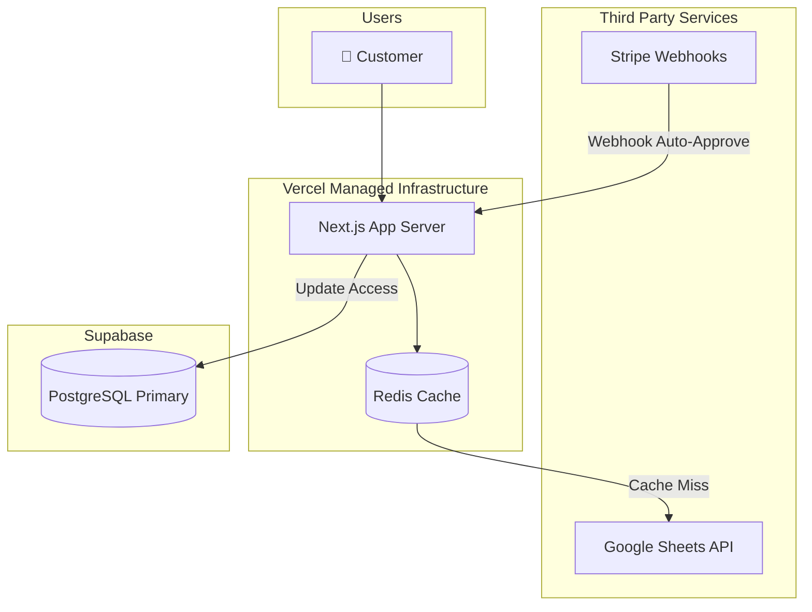
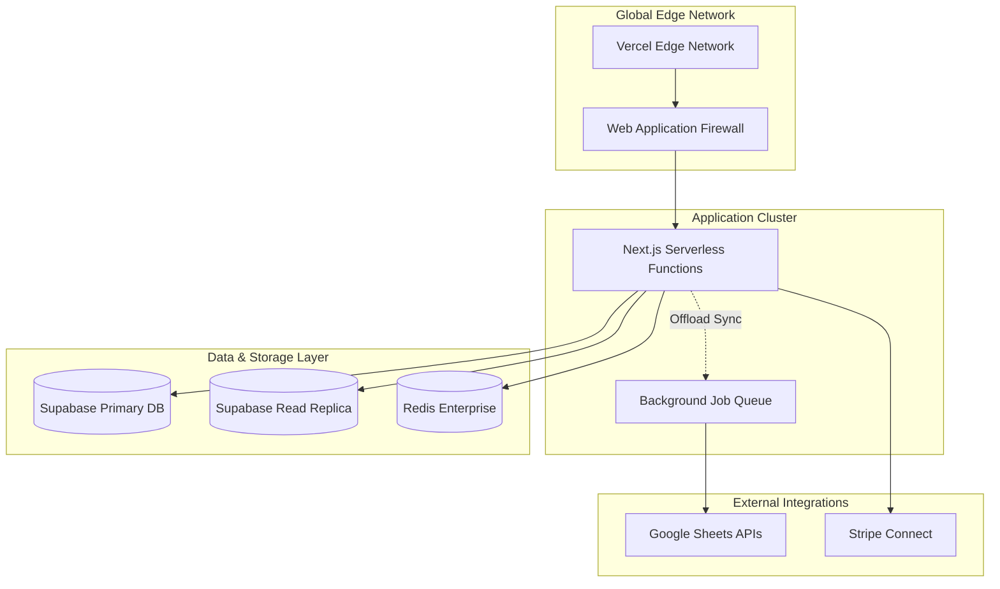
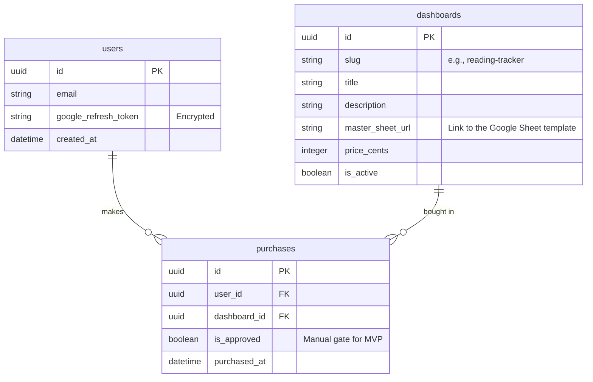
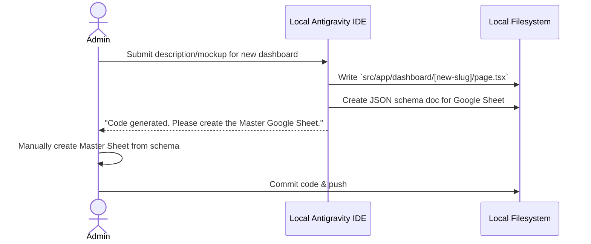

# Architecture: Dashboard Hub

## Overview
Dashboard Hub uses a modern, serverless architecture centered around Next.js on Vercel. The system serves dual purposes: a B2C storefront for selling tracking dashboards, and a B2B admin portal where Antigravity AI generates new dashboard components. User tracking data never touches our database; our Next.js backend securely proxies requests from the user's browser to their personal Google Sheet using OAuth credentials stored in Supabase.

## Phase 1: MVP & Storefront Validation

### Design Goals
- **Zero Fixed Cost:** Use Vercel and Supabase free tiers.
- **Data Privacy:** Read/write directly to Google Sheets; do not store tracking data in Supabase.
- **Manual Payment Security:** Stripe checkout links, but admin manually flips the `has_access` flag in Supabase to prevent unauthorized scraping or data leaks.

### Architecture Diagram

```mermaid
graph LR
    subgraph "External Providers"
        Google[Google Sheets API]
        Stripe[Stripe Checkout]
    end

    subgraph "Vercel Edge"
        Next[Next.js 15 App]
        NextAuth[Auth.js<br>Manages Tokens]
    end

    subgraph "Supabase"
        Auth[User Accounts]
        DB[(PostgreSQL<br>Catalog & Purchases)]
    end
    
    subgraph "Users"
        User[👤 Customer]
        Admin[👤 Admin (You)]
    end

    User -->|Views Store| Next
    User -->|Pays| Stripe
    User -->|OAuth Login| NextAuth
    NextAuth <--> Auth
    Next <--> DB
    Next -->|Reads/Writes Data| Google
    
    Admin -->|Manual Approval| DB
```

### Components
- **Next.js App Router**: Handles storefront rendering, user dashboard views, and secured API routes.
- **Auth.js**: Manages "Sign in with Google," requesting the `drive.file` scope, and storing the short-lived access tokens.
- **Supabase DB**: Holds user profiles, the catalog of available dashboards, and a `purchases` join table mapping users to dashboards.
- **Google Sheets API**: The actual backend for the life trackers. Next.js fetches data from here on behalf of the logged-in user.

### Estimated Cost: $0/mo

---

## Phase 2: Automation & Performance

### Trigger to Transition
- You have 3+ successful dashboard sales.
- Manual payment approvals become a bottleneck.
- Google Sheets API limits are causing slow load times for users.

### Architecture Diagram



### New Components & Upgrades
- **Stripe Webhooks**: Replaces manual approval. When a user buys, a webhook automatically updates the `purchases` table in Supabase.
- **Redis Caching (Vercel KV)**: Google Sheets APIs rate limit strictly (100 reqs/100sec). We must cache API responses for 10-30 seconds to prevent the dashboard from crashing if the user refreshes rapidly.

### Security Measures
- Stripe Webhook signature verification to prevent spoofed purchases.
- SWR (Stale-While-Revalidate) caching strategy to hide Google API latency.

### Estimated Cost: $45/mo 
(Vercel Pro $20 + Supabase Pro $25 for higher database performance/backups).

---

## Phase 3: Scale & Multi-Tenancy

### Trigger to Transition
- Thousands of users. 
- You want to allow *other* creators to design and sell their own dashboards on your platform (converting from a first-party store to a marketplace).

### Architecture Diagram



### Scaling Strategy
- **Stripe Connect**: Instead of standard Checkout, use Connect to route payouts to third-party dashboard creators while taking a platform fee.
- **Background Sync Workers**: Instead of fetching from Google Sheets while the user waits for the page to load, background workers keep the cache warm.
- **Database Read Replicas**: Supabase read replicas handle the heavy load of listing the catalog and validating user permissions.

### Estimated Cost: $150+/mo

---

## Data Architecture

Because user tracking data lives in Google Sheets, our database schema is incredibly lightweight.

### ERD (Supabase)



## IDE-Based AI Generation Flow

*Note: The AI generator is NOT hosted on the web app for security and simplicity. All dashboard generation happens locally in the creator's IDE.*


