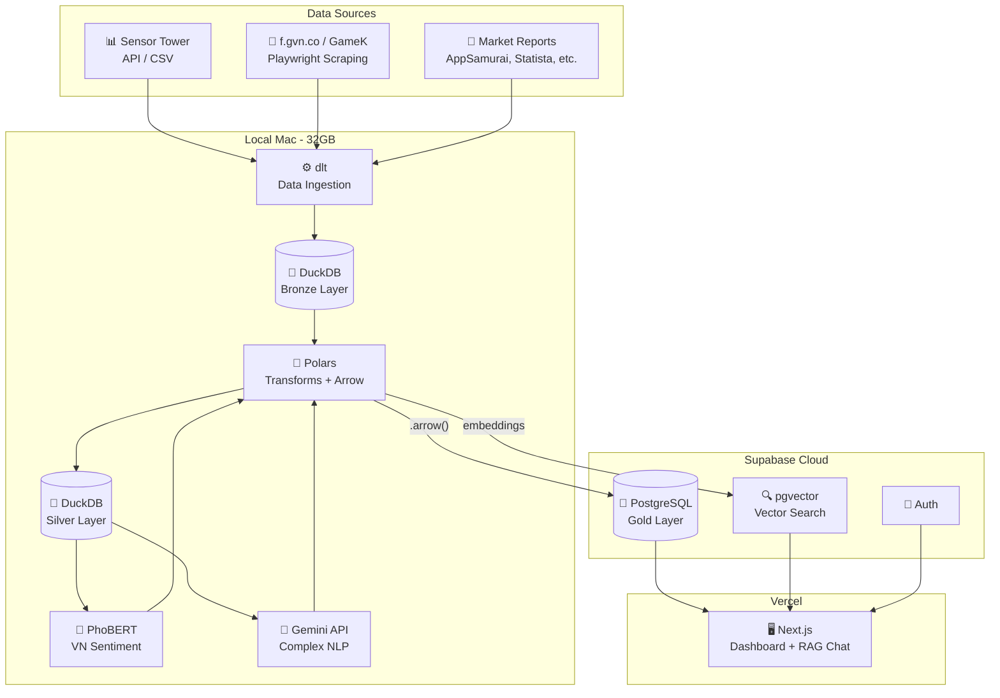
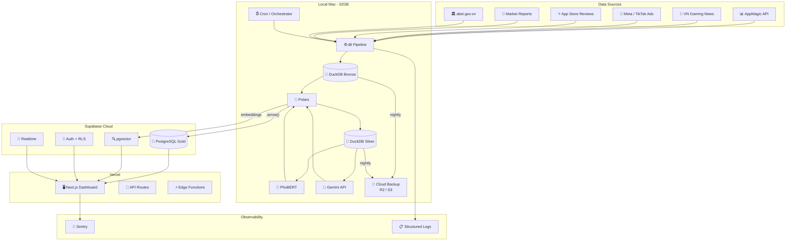
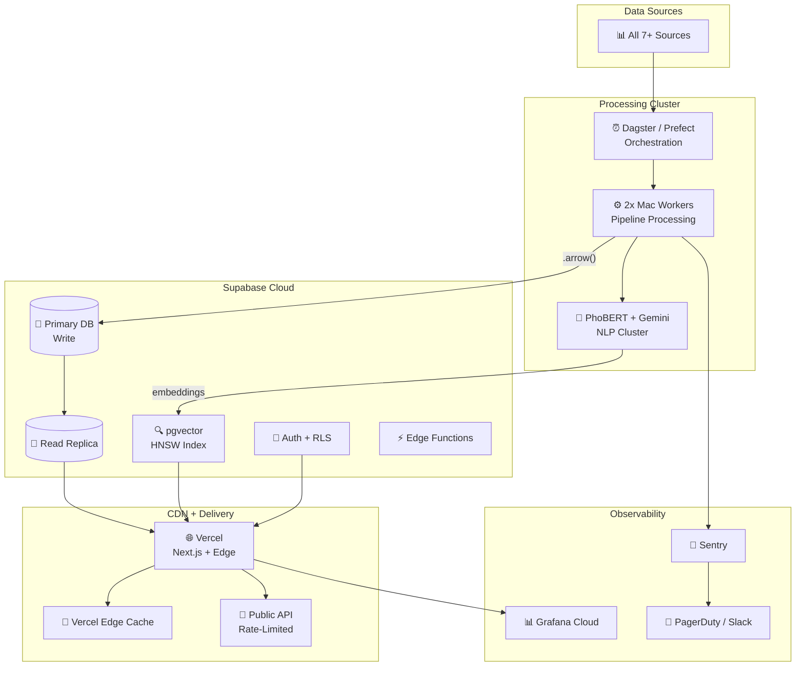
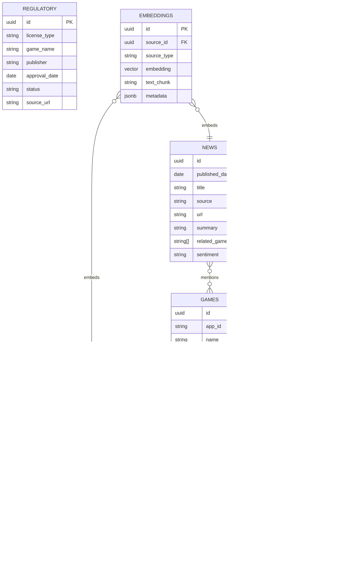
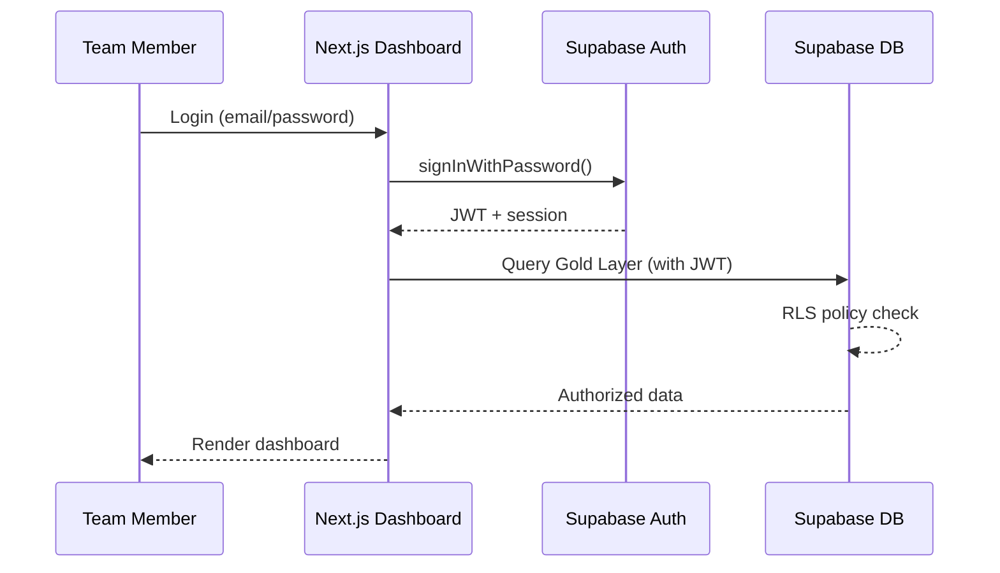

# Architecture: Hybrid Refinery

## Overview

Hybrid Refinery uses a **hybrid local-cloud architecture** — heavy data processing (ETL, NLP, transforms) runs locally on a 32GB Mac for cost efficiency, while the enriched Gold Layer data is served via Supabase (PostgreSQL + pgvector) for persistence and cloud access. The dashboard is a Next.js app deployed on Vercel that reads from Supabase. This approach minimizes cloud spend while maintaining production-grade data availability.

## Phase 1: Test / MVP

### Design Goals
- Fastest path to a working pipeline that ingests Sensor Tower data + Vietnamese gaming news
- Local processing for compute-heavy tasks (NLP, data transforms)
- Supabase as the single cloud dependency (Gold Layer + vector search)
- Internal Next.js dashboard on Vercel for team access

### Architecture Diagram

### Components
| Component | Role | Cost |
|---|---|---|
| dlt | Extract from Sensor Tower, scrape news sites, ingest reports | Free |
| DuckDB (Bronze/Silver) | Raw and cleaned data storage, SQL window functions | Free |
| Polars | Data transforms, zero-copy Arrow transfer | Free |
| PhoBERT | Vietnamese sentiment tagging for short text | Free |
| Gemini API | Complex NLP, embeddings, RAG synthesis | ~$5-50/mo |
| Supabase | Gold Layer (PostgreSQL), pgvector, Auth | Free → $25/mo |
| Next.js + Vercel | Internal dashboard, RAG chat interface | Free → $20/mo |

### Estimated Cost: $2K-3.3K/mo (with Sensor Tower) → $30-95/mo (infra only)

## Phase 2: Production

### Trigger to Transition
- Pipeline runs reliably for 30+ days with daily data updates
- Team uses dashboard regularly for report generation
- 3+ data sources integrated and producing insights
- Sensor Tower migration to AppMagic initiated

### Architecture Diagram

### New Components
| Addition | Purpose |
|---|---|
| Cron scheduler | Automated daily pipeline runs |
| Cloud backup (R2/S3) | Nightly DuckDB file backups for disaster recovery |
| Structured logging | Pipeline observability and debugging |
| Sentry | Error tracking across pipeline + dashboard |
| Supabase RLS | Row-level security for team access control |
| Realtime | Live dashboard updates when Gold Layer changes |
| Edge functions | Rate-limited API endpoints for RAG chat |

### Security Measures
- Supabase RLS policies for data access control
- API keys stored in Vercel environment variables
- Sentry for error alerting
- Git-versioned pipeline code
- Nightly DuckDB backups to object storage

### Estimated Cost: $475-1,120/mo (after AppMagic migration)

## Phase 3: Scale

### Trigger to Transition
- Team size exceeds 5 concurrent dashboard users
- Data volume exceeds 100GB Gold Layer
- Pipeline processing time exceeds 4 hours per run
- Client demand for programmatic API access to intelligence data

### Architecture Diagram

### Scaling Strategy
| Component | Scaling Approach |
|---|---|
| Pipeline processing | Add second Mac worker, distribute data sources across workers |
| Database | Supabase read replicas for dashboard queries, primary for writes |
| Vector search | HNSW index optimization, filtered search for performance |
| Dashboard | Vercel Edge Cache for common queries, ISR for static pages |
| API | Rate-limited public API for client programmatic access |
| Orchestration | Migrate from cron to Dagster/Prefect for complex DAG management |

### Performance Optimizations
- Incremental pipeline runs (dlt handles this natively)
- Materialized views in PostgreSQL for common dashboard queries
- Vercel ISR for report pages (regenerate every hour)
- pgvector HNSW index with filtered search for targeted RAG
- Apache Arrow for all data transfer between components

### Estimated Cost: $1,500-3,000/mo (with AppMagic + Supabase Team + Vercel Pro)

## Data Architecture

### ERD

### Key Data Flows

1. **Sensor Tower → Bronze → Silver → Gold (MARKET_DATA)**
   - Daily automated ingestion via dlt
   - Silver layer: 7-day moving averages, DoD/WoW deltas via DuckDB SQL
   - Gold layer: Enriched records pushed to Supabase

2. **News/Reviews → Bronze → Silver (+ NLP) → Gold (SENTIMENT, NEWS)**
   - Playwright scrapes f.gvn.co, GameK
   - PhoBERT tags short text sentiment locally
   - Gemini processes complex text for topics + intent
   - Embeddings generated and stored in pgvector

3. **Ads → Bronze → Gold (AD_CREATIVES)**
   - Meta Ads Library API fetches competitor ad data
   - Stored with creative metadata and run duration

## API Design

### Key Endpoints (Next.js API Routes)

| Method | Endpoint | Purpose |
|---|---|---|
| GET | `/api/games` | List tracked games with latest metrics |
| GET | `/api/games/[id]/trends` | Time-series revenue/download data |
| GET | `/api/games/[id]/sentiment` | Sentiment analysis results |
| GET | `/api/news` | Latest gaming news with sentiment |
| GET | `/api/ads/[game_id]` | Ad creatives for a specific game |
| POST | `/api/chat` | RAG chat — query Gold Layer via pgvector |
| GET | `/api/alerts` | Triggered alert scenarios |
| POST | `/api/reports/generate` | Generate PDF/Markdown report |

### Authentication Flow

