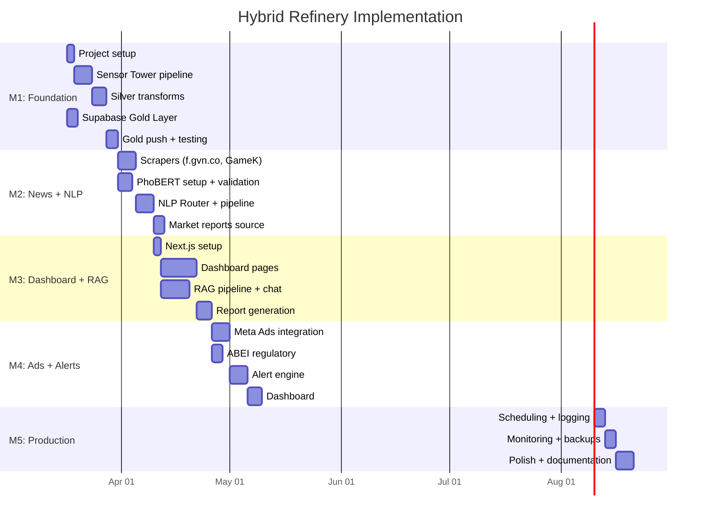

# Implementation Plan: Hybrid Refinery

## Overview

This plan breaks Hybrid Refinery into **5 milestones** spanning approximately **12-16 weeks** for a solo developer. Each milestone produces a shippable increment that delivers immediate value.

---

## Milestone 1: Foundation & First Pipeline (Weeks 1-3)

**Goal**: Working Medallion pipeline that ingests Sensor Tower data into DuckDB and pushes enriched data to Supabase.

### Tasks

| # | Task | Effort | Dependencies |
|---|---|---|---|
| 1.1 | Set up Python project structure (pyproject.toml, venv, linting) | 2h | — |
| 1.2 | Verify Sensor Tower API access; document available endpoints | 2h | — |
| 1.3 | Build dlt source for Sensor Tower API/CSV ingestion | 8h | 1.1, 1.2 |
| 1.4 | Create DuckDB Bronze schema; load raw Sensor Tower dumps | 4h | 1.3 |
| 1.5 | Build Polars Silver transforms: 7-day MA, DoD/WoW deltas | 8h | 1.4 |
| 1.6 | Set up Supabase project; create Gold Layer schema (GAMES, MARKET_DATA tables) | 4h | — |
| 1.7 | Build Gold push: Polars → Arrow → Supabase (via Python client) | 6h | 1.5, 1.6 |
| 1.8 | End-to-end pipeline test: Sensor Tower → Bronze → Silver → Gold | 4h | 1.7 |
| 1.9 | Set up GitHub repo + basic CI (linting, type checks) | 2h | 1.1 |

**Deliverable**: Automated pipeline that loads Sensor Tower data through Bronze → Silver → Gold layers. Gold Layer queryable via Supabase dashboard.

**Definition of Done**:
- [ ] Pipeline runs end-to-end without errors
- [ ] Gold Layer contains enriched MARKET_DATA with moving averages and deltas
- [ ] Supabase tables match ERD schema
- [ ] Pipeline code in GitHub with CI passing

---

## Milestone 2: News Scraping & NLP Engine (Weeks 4-6)

**Goal**: Ingest Vietnamese gaming news from f.gvn.co and GameK, apply NLP sentiment analysis, and store results in Gold Layer.

### Tasks

| # | Task | Effort | Dependencies |
|---|---|---|---|
| 2.1 | Build Playwright scraper for f.gvn.co: extract articles, titles, dates | 8h | M1 |
| 2.2 | Build Playwright/RSS scraper for GameK | 6h | M1 |
| 2.3 | Build dlt source wrapping scrapers (incremental by date) | 4h | 2.1, 2.2 |
| 2.4 | Set up PhoBERT locally: download model, create inference pipeline | 4h | — |
| 2.5 | Build Hybrid NLP Router: <50 words → PhoBERT, 50+ words → Gemini API | 6h | 2.4 |
| 2.6 | Validate PhoBERT on sample gaming reviews (20-50 examples) | 4h | 2.4 |
| 2.7 | Create SENTIMENT and NEWS tables in Supabase Gold Layer | 2h | M1.6 |
| 2.8 | Build Silver → NLP → Gold pipeline for news/sentiment data | 8h | 2.3, 2.5, 2.7 |
| 2.9 | Add error handling, retry logic, rate limiting to scrapers | 4h | 2.1, 2.2 |
| 2.10 | Build market reports dlt source (RSS/web for AppSamurai, Statista, etc.) | 6h | M1 |

**Deliverable**: Pipeline ingests Vietnamese gaming news, applies sentiment analysis (PhoBERT/Gemini), and stores enriched data in Gold Layer alongside market data.

**Definition of Done**:
- [ ] f.gvn.co and GameK scrapers run without errors for 7 consecutive days
- [ ] PhoBERT accuracy validated at >85% on gaming text sample
- [ ] NEWS and SENTIMENT tables populated with daily data
- [ ] Market reports data available in Gold Layer
- [ ] NLP Router correctly routes based on text length

---

## Milestone 3: RAG Pipeline & Dashboard MVP (Weeks 7-10)

**Goal**: Working Next.js dashboard with data visualizations and RAG chat interface for "talking to the data."

### Tasks

| # | Task | Effort | Dependencies |
|---|---|---|---|
| 3.1 | Set up Next.js 15 project with Tailwind CSS, App Router | 2h | — |
| 3.2 | Configure Supabase client (`@supabase/ssr`) with auth | 4h | 3.1 |
| 3.3 | Build Gemini embedding pipeline: generate vectors for NEWS + SENTIMENT | 6h | M2 |
| 3.4 | Set up pgvector in Supabase: EMBEDDINGS table + HNSW index | 4h | 3.3 |
| 3.5 | Build dashboard: Game overview page (revenue trends, download charts) | 12h | 3.1, 3.2 |
| 3.6 | Build dashboard: Sentiment analysis page (word clouds, sentiment timeline) | 8h | 3.5 |
| 3.7 | Build dashboard: News feed page (latest news with sentiment coloring) | 6h | 3.5 |
| 3.8 | Build RAG chat API route: user query → embedding → pgvector search → Gemini synthesis | 10h | 3.4 |
| 3.9 | Build RAG chat UI component (conversational interface) | 6h | 3.8 |
| 3.10 | Deploy to Vercel, configure environment variables | 2h | 3.5 |
| 3.11 | Build report generation: export dashboard data as PDF/Markdown | 8h | 3.5, 3.6, 3.7 |

**Deliverable**: Internal dashboard with interactive charts, sentiment analysis, news feed, RAG chat, and report export. Deployed on Vercel.

**Definition of Done**:
- [ ] Dashboard loads game trends, sentiment, and news from Supabase
- [ ] RAG chat returns relevant answers based on pipeline data
- [ ] Reports exportable as PDF/Markdown
- [ ] Deployed on Vercel, accessible by team
- [ ] Auth working (team members login required)

---

## Milestone 4: Ad Intelligence & Alerts (Weeks 11-13)

**Goal**: Add ad creative tracking from Meta Ads Library (+ TikTok if approved) and implement automated alert scenarios.

### Tasks

| # | Task | Effort | Dependencies |
|---|---|---|---|
| 4.1 | Register Meta developer app, obtain Ads Library API access | 2h | — |
| 4.2 | Build dlt source for Meta Ads Library: competitor ad creatives | 8h | 4.1 |
| 4.3 | Apply for TikTok Commercial Content API access | 1h | — |
| 4.4 | Build dlt source for TikTok Ads (if approved) | 6h | 4.3 |
| 4.5 | Create AD_CREATIVES table in Supabase | 2h | M1.6 |
| 4.6 | Build ABEI regulatory scraper (abei.gov.vn G1 license monitoring) | 6h | M2 |
| 4.7 | Create REGULATORY table in Supabase | 2h | M1.6 |
| 4.8 | Implement alert engine: configurable threshold SQL queries | 8h | M3 |
| 4.9 | Gacha Backlash alert: revenue spike + sentiment drop correlation | 4h | 4.8 |
| 4.10 | Silent Churn alert: revenue decline + zero engagement detection | 4h | 4.8 |
| 4.11 | Viral Optimization alert: download spike + social topic correlation | 4h | 4.8 |
| 4.12 | Dashboard: Ads page + Alerts page | 10h | 4.5, 4.8, M3 |

**Deliverable**: Ad creative intelligence from Meta/TikTok, ABEI regulatory monitoring, and automated alert system with configurable thresholds.

**Definition of Done**:
- [ ] Meta Ads data flowing into Gold Layer daily
- [ ] ABEI regulatory updates scraped and stored
- [ ] Alert engine fires correctly on test data for all 3 scenarios
- [ ] Dashboard shows ad creatives and triggered alerts
- [ ] Alert thresholds are configurable via dashboard or config file

---

## Milestone 5: Production Hardening (Weeks 14-16)

**Goal**: Productionize the entire system with scheduling, monitoring, backups, and documentation.

### Tasks

| # | Task | Effort | Dependencies |
|---|---|---|---|
| 5.1 | Set up cron scheduler for daily pipeline runs (local crontab or Dagster) | 4h | M4 |
| 5.2 | Implement structured logging across all pipeline modules | 4h | M4 |
| 5.3 | Set up Sentry for error tracking (pipeline + dashboard) | 4h | M4 |
| 5.4 | Build nightly DuckDB backup to Cloudflare R2 or S3 | 4h | M4 |
| 5.5 | Implement Supabase RLS policies for team access control | 4h | M3 |
| 5.6 | Add incremental loading to all dlt sources (avoid re-processing old data) | 6h | M4 |
| 5.7 | Performance testing: pipeline throughput, dashboard load times | 4h | M4 |
| 5.8 | Write ops runbook: pipeline recovery, common errors, monitoring guide | 6h | M4 |
| 5.9 | Dashboard polish: loading states, error handling, responsive design | 6h | M3 |
| 5.10 | Document Sensor Tower → AppMagic migration plan for future execution | 2h | — |

**Deliverable**: Production-grade system with automated scheduling, monitoring, backups, and documentation.

**Definition of Done**:
- [ ] Pipeline runs daily via cron without manual intervention for 14+ days
- [ ] Sentry captures and alerts on pipeline errors
- [ ] DuckDB backed up nightly to cloud storage
- [ ] Ops runbook covers all common failure scenarios
- [ ] Dashboard handles edge cases (loading, errors, empty states)

---

## Timeline Summary

## Risk-Adjusted Notes

> [!CAUTION]
> **Sensor Tower API access is the #1 blocker.** Task 1.2 (verify API access) must complete before Task 1.3 (build dlt source). If API access is unavailable, immediately evaluate AppMagic as a replacement — this adds 1-2 weeks to Milestone 1.

> [!WARNING]
> **Vietnamese site scrapers (f.gvn.co, GameK) will require ongoing maintenance.** Budget 2-4 hours/month post-launch for scraper fixes as site structures change.

> [!NOTE]
> **Milestone 3 is the longest** (4 weeks) because it spans both backend (RAG pipeline) and frontend (dashboard) work. Can be parallelized if a second developer is available.
