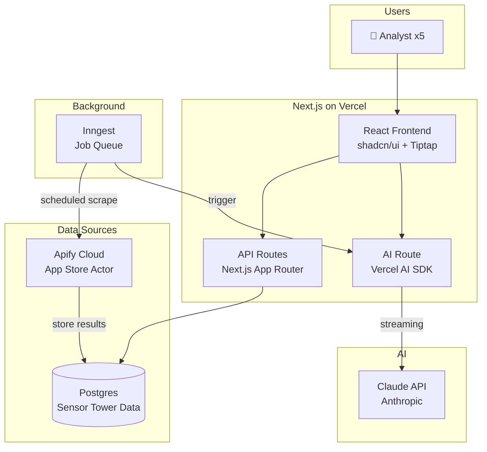
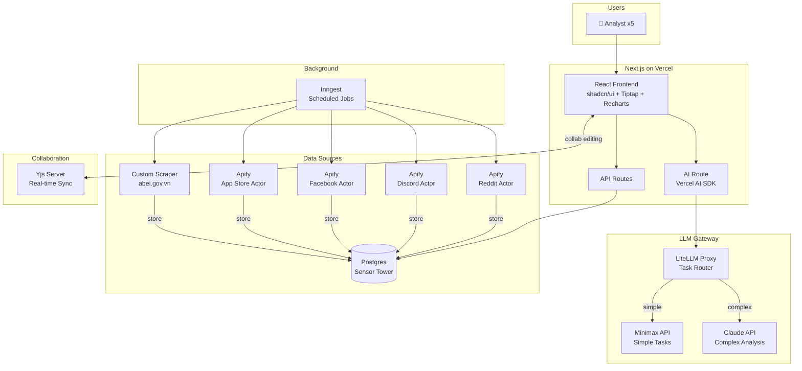
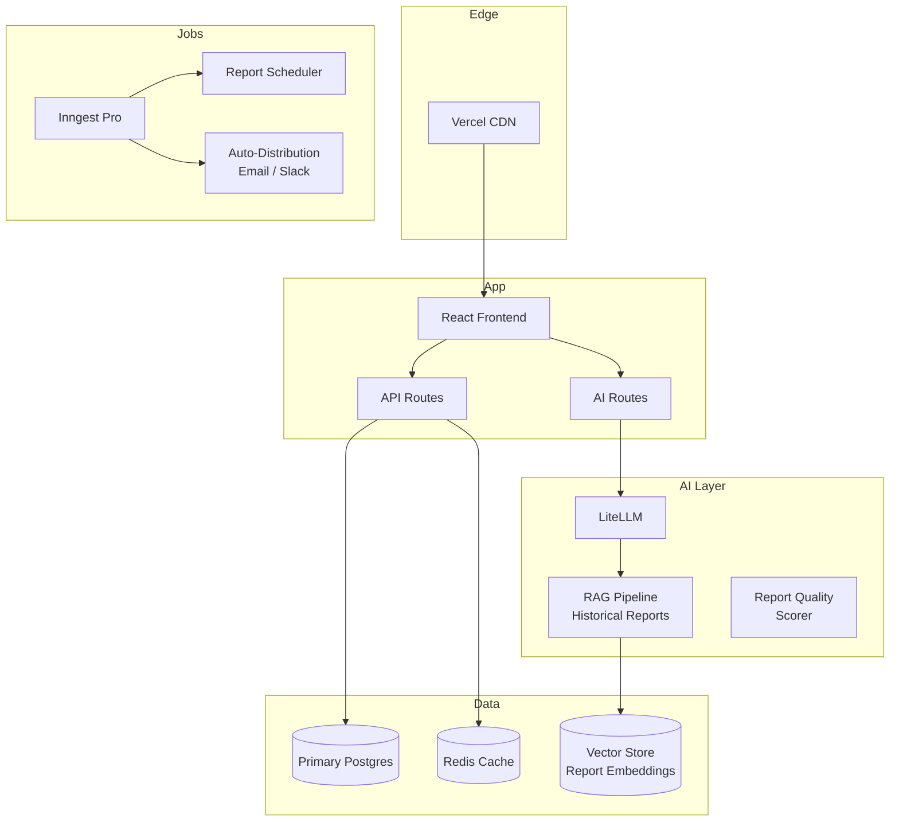
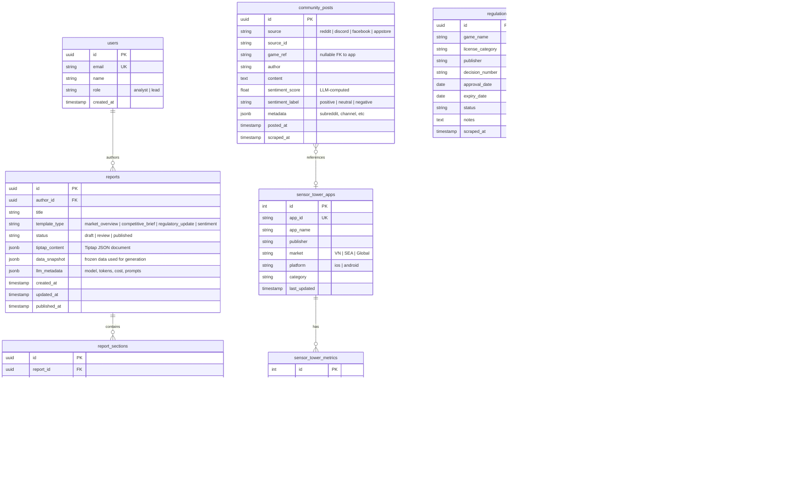

# Architecture: Market Insights Platform

## Overview

The Market Insights Platform follows a **data-first, pipeline-oriented architecture**. Raw data flows through three stages: **Ingest → Enrich → Generate**. Sensor Tower market data (already in Postgres) is combined with community sentiment data (via Apify) and regulation data (custom scraper) into a unified data store. LLM pipelines transform enriched data into draft reports, which are presented in a collaborative rich text editor for human review and publishing. The system is designed as a Next.js monolith deployed on Vercel, with background jobs handling data ingestion and report generation asynchronously.

## Phase 1: MVP (Weeks 1-6)

### Design Goals

- Validate the core workflow: data → LLM → draft report → human edit → publish
- Single LLM provider (Claude) to minimize integration complexity
- 2 data sources only: existing Sensor Tower (Postgres) + 1 Apify source (App Store reviews)
- Simple email auth for 5 internal users

### Architecture Diagram



### Components

| Component | Technology | Purpose |
|---|---|---|
| Frontend / UI | Next.js 15 + React + shadcn/ui | Dashboard and report interface |
| Report Editor | Tiptap 2.x | Rich text editing with LLM content insertion |
| API Layer | Next.js API Routes | Data queries, report CRUD, auth |
| AI Streaming | Vercel AI SDK v6 | Stream Claude responses to editor |
| Database | PostgreSQL (existing) | Store all data: market, community, reports |
| ORM | Drizzle | Type-safe database access, migrations |
| Scraping | Apify SDK + App Store Actor | Collect App Store reviews |
| Background Jobs | Inngest | Scheduled scraping, report generation |
| Auth | NextAuth.js | Email-based login for 5 users |
| Hosting | Vercel | Deployment, preview URLs |

### Estimated Cost: ~$30-50/mo

---

## Phase 2: Production (Weeks 7-12)

### Trigger to Transition

MVP validated: team actively using report generation workflow, at least 10 reports generated, feedback confirms workflow value.

### Architecture Diagram



### New Components (over Phase 1)

| Component | Technology | Purpose |
|---|---|---|
| LLM Router | LiteLLM (self-hosted) | Route tasks by complexity to Minimax or Claude |
| Dashboard Charts | Recharts | Visualize market trends, sentiment, KPIs |
| Community Scrapers | Apify (Reddit, Discord, Facebook actors) | Collect community data from 4 platforms |
| Regulation Scraper | Custom (Cheerio + fetch) | Parse abei.gov.vn game license data |
| Collaboration Server | Yjs (Hocuspocus or self-hosted) | Real-time multi-user report editing |
| Report Templates | 4+ templates | Market Overview, Competitive Brief, Regulatory Update, Sentiment |

### Security Measures

- Server-side API key storage (env vars on Vercel, never exposed to client)
- NextAuth session validation on all API routes
- Rate limiting on AI routes to prevent cost overrun
- LLM output sanitization before rendering in editor
- No PII sent to LLM APIs (only aggregated market data)

### Estimated Cost: ~$155-235/mo

---

## Phase 3: Scale (Months 4-6+)

### Trigger to Transition

Production stable: 20+ reports/month, team requests advanced features (RAG, scheduling, auto-distribution), potential to onboard additional teams.

### Architecture Diagram



### Scaling Strategy

| Component | Scaling Approach |
|---|---|
| Frontend | Vercel auto-scales with edge CDN |
| API Routes | Vercel serverless auto-scaling |
| Database | Supabase Pro with connection pooling (PgBouncer) |
| LLM Gateway | Self-hosted LiteLLM with load balancing across providers |
| Background Jobs | Inngest Pro for higher concurrency and longer step functions |
| Collaboration | Hocuspocus Cloud or self-hosted Yjs cluster |

### Performance Optimizations

- RAG pipeline using historical reports as context for better analysis quality
- Redis caching for frequently accessed market data queries
- Vector embeddings of past reports for similarity search and deduplication
- Report generation queue with priority levels (urgent vs. scheduled)
- Pre-computed dashboard aggregates refreshed on data ingestion

### Estimated Cost: ~$475-825/mo

---

## Data Architecture

### ERD



### Key Data Flows

#### Flow 1: Data Ingestion Pipeline

```
┌──────────────┐     ┌──────────────┐     ┌──────────────┐
│  Inngest      │────▶│  Apify SDK   │────▶│  PostgreSQL  │
│  (scheduled)  │     │  (scrape)    │     │  (store)     │
└──────────────┘     └──────────────┘     └──────────────┘
        │                                         │
        │              ┌──────────────┐          │
        └─────────────▶│  Reg Scraper │──────────┘
                       │  (cheerio)   │
                       └──────────────┘

Schedule: 
- Apify scrapers: weekly (configurable per source)
- Regulation scraper: monthly
- Sensor Tower: already in DB (monthly batch by existing process)
```

#### Flow 2: Report Generation Pipeline

```
┌──────────┐    ┌───────────┐    ┌──────────┐    ┌──────────┐    ┌──────────┐
│ Analyst   │───▶│ Select    │───▶│ Fetch    │───▶│ LLM      │───▶│ Tiptap   │
│ clicks    │    │ template  │    │ relevant │    │ generate │    │ editor   │
│ "Generate"│    │ + params  │    │ data     │    │ sections │    │ (draft)  │
└──────────┘    └───────────┘    └──────────┘    └──────────┘    └──────────┘
                                       │               │               │
                                       ▼               ▼               ▼
                                  sensor_tower    Vercel AI SDK    Human edits
                                  community       streaming        + publishes
                                  regulation      to frontend      final report
```

**Step-by-step:**

1. Analyst selects a report template (e.g., "Market Overview — Vietnam — March 2026")
2. System fetches relevant data: top apps by downloads/revenue, community posts with sentiment, recent regulation changes
3. Data is structured into a **data snapshot** (frozen JSON stored with report for reproducibility)
4. Template prompt + data snapshot sent to Claude via Vercel AI SDK
5. Response streams into Tiptap editor as structured sections (summary, market data, sentiment analysis, regulatory notes, recommendations)
6. Analyst reviews, edits, and publishes the report
7. LLM metadata (model, tokens, cost) logged for tracking

#### Flow 3: Community Sentiment Pipeline

```
┌──────────┐    ┌──────────┐    ┌──────────┐    ┌──────────┐
│ Apify    │───▶│ Raw      │───▶│ Claude   │───▶│ Enriched │
│ scrape   │    │ posts    │    │ classify │    │ posts    │
│ (weekly) │    │ stored   │    │ sentiment│    │ w/ score │
└──────────┘    └──────────┘    └──────────┘    └──────────┘
```

**Sentiment classification prompt** (run via Minimax in Phase 2 for cost savings):
- Input: batch of 50 community posts
- Output: `{post_id, sentiment: "positive"|"neutral"|"negative", score: 0.0-1.0, key_topics: [...]}`
- Stored in `community_posts.sentiment_score` and `sentiment_label`

### API Contract Summary

#### Core Endpoints

| Method | Path | Purpose | Auth |
|---|---|---|---|
| `GET` | `/api/dashboard` | Dashboard KPIs and trends | ✅ |
| `GET` | `/api/apps` | Search Sensor Tower apps | ✅ |
| `GET` | `/api/apps/[id]/metrics` | App metrics time series | ✅ |
| `GET` | `/api/community` | Community posts w/ sentiment | ✅ |
| `GET` | `/api/regulations` | Regulation entries w/ filters | ✅ |
| `GET` | `/api/reports` | List user's reports | ✅ |
| `POST` | `/api/reports` | Create new report | ✅ |
| `PUT` | `/api/reports/[id]` | Save report content | ✅ |
| `PATCH` | `/api/reports/[id]/status` | Change report status | ✅ |
| `POST` | `/api/reports/[id]/generate` | Trigger LLM generation | ✅ |
| `POST` | `/api/ai/chat` | Streaming AI chat for editor | ✅ |
| `POST` | `/api/scrape/trigger` | Manually trigger scrape job | ✅ (lead) |
| `GET` | `/api/scrape/jobs` | Scrape job status | ✅ |

#### Key Request/Response Contracts

**POST `/api/reports/[id]/generate`**
```typescript
// Request
{
  templateType: "market_overview" | "competitive_brief" | "regulatory_update" | "sentiment",
  params: {
    market: "VN" | "SEA" | "Global",
    period: "2026-03",          // month
    appIds?: number[],          // specific apps to focus on
    includeRegulation?: boolean,
    includeSentiment?: boolean,
  }
}

// Response (streamed via Vercel AI SDK)
{
  sections: [
    {
      type: "summary",
      content: "<markdown>",
      model: "claude-sonnet-4-20250514",
      tokens: { input: 2400, output: 800 },
      cost: 0.019
    },
    // ... more sections
  ],
  totalCost: 0.087,
  dataSnapshot: { /* frozen data used */ }
}
```

**GET `/api/dashboard`**
```typescript
// Response
{
  topMovers: [{ appName, downloads, change_pct }],
  revenueLeaders: [{ appName, revenue, change_pct }],
  sentimentSummary: {
    positive: 45, neutral: 30, negative: 25,
    trending_topics: ["gacha rates", "server lag", "new event"]
  },
  recentRegulations: [{ gameName, category, approvalDate }],
  reportActivity: { drafts: 3, published: 12, thisWeek: 2 }
}
```

### Folder Structure (Next.js Project)

```
market-insights-platform/
├── src/
│   ├── app/                          # Next.js App Router
│   │   ├── (auth)/
│   │   │   ├── login/page.tsx
│   │   │   └── layout.tsx
│   │   ├── (dashboard)/
│   │   │   ├── page.tsx              # Main dashboard
│   │   │   ├── apps/page.tsx         # App rankings browser
│   │   │   ├── community/page.tsx    # Community sentiment view
│   │   │   ├── regulations/page.tsx  # Regulation tracker
│   │   │   ├── reports/
│   │   │   │   ├── page.tsx          # Report list
│   │   │   │   ├── new/page.tsx      # New report wizard
│   │   │   │   └── [id]/page.tsx     # Report editor (Tiptap)
│   │   │   └── settings/page.tsx     # Scrape config, user mgmt
│   │   ├── api/
│   │   │   ├── ai/chat/route.ts      # Streaming AI endpoint
│   │   │   ├── reports/
│   │   │   │   ├── route.ts          # CRUD
│   │   │   │   └── [id]/
│   │   │   │       ├── route.ts
│   │   │   │       └── generate/route.ts
│   │   │   ├── dashboard/route.ts
│   │   │   ├── apps/route.ts
│   │   │   ├── community/route.ts
│   │   │   ├── regulations/route.ts
│   │   │   ├── scrape/
│   │   │   │   ├── trigger/route.ts
│   │   │   │   └── jobs/route.ts
│   │   │   └── inngest/route.ts      # Inngest webhook handler
│   │   └── layout.tsx                # Root layout
│   ├── components/
│   │   ├── ui/                       # shadcn/ui components
│   │   ├── dashboard/                # Dashboard widgets
│   │   ├── editor/                   # Tiptap editor + extensions
│   │   ├── reports/                  # Report-specific components
│   │   └── layout/                   # Navigation, sidebar
│   ├── lib/
│   │   ├── db/
│   │   │   ├── schema.ts            # Drizzle schema definitions
│   │   │   ├── index.ts             # DB connection
│   │   │   └── migrations/          # Drizzle migrations
│   │   ├── ai/
│   │   │   ├── prompts/             # Report generation prompts
│   │   │   ├── router.ts            # Task complexity classifier
│   │   │   └── providers.ts         # LLM provider configs
│   │   ├── scraping/
│   │   │   ├── apify.ts             # Apify SDK wrapper
│   │   │   ├── regulation.ts        # abei.gov.vn scraper
│   │   │   └── sentiment.ts         # Sentiment classification
│   │   ├── inngest/
│   │   │   ├── client.ts            # Inngest client
│   │   │   └── functions.ts         # Job definitions
│   │   └── auth.ts                  # NextAuth config
│   └── types/
│       └── index.ts                 # Shared TypeScript types
├── drizzle.config.ts
├── next.config.ts
├── package.json
├── tsconfig.json
└── .env.local                        # API keys (never committed)
```
