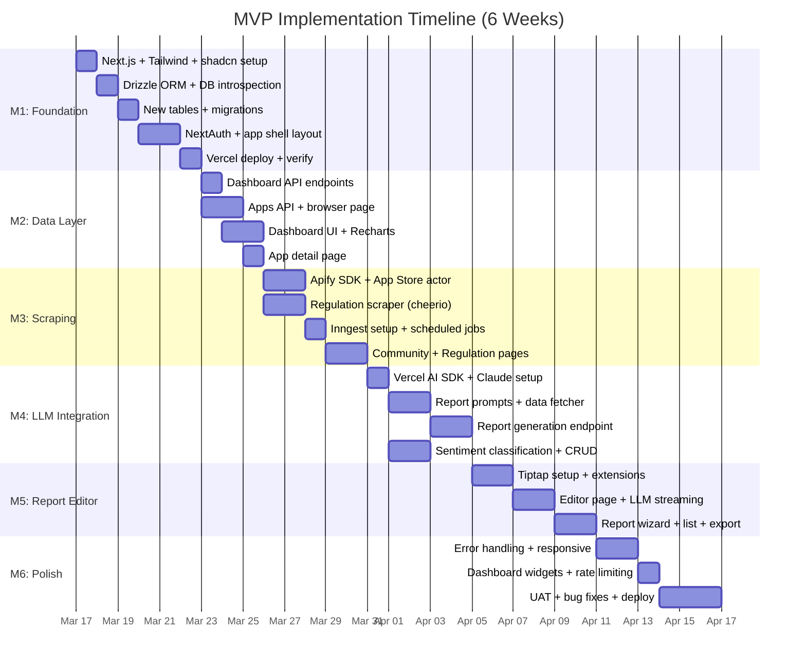

# Implementation Plan: Market Insights Platform

## Overview

The MVP build spans **6 weeks** across **6 milestones**, progressing from foundation → data → scraping → LLM → editor → polish. Each milestone produces a deployable increment. The plan covers the MVP phase only (Claude-only, 2 data sources, basic editor). Production phase (multi-LLM, all scrapers, collaboration) is planned as a follow-on after MVP validation.

**Team**: 1 developer (AI-assisted) building for 5 internal analyst users.

## Milestones

### Milestone 1: Foundation & Auth (Week 1)

**Goal**: Deployable Next.js app with auth, database connection, and base UI shell.

| # | Task | Effort | Dependencies | Status |
|---|---|---|---|---|
| 1.1 | Initialize Next.js 15 project with TypeScript, Tailwind 4, App Router | 2h | — | ⬜ |
| 1.2 | Install and configure shadcn/ui (sidebar, button, card, table, dialog, tabs) | 2h | 1.1 | ⬜ |
| 1.3 | Set up Drizzle ORM with connection to existing Postgres | 3h | 1.1 | ⬜ |
| 1.4 | Introspect existing Sensor Tower tables (sensor_tower_apps, sensor_tower_metrics) | 2h | 1.3 | ⬜ |
| 1.5 | Create new tables: users, reports, report_sections, community_posts, regulation_entries, scrape_jobs | 3h | 1.3 | ⬜ |
| 1.6 | Configure NextAuth.js with email/password provider for 5 users | 3h | 1.5 | ⬜ |
| 1.7 | Build app shell layout: sidebar navigation, header, auth guard | 4h | 1.2, 1.6 | ⬜ |
| 1.8 | Deploy to Vercel, verify auth flow works | 1h | 1.7 | ⬜ |

**Effort Total**: ~20h (1 week)

**Definition of Done**:
- [ ] App deploys to Vercel and loads without errors
- [ ] Users can log in with email/password
- [ ] Sidebar navigation renders all page routes (dashboard, apps, community, regulations, reports, settings)
- [ ] Drizzle can query existing Sensor Tower data
- [ ] New tables created via migration

---

### Milestone 2: Data Layer & Dashboard (Week 2)

**Goal**: Dashboard showing Sensor Tower data with KPI widgets and trend charts.

| # | Task | Effort | Dependencies | Status |
|---|---|---|---|---|
| 2.1 | Build `GET /api/dashboard` endpoint — aggregate top movers, revenue leaders from Sensor Tower data | 4h | M1 | ⬜ |
| 2.2 | Build `GET /api/apps` endpoint — paginated, searchable, filterable app list | 3h | M1 | ⬜ |
| 2.3 | Build `GET /api/apps/[id]/metrics` endpoint — time series data for a single app | 2h | M1 | ⬜ |
| 2.4 | Create Dashboard page with KPI cards (top movers, revenue leaders, report activity) | 4h | 2.1 | ⬜ |
| 2.5 | Add Recharts line/bar charts for download and revenue trends | 3h | 2.1 | ⬜ |
| 2.6 | Create Apps browser page with data table, search, and filters (market, category, platform) | 4h | 2.2 | ⬜ |
| 2.7 | Create App detail page with metrics charts | 3h | 2.3 | ⬜ |

**Effort Total**: ~23h (1 week)

**Definition of Done**:
- [ ] Dashboard renders real Sensor Tower data with KPI cards
- [ ] Recharts displays monthly download/revenue trend charts
- [ ] Apps page shows paginated/searchable list of apps
- [ ] App detail page shows historical metrics graph
- [ ] All API endpoints return correct JSON with proper error handling

---

### Milestone 3: Scraping Pipeline (Week 3)

**Goal**: Automated data collection from App Store reviews and abei.gov.vn regulation data.

| # | Task | Effort | Dependencies | Status |
|---|---|---|---|---|
| 3.1 | Set up Apify SDK client in `lib/scraping/apify.ts` | 2h | M1 | ⬜ |
| 3.2 | Configure App Store Reviews Apify actor — target top 50 games in VN market | 3h | 3.1 | ⬜ |
| 3.3 | Build Apify result parser → store in `community_posts` table | 3h | 3.2 | ⬜ |
| 3.4 | Build custom regulation scraper (`lib/scraping/regulation.ts`) — fetch + parse abei.gov.vn HTML | 4h | M1 | ⬜ |
| 3.5 | Parse regulation data → store in `regulation_entries` table (game name, category G1-G4, date, status) | 3h | 3.4 | ⬜ |
| 3.6 | Set up Inngest client and webhook handler at `/api/inngest` | 2h | M1 | ⬜ |
| 3.7 | Create Inngest functions: `scrape-appstore-reviews` (weekly), `scrape-regulations` (monthly) | 3h | 3.3, 3.5, 3.6 | ⬜ |
| 3.8 | Build `POST /api/scrape/trigger` and `GET /api/scrape/jobs` endpoints | 2h | 3.7 | ⬜ |
| 3.9 | Build Settings page with manual scrape trigger button and job history | 2h | 3.8 | ⬜ |
| 3.10 | Build Community page — list posts with sentiment labels, source filter | 3h | 3.3 | ⬜ |
| 3.11 | Build Regulations page — list entries with G1-G4 filter, date range, search | 3h | 3.5 | ⬜ |

**Effort Total**: ~30h (1 week, slightly heavier)

**Definition of Done**:
- [ ] Apify App Store actor runs and stores reviews in `community_posts`
- [ ] Regulation scraper extracts game names, license categories, and dates from abei.gov.vn
- [ ] Inngest schedules run on configured schedule (weekly/monthly)
- [ ] Manual scrape trigger works from Settings page
- [ ] Community page displays scraped posts
- [ ] Regulations page displays scraped entries with filters
- [ ] Scrape job history shows status (pending/running/completed/failed)

---

### Milestone 4: LLM Integration (Week 4)

**Goal**: Claude-powered report generation with streaming output via Vercel AI SDK.

| # | Task | Effort | Dependencies | Status |
|---|---|---|---|---|
| 4.1 | Set up Vercel AI SDK v6 with Anthropic provider in `lib/ai/providers.ts` | 2h | M1 | ⬜ |
| 4.2 | Design report generation prompts for 2 templates (`lib/ai/prompts/`) | 4h | — | ⬜ |
| 4.3 | Build data fetcher — collects relevant Sensor Tower + community + regulation data into a data snapshot JSON | 4h | M2, M3 | ⬜ |
| 4.4 | Build `POST /api/reports/[id]/generate` endpoint — assembles prompt + data → streams Claude response | 5h | 4.1, 4.2, 4.3 | ⬜ |
| 4.5 | Build `POST /api/ai/chat` endpoint — freeform AI chat for in-editor questions | 3h | 4.1 | ⬜ |
| 4.6 | Build report CRUD endpoints: `GET/POST /api/reports`, `PUT/PATCH /api/reports/[id]` | 3h | M1 | ⬜ |
| 4.7 | Implement LLM cost tracking — log model, tokens, cost per section in `report_sections` | 2h | 4.4 | ⬜ |
| 4.8 | Add community sentiment classification via Claude — batch process posts for sentiment score | 3h | 4.1, M3 | ⬜ |

**Effort Total**: ~26h (1 week)

**Definition of Done**:
- [ ] Report generation streams Claude output section-by-section
- [ ] 2 report templates work: Market Overview, Competitive Brief
- [ ] Data snapshot saved with each report for reproducibility
- [ ] LLM cost tracked per section (model, tokens, USD)
- [ ] Sentiment classification populates `sentiment_score` and `sentiment_label` on community posts
- [ ] AI chat endpoint answers freeform questions about the data

---

### Milestone 5: Report Editor (Week 5)

**Goal**: Tiptap-based report editor where analysts can generate, edit, and publish reports.

| # | Task | Effort | Dependencies | Status |
|---|---|---|---|---|
| 5.1 | Install and configure Tiptap with essential extensions (StarterKit, Placeholder, Typography) | 3h | M1 | ⬜ |
| 5.2 | Build custom Tiptap extensions: AI content insertion node, section divider, data callout block | 4h | 5.1 | ⬜ |
| 5.3 | Build Report Editor page (`reports/[id]/page.tsx`) — full-width Tiptap editor with toolbar | 4h | 5.1, 5.2 | ⬜ |
| 5.4 | Integrate "Generate Report" button — triggers LLM generation, streams sections into editor | 4h | 5.3, M4 | ⬜ |
| 5.5 | Build New Report wizard (`reports/new/page.tsx`) — template selection, market/period params | 3h | M4 | ⬜ |
| 5.6 | Build report list page (`reports/page.tsx`) — cards showing title, status, date, author | 2h | M4 | ⬜ |
| 5.7 | Implement report status flow: draft → review → published (with status badge and PATCH endpoint) | 2h | 5.3, M4 | ⬜ |
| 5.8 | Add in-editor AI chat panel — ask questions about current data while editing | 3h | 5.3, M4 | ⬜ |
| 5.9 | Implement report export (copy as Markdown, download as HTML) | 2h | 5.3 | ⬜ |

**Effort Total**: ~27h (1 week)

**Definition of Done**:
- [ ] Analyst can create a new report by selecting template + parameters
- [ ] "Generate Report" streams LLM output into Tiptap editor in real-time
- [ ] Analyst can freely edit generated content (add, delete, reformat)
- [ ] Report status transitions work (draft → review → published)
- [ ] Report list page shows all reports with status badges
- [ ] AI chat panel available within editor for follow-up questions
- [ ] Reports exportable as Markdown or HTML

---

### Milestone 6: Polish & Deploy (Week 6)

**Goal**: Production-ready MVP with error handling, loading states, responsive design, and user testing.

| # | Task | Effort | Dependencies | Status |
|---|---|---|---|---|
| 6.1 | Add loading skeletons and error boundaries to all pages | 3h | M2-M5 | ⬜ |
| 6.2 | Implement responsive design (desktop-first, tablet-friendly) | 3h | M2-M5 | ⬜ |
| 6.3 | Add toast notifications for actions (report saved, scrape triggered, generation complete) | 2h | M2-M5 | ⬜ |
| 6.4 | Dashboard sentiment summary widget (aggregate sentiment from community posts) | 3h | M3, M4 | ⬜ |
| 6.5 | Dashboard regulation widget (recent license approvals) | 2h | M3 | ⬜ |
| 6.6 | API rate limiting on AI routes (prevent cost overrun) | 2h | M4 | ⬜ |
| 6.7 | Environment variable documentation and Vercel config | 1h | — | ⬜ |
| 6.8 | User acceptance testing with 2-3 team members | 4h | M1-M5 | ⬜ |
| 6.9 | Bug fixes from UAT feedback | 4h | 6.8 | ⬜ |
| 6.10 | Production deployment with proper env vars and domain | 2h | 6.9 | ⬜ |

**Effort Total**: ~26h (1 week)

**Definition of Done**:
- [ ] All pages have loading skeletons and error boundaries
- [ ] No console errors in production build
- [ ] Dashboard shows all 4 widgets: top movers, revenue, sentiment, regulations
- [ ] AI route has rate limiting (X requests/user/hour)
- [ ] 2+ team members have successfully generated and edited a report
- [ ] Production deployment live on Vercel with custom domain
- [ ] Environment variables documented for all API keys

---

## Timeline

## Assumptions & Constraints

- **Existing Postgres is accessible** from Vercel serverless functions (may need connection string and/or Supabase pooler)
- **Apify free tier** is sufficient for MVP scraping volume (~50 apps × 200 reviews = 10K items/month)
- **Claude API access** is available with sufficient rate limits for 5 users
- **1 developer** working ~25-30 hours/week (AI-assisted development)
- **No mobile-first design** — analysts use desktop browsers
- **abei.gov.vn** HTML structure is stable enough for scraping during MVP timeline

## Risks

| Risk | Impact | Mitigation |
|---|---|---|
| Existing Postgres connection from Vercel fails (firewall/SSL) | 🔴 Blocks M1 | Test connection in Day 1; fallback to Supabase migration if needed |
| abei.gov.vn HTML structure is too complex to parse reliably | 🟡 Delays M3 | Start with manual data entry as fallback; iterate scraper |
| Claude streaming latency > 30s for full report generation | 🟡 Poor UX | Stream section-by-section to show progress; add progress indicator |
| Tiptap LLM content insertion has formatting issues | 🟡 Delays M5 | Use Markdown intermediary + Tiptap Markdown extension for conversion |
| Team feedback in UAT requires significant rework | 🟡 Delays M6 | Involve 1 analyst early (Week 3-4) for informal feedback before formal UAT |

## Post-MVP Roadmap (Production Phase, Weeks 7-12)

After MVP validation, the Production phase adds:

| Feature | Milestone | Effort Est. |
|---|---|---|
| LiteLLM proxy + Minimax routing | P-M1 | 1 week |
| Reddit, Discord, Facebook Apify actors | P-M2 | 1 week |
| Yjs collaborative editing (multi-user live) | P-M3 | 1 week |
| 2 additional report templates (Regulatory Update, Sentiment Analysis) | P-M4 | 0.5 week |
| Dashboard enhancements (more charts, cross-source correlations) | P-M5 | 1 week |
| Automated report scheduling | P-M6 | 0.5 week |
