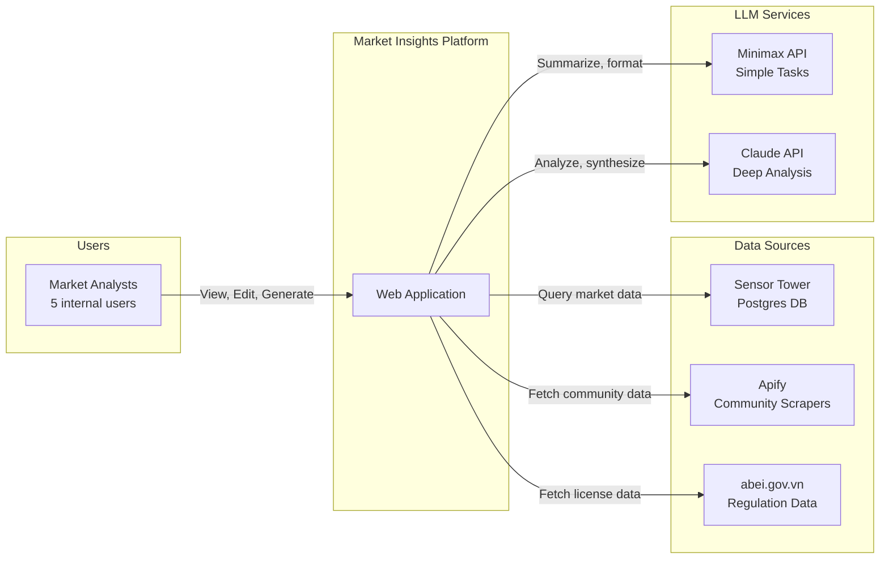

# Market Insights Platform

> **Status**: 🟡 Planning  
> **Created**: 2026-03-14  
> **Last Updated**: 2026-03-14  
> **Size**: 🟡 Medium  

## Summary

An internal web application that aggregates mobile gaming market data from multiple sources (Sensor Tower, community sentiment, game news, and Vietnamese gaming regulations), processes it through a multi-LLM pipeline (Minimax for cost-efficient simple tasks, Claude for deep analysis), and enables a team of 5 analysts to collaboratively view, edit, and generate market insight reports.

## Problem Statement

The team currently works with fragmented data across Sensor Tower exports, manual community monitoring, and government regulation portals. Generating comprehensive market insights requires manually cross-referencing these sources, which is time-consuming and error-prone. There is no unified system to combine quantitative market data (app rankings, downloads, revenue) with qualitative signals (community sentiment, news trends) and regulatory context (G1/G2/G3 licenses) into actionable intelligence.

## Target Users

| User | Role | Needs |
|---|---|---|
| **Market Analyst** | Primary user (3–4 people) | View aggregated data, generate reports, edit insights, track trends |
| **Team Lead** | Review & approve (1 person) | Approve reports, set analysis priorities, view dashboards |

## Discovery Answers

| # | Question | Answer |
|---|---|---|
| 🎯 | **North Star**: Singular desired outcome? | Reduce market insights report generation time from days to hours with higher data coverage |
| 🔌 | **Integrations**: External services/APIs needed? | Sensor Tower API (existing, data in Postgres), Apify (Reddit, Discord, Facebook, App Store reviews), abei.gov.vn (game licenses), Minimax API, Claude API |
| 💾 | **Source of Truth**: Where does primary data live? | Postgres DB (Sensor Tower data: top 10K apps, multiple markets — rankings, downloads, revenue monthly) |
| 📦 | **Delivery Payload**: How/where is the result delivered? | Web app with collaborative editing; exportable report documents |
| 🚫 | **Behavioral Rules**: Constraints or "Do Not" rules? | Internal-only (5 users), no external client access in MVP; LLM outputs must be editable/reviewable before finalization |

## Non-Functional Requirements

| Category | Requirement | Target |
|---|---|---|
| **Performance** | Report generation (LLM pipeline) | < 2 min for standard report |
| **Performance** | Dashboard page load | < 3 seconds |
| **Availability** | Uptime | 99% (internal tool, business hours) |
| **Scalability** | Concurrent users | 5 (MVP), extensible to 20 |
| **Security** | API key management | Server-side only, no client exposure |
| **Security** | Authentication | Team-internal auth (email-based) |
| **Data freshness** | Sensor Tower data | Monthly batch (already in DB) |
| **Data freshness** | Community data (Apify) | On-demand or weekly scheduled |
| **Data freshness** | Regulation data | Monthly manual check / scrape |

## Integration Inventory

| System | Protocol | Auth | Data Flow | Frequency |
|---|---|---|---|---|
| **Sensor Tower** | REST API → Postgres | API Key | Already ingested: rankings, downloads, revenue (10K apps, multi-market) | Monthly |
| **Apify** | REST API | API Token | Reddit posts, Discord messages, Facebook groups, App Store reviews | On-demand / weekly |
| **abei.gov.vn** | Web scraping (Apify or custom) | Public | Game license approvals list (2015–2025), licensing categories | Monthly |
| **Minimax API** | REST (OpenAI-compatible) | API Key | Simple summarization, data formatting, translation | Per-report |
| **Claude API** | REST (Anthropic) | API Key | Deep analysis, cross-source synthesis, strategic recommendations | Per-report |

## System Context (C4 Level 1)

## Key Features

- [x] **Data Aggregation Dashboard** — Unified view of Sensor Tower metrics, community signals, and regulation status
- [ ] **Multi-LLM Report Generation** — Route tasks to Minimax (simple) or Claude (complex) based on task type
- [ ] **Collaborative Report Editor** — Rich text editor where teammates can view, edit, and annotate LLM-generated reports
- [ ] **Community Sentiment Pipeline** — Apify-powered ingestion of Reddit, Discord, Facebook, and App Store reviews
- [ ] **Regulation Tracker** — Track game license approvals from abei.gov.vn (G1/G2/G3 categories)
- [ ] **Report Templates** — Pre-built templates for common report types (market overview, competitive analysis, regulatory update)
- [ ] **Export** — Download finalized reports as PDF/DOCX

## Scope Boundaries (What This Is NOT)

- **NOT** a public-facing product or SaaS — internal team tool only
- **NOT** a real-time analytics system — batch data ingestion is acceptable
- **NOT** a complete BI/dashboard replacement — focused on report generation workflow
- **NOT** building ML models — consuming LLM APIs for analysis, not training
- **NOT** a CRM or project management tool — strictly market intelligence

## Ideas & Notes

- Minimax M2/M2.5 is highly cost-effective ($0.26/M input tokens) for simple tasks like summarization, formatting, translation
- Claude Sonnet/Opus excels at deep analysis, cross-source synthesis, and strategic recommendations
- Consider a "task router" that classifies each LLM request and routes to the appropriate model
- Apify has ready-made actors for Reddit, Discord, Facebook, and App Store — minimal scraper development needed
- abei.gov.vn publishes game license lists as web pages; scraping can be done via Apify custom actors or simple HTTP scraping
- The regulation site (Cục PTTH) provides "Danh sách cấp phép" (license lists) dating back to 2015

## Version History

| Version | Date | Summary |
|---|---|---|
| Initial | 2026-03-14 | Project created, Phase 1 discovery completed |
