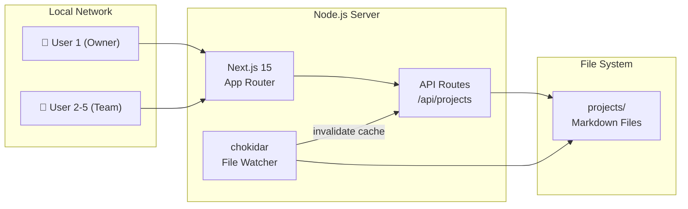
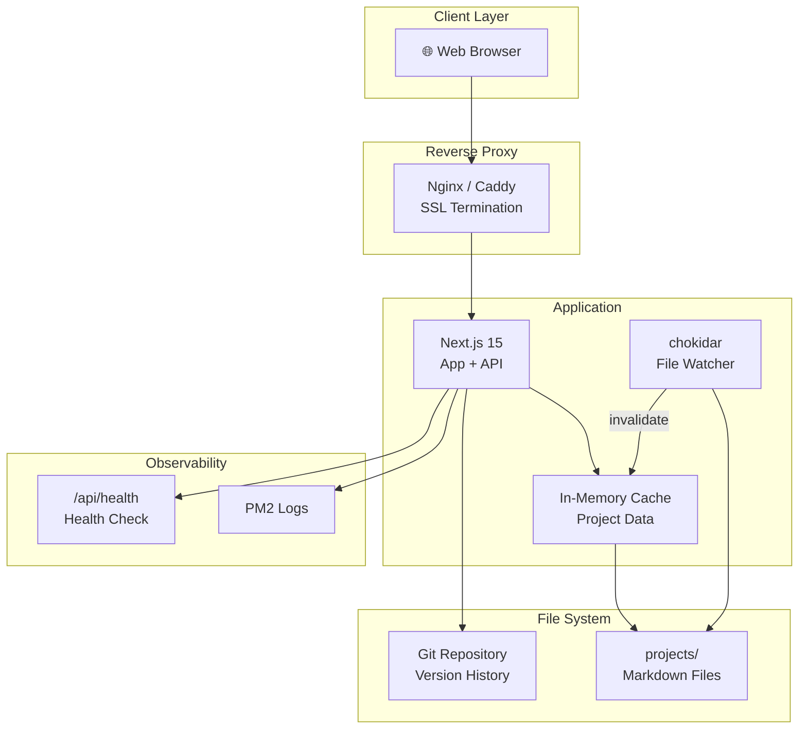
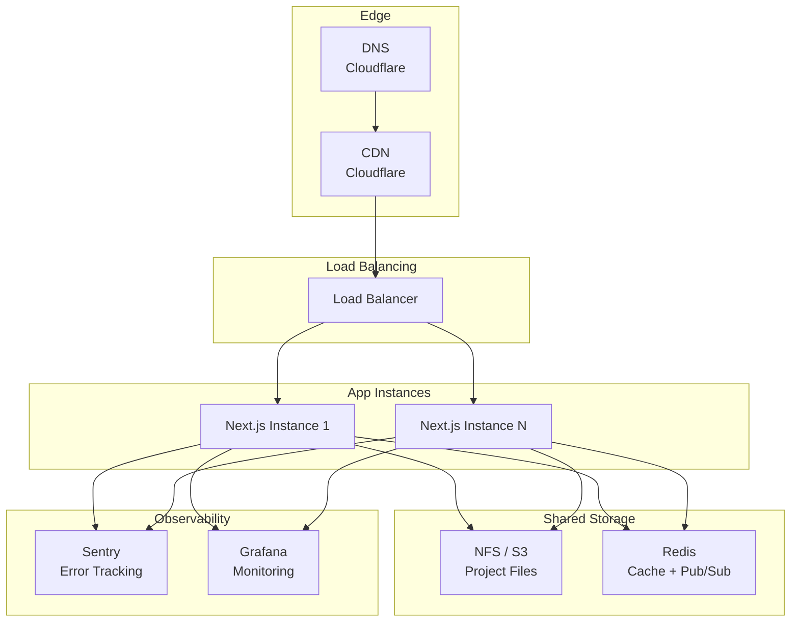
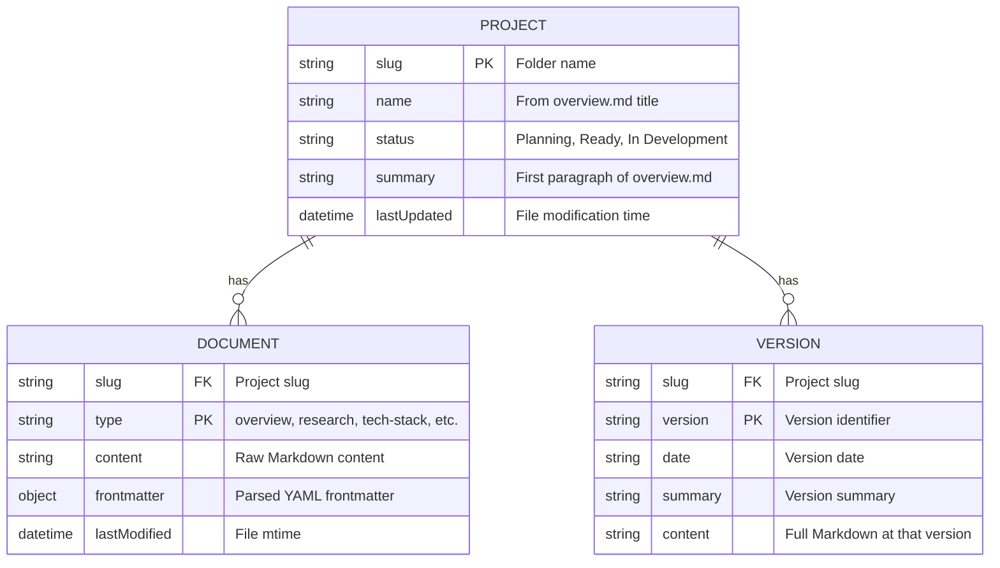
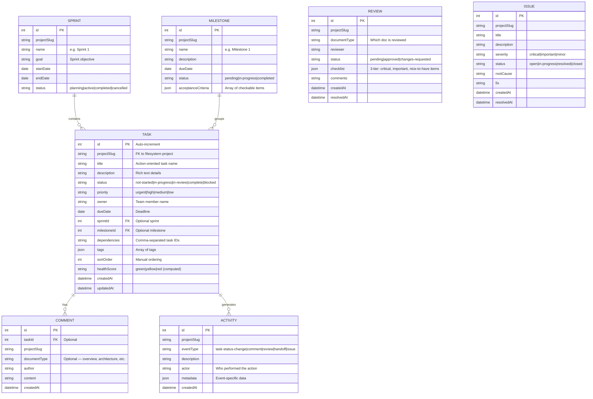

# Architecture: Project Viewer

## Overview

The Project Viewer follows a **monolithic, server-rendered architecture** using Next.js 15. A single Node.js process serves both the React frontend and API endpoints, reading Markdown files from the `projects/` directory at runtime. A file watcher (`chokidar`) detects changes and pushes updates to connected clients. The architecture is designed to evolve from a simple local dev tool (Phase 1) to a production-ready team tool (Phase 2) and eventually a scalable hosted service (Phase 3).

## Phase 1: Test / MVP

### Design Goals
- **Fast to build**: Single Next.js app, no external services
- **Zero config for users**: Point to `projects/` folder and run
- **Real-time updates**: File watcher triggers page refresh
- **Team accessible**: Bind to `0.0.0.0` for LAN access

### Architecture Diagram



### Components

| Component | Technology | Purpose |
|---|---|---|
| Frontend | Next.js 15 (React Server Components) | Render project dashboard, cards, detail views |
| API Layer | Next.js API Routes | Serve project data, search, version history |
| Markdown Parser | gray-matter + react-markdown | Parse frontmatter, render Markdown to React |
| Diagram Renderer | mermaid (client-side) | Render Mermaid code blocks as SVG diagrams |
| File Watcher | chokidar | Detect file changes, invalidate in-memory cache |
| Search | fuse.js (client-side) | Fuzzy search across project names and content |
| Diff Engine | diff (server-side) | Generate text diffs for version comparison |

### Key API Endpoints

| Method | Path | Description |
|---|---|---|
| GET | `/api/projects` | List all projects with metadata |
| GET | `/api/projects/[slug]` | Get full project data (all docs) |
| GET | `/api/projects/[slug]/versions` | Get CHANGELOG entries |
| GET | `/api/projects/[slug]/diff` | Generate diff between two versions |
| GET | `/api/search?q=...` | Search across all projects |

### Estimated Cost: $0/mo
Running on a local machine or existing dev server.

---

## Phase 2: Production

### Trigger to Transition
- Team grows beyond 5 people
- Need reliable uptime (not tied to one person's laptop)
- Want HTTPS for secure access outside LAN

### Architecture Diagram



### New Components

| Component | Technology | Purpose |
|---|---|---|
| Reverse Proxy | Nginx or Caddy | SSL termination, HTTP/2, gzip compression |
| Process Manager | PM2 | Auto-restart, cluster mode, log management |
| Git Integration | simple-git | Read commit history for version tracking |
| Health Check | /api/health endpoint | Monitor uptime |

### Security Measures
- HTTPS via Let's Encrypt (automated with Caddy)
- Basic auth or IP allowlist for access control
- `react-markdown` XSS protection (HTML escaping by default)
- `rehype-sanitize` for additional Markdown safety

### Estimated Cost: $5-15/mo
Small VPS (e.g., DigitalOcean $6/mo droplet) + domain ($12/yr).

---

## Phase 3: Scale

### Trigger to Transition
- Multiple teams / organizations using the tool
- Need multi-tenancy (multiple `projects/` directories)
- Demand for hosted/managed version

### Architecture Diagram



### Scaling Strategy
- **Horizontal**: Multiple Next.js instances behind load balancer
- **Caching**: Redis for shared project data cache across instances
- **Storage**: Shared file system (NFS) or S3 for project files
- **CDN**: Cloudflare for static assets and SSR caching
- **Pub/Sub**: Redis pub/sub for file change notifications across instances

### Performance Optimizations
- Pre-parsed Markdown cached in Redis (avoid re-parsing on every request)
- Incremental cache invalidation (only changed files, not full scan)
- Client-side route prefetching for project detail pages
- Mermaid diagram SVG caching (diagrams rarely change)

### Estimated Cost: $50-150/mo
VPS cluster + Redis + monitoring services.

---

## Data Architecture

### Data Model — Filesystem (Viewer)



### Data Model — SQLite Database (Project Management)



### Key Data Flows

1. **Project Discovery**: Server scans `projects/` → reads each `overview.md` → extracts name, status, summary → builds project index
2. **Document Rendering**: Client requests project detail → server reads all `.md` files in project folder → parses frontmatter + content → sends to client → React renders Markdown + Mermaid
3. **Version Comparison**: Client requests diff → server reads CHANGELOG.md → parses version entries → runs `diff` library → sends diff data → client renders side-by-side view
4. **File Change Detection**: `chokidar` watches `projects/` → on file change → invalidates in-memory cache → next request gets fresh data
5. **Task Seeding** *(new)*: User triggers seed → server parses task tables from `implementation-plan.md` → creates Task records in SQLite → returns seeded task count
6. **Task Board** *(new)*: Client renders Kanban → drag-and-drop triggers PATCH to `/api/projects/:slug/tasks/:id` → server updates `status` in SQLite → broadcasts to connected clients
7. **Sprint Tracking** *(new)*: Client requests sprint data → server queries SQLite for tasks in sprint → calculates burndown (tasks remaining vs. days left) → returns sprint metrics
8. **Health Scoring** *(new)*: Server computes per-task health score: overdue (+3), blocked (+3), no owner (+2), dependency-stalled (+2). Total 7+ = 🔴, 4-6 = 🟡, 0-3 = 🟢
9. **Review Workflow** *(new)*: Reviewer opens document → creates review with 3-tier checklist → checks items → signs off with approve/request-changes → status badge updates on document tab
10. **Activity Feed** *(new)*: Every state change (task transition, comment, review, handoff) creates an Activity record → feed queries sorted by `createdAt` desc

---

## API Design

### Viewer Endpoints (Existing)

```
GET  /api/projects              → ProjectSummary[]
GET  /api/projects/:slug        → ProjectDetail (all documents)
GET  /api/projects/:slug/docs/:type → Single document content
GET  /api/projects/:slug/versions   → VersionEntry[]
GET  /api/projects/:slug/diff?from=v1&to=v2 → DiffResult
GET  /api/search?q=query        → SearchResult[]
GET  /api/health                → { status: "ok", uptime, projectCount }
```

### PM Endpoints (New)

```
# Tasks
GET    /api/projects/:slug/tasks            → Task[]
POST   /api/projects/:slug/tasks            → Task (create)
PATCH  /api/projects/:slug/tasks/:id        → Task (update status, owner, priority, etc.)
DELETE /api/projects/:slug/tasks/:id        → void
POST   /api/projects/:slug/tasks/seed       → { seeded: number } (parse from implementation-plan.md)

# Sprints
GET    /api/projects/:slug/sprints          → Sprint[] (with task counts)
POST   /api/projects/:slug/sprints          → Sprint (create)
PATCH  /api/projects/:slug/sprints/:id      → Sprint (update, complete)
GET    /api/projects/:slug/sprints/:id/burndown → BurndownData[]

# Milestones
GET    /api/projects/:slug/milestones       → Milestone[]
POST   /api/projects/:slug/milestones       → Milestone (create)
PATCH  /api/projects/:slug/milestones/:id   → Milestone (update, check criteria)

# Comments
GET    /api/projects/:slug/comments?taskId=X&docType=Y → Comment[]
POST   /api/projects/:slug/comments         → Comment (create)

# Reviews
GET    /api/projects/:slug/reviews          → Review[]
POST   /api/projects/:slug/reviews          → Review (create with checklist)
PATCH  /api/projects/:slug/reviews/:id      → Review (sign off, update status)

# Issues
GET    /api/projects/:slug/issues           → Issue[]
POST   /api/projects/:slug/issues           → Issue (create)
PATCH  /api/projects/:slug/issues/:id       → Issue (update status, add fix)

# Activity
GET    /api/projects/:slug/activity         → Activity[] (latest 50, with pagination)
```

### Response Shapes

```typescript
// === Viewer Types (Existing) ===
interface ProjectSummary {
  slug: string;
  name: string;
  status: 'planning' | 'ready' | 'in-development';
  summary: string;
  lastUpdated: string; // ISO 8601
  documentCount: number;
  // New PM fields
  taskProgress: { done: number; total: number };
  healthScore: 'green' | 'yellow' | 'red';
  activeSprint: string | null;
}

interface ProjectDetail {
  slug: string;
  name: string;
  status: string;
  documents: Document[];
  versions: VersionEntry[];
}

interface Document {
  type: string;
  content: string;
  frontmatter: Record<string, unknown>;
  lastModified: string;
}

interface VersionEntry {
  version: string;
  date: string;
  summary: string;
}

interface DiffResult {
  fromVersion: string;
  toVersion: string;
  changes: DiffChange[];
}

// === PM Types (New) ===
type TaskStatus = 'not-started' | 'in-progress' | 'in-review' | 'complete' | 'blocked';
type TaskPriority = 'urgent' | 'high' | 'medium' | 'low';
type HealthScore = 'green' | 'yellow' | 'red';

interface Task {
  id: number;
  projectSlug: string;
  title: string;
  description: string;
  status: TaskStatus;
  priority: TaskPriority;
  owner: string | null;
  dueDate: string | null;
  sprintId: number | null;
  milestoneId: number | null;
  dependencies: number[];
  tags: string[];
  sortOrder: number;
  healthScore: HealthScore;
  commentCount: number;
  createdAt: string;
  updatedAt: string;
}

interface Sprint {
  id: number;
  projectSlug: string;
  name: string;
  goal: string;
  startDate: string;
  endDate: string;
  status: 'planning' | 'active' | 'completed' | 'cancelled';
  taskCount: { total: number; done: number; inProgress: number; blocked: number };
}

interface Milestone {
  id: number;
  projectSlug: string;
  name: string;
  description: string;
  dueDate: string | null;
  status: 'pending' | 'in-progress' | 'completed';
  acceptanceCriteria: { text: string; checked: boolean }[];
  taskCount: { total: number; done: number };
}

interface Comment {
  id: number;
  taskId: number | null;
  projectSlug: string;
  documentType: string | null;
  author: string;
  content: string;
  createdAt: string;
}

interface Review {
  id: number;
  projectSlug: string;
  documentType: string;
  reviewer: string;
  status: 'pending' | 'approved' | 'changes-requested';
  checklist: {
    critical: { text: string; passed: boolean }[];
    important: { text: string; passed: boolean }[];
    niceToHave: { text: string; passed: boolean }[];
  };
  comments: string;
  createdAt: string;
  resolvedAt: string | null;
}

interface Issue {
  id: number;
  projectSlug: string;
  title: string;
  description: string;
  severity: 'critical' | 'important' | 'minor';
  status: 'open' | 'in-progress' | 'resolved' | 'closed';
  rootCause: string | null;
  fix: string | null;
  createdAt: string;
  resolvedAt: string | null;
}

interface Activity {
  id: number;
  projectSlug: string;
  eventType: 'task-status-change' | 'comment' | 'review' | 'handoff' | 'issue';
  description: string;
  actor: string;
  metadata: Record<string, unknown>;
  createdAt: string;
}

interface BurndownData {
  date: string;
  tasksRemaining: number;
  idealRemaining: number;
}
```

