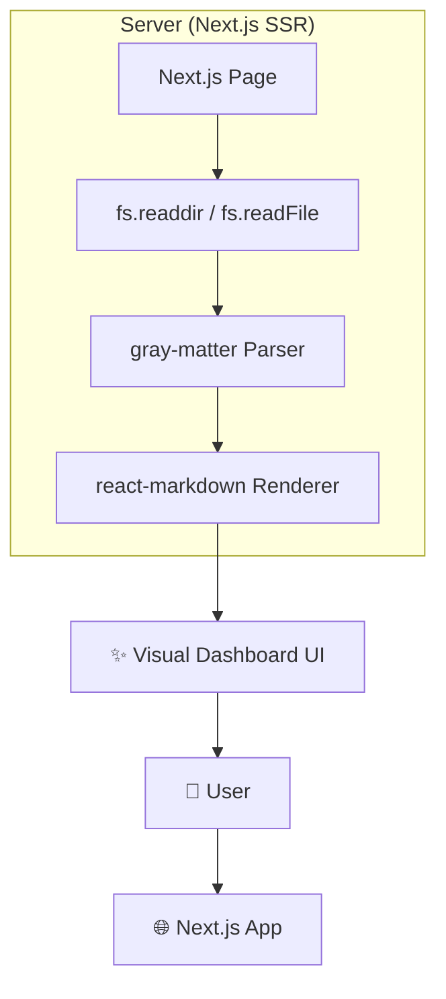
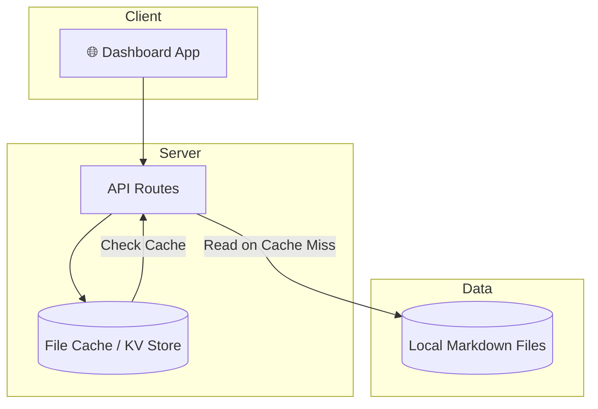
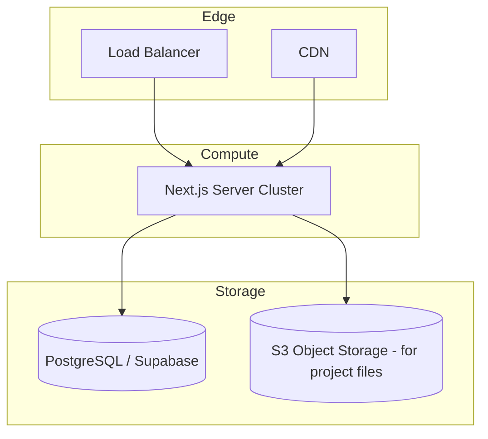
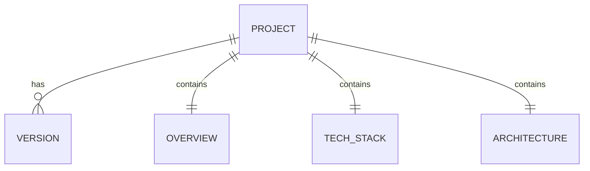

# Architecture: Project Viewer

## Overview

The Project Viewer is a server-side rendered (SSR) application designed to read and visualize Markdown project plans from the local filesystem. It uses a **Next.js 14+** architecture to achieve high performance and live data updates.

## Phase 1: Test / MVP (Current Goal)

### Design Goals

-   **Fast Development**: Minimal setup, reading directly from the `projects/` directory.
-   **Live Updates**: Every page load re-reads the filesystem.
-   **No Database**: All project data is stored in existing Markdown files.

### Architecture Diagram

### Components

| Component | Technology | Purpose |
| :--- | :--- | :--- |
| **Project Discoverer** | Next.js Server Side | Scans `projects/` for `overview.md` files to build the dashboard. |
| **Doc Renderer** | `react-markdown` | Renders project planning documents into readable HTML. |
| **Diagram Engine** | `mermaid.js` | Client-side rendering of architecture and Gantt charts. |

---

## Phase 2: Production (Transition Trigger: 10+ Projects)

### Trigger to Transition

Transition to Phase 2 when the project list grows enough to require better performance (e.g., more than 10-20 projects, making live re-reads slower).

### Architecture Diagram

### New Components

-   **Caching Layer**: Using a simple in-memory cache or KV store to avoid redundant file reads.
-   **Advanced Search**: Indexing project content for full-text fuzzy search (via Fuse.js on the client).

---

## Phase 3: Scale (Transition Trigger: Multi-User Access)

### Trigger to Transition

Transition to Phase 3 if the tool needs to be shared with multiple collaborators or accessed remotely via a hosted server.

### Architecture Diagram

### Scaling Strategy

-   **S3 for Files**: Moving project files to object storage if they become too large for local disk.
-   **Database**: Introducing a database for project metadata and user-specific viewing preferences.

## Data Architecture

### ERD

### Key Data Flows

1.  User visits the dashboard.
2.  Next.js Server reads all subdirectories in `projects/`.
3.  Each `overview.md` is parsed for its title, status, and summary.
4.  Data is passed as props to the React frontend and rendered as project cards.
