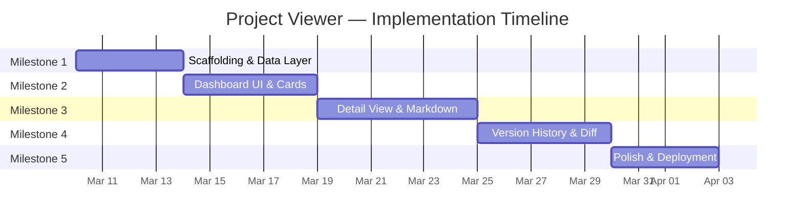

# Implementation Plan: Project Viewer

> **Team Size**: 1 developer (solo build)  
> **Estimated Timeline**: 3–4 weeks  
> **Milestones**: 5

---

## Milestone 1: Project Scaffolding & Core Data Layer

**Goal**: Set up the Next.js project, implement file-system reading, and build the project data API.

**Estimated Effort**: 3–4 days

### Tasks

| # | Task | Effort | Dependencies |
|---|---|---|---|
| 1.1 | Initialize Next.js 15 project with TypeScript, App Router | 1h | — |
| 1.2 | Define TypeScript interfaces (ProjectSummary, ProjectDetail, Document, etc.) | 1h | 1.1 |
| 1.3 | Build `ProjectScanner` service — scan `projects/` dir, read `overview.md`, extract metadata | 3h | 1.2 |
| 1.4 | Build `DocumentReader` service — read any `.md` file, parse frontmatter with `gray-matter` | 2h | 1.2 |
| 1.5 | Implement in-memory cache for project data | 2h | 1.3 |
| 1.6 | Set up `chokidar` file watcher — invalidate cache on file changes | 2h | 1.5 |
| 1.7 | Create API routes: `GET /api/projects`, `GET /api/projects/[slug]` | 3h | 1.3, 1.4 |
| 1.8 | Create API route: `GET /api/health` | 0.5h | 1.1 |

### Definition of Done
- [ ] `npm run dev` starts successfully
- [ ] `/api/projects` returns a list of all projects with name, status, summary, lastUpdated
- [ ] `/api/projects/[slug]` returns all documents for a specific project
- [ ] Modifying a Markdown file triggers cache invalidation
- [ ] TypeScript compiles with no errors

---

## Milestone 2: Dashboard UI & Project Cards

**Goal**: Build the main dashboard page with project cards, status indicators, and navigation.

**Estimated Effort**: 4–5 days

### Tasks

| # | Task | Effort | Dependencies |
|---|---|---|---|
| 2.1 | Design and implement the global layout (header, main content area, footer) | 3h | M1 |
| 2.2 | Set up the light theme design system (CSS variables, typography, spacing) | 3h | 2.1 |
| 2.3 | Build `ProjectCard` component (name, status badge, summary, last updated) | 3h | 2.2 |
| 2.4 | Build the dashboard grid page — fetch from `/api/projects`, render cards | 3h | 2.3 |
| 2.5 | Implement status emoji badges (🟡 Planning, 🟢 Ready, 🔵 In Development) | 1h | 2.3 |
| 2.6 | Add status filter bar — filter cards by planning status | 2h | 2.4 |
| 2.7 | Integrate `fuse.js` — search bar with fuzzy matching across project names/summaries | 3h | 2.4 |
| 2.8 | Add responsive design — works on tablet and desktop | 2h | 2.4 |
| 2.9 | Add loading states and empty states | 1h | 2.4 |

### Definition of Done
- [ ] Dashboard shows all projects as cards in a responsive grid
- [ ] Status filter correctly shows/hides cards
- [ ] Search bar finds projects by name or keyword
- [ ] Cards link to project detail pages
- [ ] UI uses light theme with clean typography

---

## Milestone 3: Project Detail View & Markdown Rendering

**Goal**: Build the drill-down view for reading all project documents with full Markdown and Mermaid support.

**Estimated Effort**: 5–6 days

### Tasks

| # | Task | Effort | Dependencies |
|---|---|---|---|
| 3.1 | Build project detail page layout — sidebar nav (doc tabs) + content area | 4h | M2 |
| 3.2 | Integrate `react-markdown` + `remark-gfm` for Markdown rendering | 3h | 3.1 |
| 3.3 | Style rendered Markdown (headings, tables, code blocks, lists, blockquotes) | 4h | 3.2 |
| 3.4 | Integrate `mermaid` for diagram rendering — custom component for Mermaid code blocks | 4h | 3.2 |
| 3.5 | Add syntax highlighting for code blocks with `rehype-highlight` | 2h | 3.2 |
| 3.6 | Build document tab navigation — switch between overview, research, tech-stack, etc. | 2h | 3.1 |
| 3.7 | Handle missing documents gracefully (show "not yet created" state) | 1h | 3.6 |
| 3.8 | Add "back to dashboard" navigation | 0.5h | 3.1 |
| 3.9 | Add GitHub-style alert rendering (`[!NOTE]`, `[!WARNING]`, etc.) | 2h | 3.2 |

### Definition of Done
- [ ] Clicking a project card navigates to its detail page
- [ ] All document types render correctly (overview, research, tech-stack, architecture, implementation-plan, handoff)
- [ ] Markdown tables render cleanly
- [ ] Mermaid diagrams render as SVG
- [ ] Code blocks have syntax highlighting
- [ ] GitHub-style alerts render with appropriate styling

---

## Milestone 4: Version History & Diff Comparison

**Goal**: Implement the version history viewer and side-by-side diff comparison.

**Estimated Effort**: 4–5 days

### Tasks

| # | Task | Effort | Dependencies |
|---|---|---|---|
| 4.1 | Build CHANGELOG parser — extract version entries from `CHANGELOG.md` or version history table in `overview.md` | 3h | M1 |
| 4.2 | Create API route: `GET /api/projects/[slug]/versions` | 2h | 4.1 |
| 4.3 | Create API route: `GET /api/projects/[slug]/diff` | 3h | 4.1 |
| 4.4 | Build version history timeline UI — list of versions with dates and summaries | 3h | 4.2 |
| 4.5 | Build side-by-side diff view component — split pane with highlighted changes | 6h | 4.3 |
| 4.6 | Integrate `diff` library for text comparison | 2h | 4.5 |
| 4.7 | Add version selector dropdowns (from version → to version) | 2h | 4.4, 4.5 |
| 4.8 | Style diff view — green for additions, red for deletions, line numbers | 2h | 4.5 |

### Definition of Done
- [ ] Version history shows all past versions with dates
- [ ] Users can select two versions to compare
- [ ] Side-by-side diff view highlights additions and deletions
- [ ] Diff view shows line numbers
- [ ] Works for all document types (overview, research, etc.)

---

## Milestone 5: Polish, Testing & Team Deployment

**Goal**: Final polish, performance optimization, documentation, and deployment for team use.

**Estimated Effort**: 3–4 days

### Tasks

| # | Task | Effort | Dependencies |
|---|---|---|---|
| 5.1 | Performance audit — optimize re-renders, cache efficiency, Mermaid init | 3h | M3, M4 |
| 5.2 | Cross-browser testing (Chrome, Firefox, Safari) | 2h | M3, M4 |
| 5.3 | Add keyboard shortcuts (Ctrl+K for search, Esc to close, arrow keys for navigation) | 2h | M2 |
| 5.4 | Write README.md — setup instructions, environment requirements, usage guide | 2h | All |
| 5.5 | Configure `0.0.0.0` binding for LAN access | 0.5h | M1 |
| 5.6 | Add `npm run start` production script | 1h | M1 |
| 5.7 | Create `/api/health` dashboard diagnostics (project count, uptime, last scan time) | 1h | 1.8 |
| 5.8 | Final UI polish — transitions, hover effects, micro-animations | 3h | M3, M4 |
| 5.9 | Team onboarding — share URL, verify access for all teammates | 1h | 5.5 |

### Definition of Done
- [ ] All features work reliably across Chrome, Firefox, Safari
- [ ] README documents setup and usage
- [ ] Teammates can access the dashboard over LAN
- [ ] Search, filtering, and navigation feel responsive (<200ms)
- [ ] No console errors or TypeScript warnings

---

## Timeline Summary

## Risks & Assumptions

| Assumption | Risk if Wrong | Mitigation |
|---|---|---|
| Solo developer builds all milestones | Timeline slips if blocked | Milestones are independent enough to be parallelized if team expands |
| Version history comes from CHANGELOG.md or overview.md table | Not all projects have version tables | Gracefully show "no version history" state |
| ~5 concurrent users | More users could cause performance issues | Phase 2 architecture adds PM2 cluster mode |
| Projects follow the `project-planning` folder convention | Unexpected folder structures cause parsing errors | Defensive parsing with fallbacks for missing files |
| Mermaid diagrams render client-side | Flash of unstyled content on load | Add loading skeleton while Mermaid initializes |
