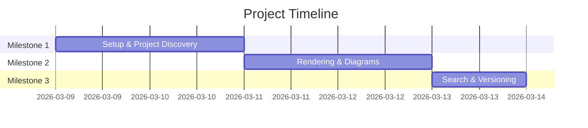

# Implementation Plan: Project Viewer

## Overview

This implementation plan covers the build process for the Project Viewer — a visual dashboard for browsing and reviewing project plans. As this is a personal demo, the focus is on a high-quality prototype with functional file reading and polished UI.

## Milestones

### Milestone 1: Core Dashboard (2 Days)

**Goal**: Build the foundation and a working project grid.

| # | Task | Effort | Dependencies | Status |
|---|---|---|---|---|
| 1.1 | Initialize Next.js 14 project with TS and CSS Modules | 2h | — | ⬜ |
| 1.2 | Create "Project Discovery" service using Node `fs` | 4h | 1.1 | ⬜ |
| 1.3 | Build the Project Card component (vibrant design) | 4h | 1.2 | ⬜ |
| 1.4 | Implement Dashboard Grid view (Responsive) | 4h | 1.3 | ⬜ |

**Definition of Done**:
- [ ] App runs locally and displays all projects found in `projects/`.
- [ ] Each card shows accurate metadata parsed from `overview.md`.

---

### Milestone 2: Document Rendering (2 Days)

**Goal**: Implement the side-by-side or drill-down view for project docs.

| # | Task | Effort | Dependencies | Status |
|---|---|---|---|---|
| 2.1 | Create Project Detail page with dynamic routing | 4h | M1 | ⬜ |
| 2.2 | Integrate `react-markdown` with GFM support | 4h | 2.1 | ⬜ |
| 2.3 | Implement Mermaid.js rendering for diagrams | 4h | 2.2 | ⬜ |
| 2.4 | Add a sidebar for navigating between project files | 4h | 2.1 | ⬜ |

**Definition of Done**:
- [ ] User can click a project and view its full planning documents.
- [ ] Architecture diagrams render correctly as interactive SVGs.

---

### Milestone 3: Search & Versioning (1 Day)

**Goal**: Add interactivity and version history browsing.

| # | Task | Effort | Dependencies | Status |
|---|---|---|---|---|
| 3.1 | Implement fuzzy search via Fuse.js | 4h | M1 | ⬜ |
| 3.2 | Create Version Switcher component (`v1`, `v2`, etc.) | 4h | M2 | ⬜ |

**Definition of Done**:
- [ ] User can search projects by name/keyword.
- [ ] User can switch between different versions of a project's documentation.

## Timeline

## Assumptions & Constraints

-   The application will run in a local development environment.
-   Project files will follow the standard structure as defined in the workspace rules.

## Risks

| Risk | Impact | Mitigation |
|---|---|---|
| Large file sizes slowing down SSR | Low | Implement simple file-system caching early. |
| Mermaid diagram rendering issues | Medium | Use client-side rendering with hydrating components. |
