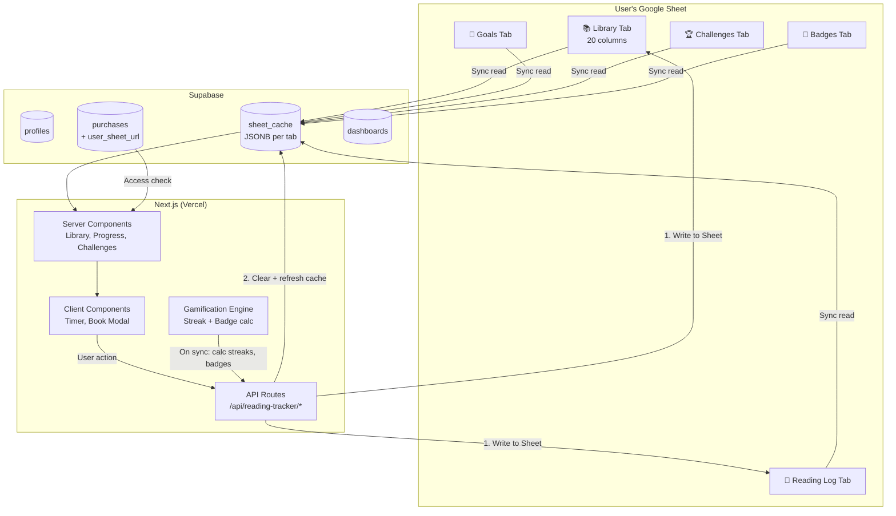
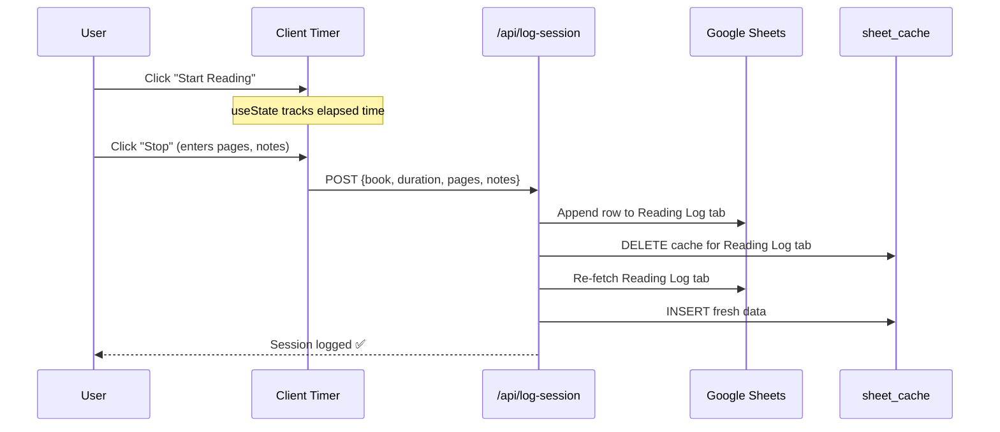

# Architecture: Reading Tracker

> **Parent Architecture**: [Dashboard Hub architecture.md](../dashboard-hub/architecture.md)

## Overview

Reading Tracker is a premium product route within the Dashboard Hub Next.js app. It lives at `/dashboard/reading-tracker/*` and follows the app's shared architecture: user data in Google Sheets, cached in Supabase `sheet_cache`, rendered via Next.js Server Components. The cache is **cleared and refreshed after every write-back** to keep data consistent.

## Design Theme

**Bright, warm, and inviting** — light backgrounds with warm accents (amber, soft browns, cream). Clean typography. The bookshelf should feel cozy and personal, not dark or heavy.

## Route Structure

```
/store
  └── /product/reading-tracker     → SEO product page (ISR)

/dashboard/reading-tracker
  ├── /library                     → Bookshelf view (Server Component)
  ├── /library/[bookId]            → Book detail modal
  ├── /progress                    → Stats + charts (Server Component)
  ├── /schedule                    → Calendar + timer (Client Component)
  └── /challenges                  → Badges + goals (Server Component)
```

## Data Flow



## Supabase Schema (Actual)

```sql
-- Existing tables (created by user)
create table public.profiles (
  id text not null primary key,
  email text not null unique,
  role text not null default 'user',
  created_at timestamp not null default now()
);

create table public.dashboards (
  id text not null primary key,
  slug text not null unique,
  title text not null,
  description text not null,
  price_cents integer not null default 0,
  master_sheet_url text not null,
  is_active boolean not null default true,
  created_at timestamp not null default now(),
  discount_cents integer not null default 0,
  thumbnail_url text null,
  demo_images text null,
  demo_video_url text null
);

create table public.purchases (
  id text not null primary key,
  user_id text not null references profiles(id),
  dashboard_id text not null references dashboards(id),
  is_approved boolean not null default false,
  purchased_at timestamp not null default now(),
  user_sheet_url text null,
  payment_submitted boolean not null default false
);

-- NEW: Cache table for Google Sheet data
create table public.sheet_cache (
  id text not null primary key,
  purchase_id text not null references purchases(id),
  tab_name text not null,
  data jsonb not null default '[]'::jsonb,
  last_good_data jsonb null,
  cached_at timestamp not null default now(),
  constraint sheet_cache_unique unique (purchase_id, tab_name)
);
```

### Cache Invalidation Rule

> **On every write-back to Google Sheet, the corresponding `sheet_cache` row is deleted and re-fetched.** This ensures the cache never shows stale data.

```typescript
async function writeBackAndRefreshCache(purchaseId, tabName, rowData) {
  const token = await getGoogleToken(userId);
  const sheetUrl = await getSheetUrl(purchaseId);

  // 1. Write to Google Sheet
  await sheetsApi.append(sheetUrl, tabName, rowData, token);

  // 2. Clear cache for this tab
  await supabase.from('sheet_cache')
    .delete()
    .match({ purchase_id: purchaseId, tab_name: tabName });

  // 3. Re-fetch and cache fresh data
  const freshData = await sheetsApi.read(sheetUrl, tabName, token);
  await supabase.from('sheet_cache').insert({
    id: generateId(),
    purchase_id: purchaseId,
    tab_name: tabName,
    data: freshData,
    last_good_data: freshData,
    cached_at: new Date()
  });
}
```

## Google Sheet Schema (Master Template)

### Library Tab (20 columns)

| # | Column | Type | Required | Example |
|---|---|---|---|---|
| 1 | Cover URL | URL | No | `https://...` |
| 2 | Title | String | **Yes** | "Dế Mèn Phiêu Lưu Ký" |
| 3 | Author | String | **Yes** | "Tô Hoài" |
| 4 | Release Year | Number | No | 1941 |
| 5 | Country | String | No | "Vietnam" |
| 6 | Publisher | String | No | "Kim Đồng" |
| 7 | Author Gender | String | No | "Male" |
| 8 | Main Genre | String | No | "Fiction" |
| 9 | Sub-Genre(s) | String | No | "Adventure, Coming-of-age" |
| 10 | Non-fiction Category | String | No | — |
| 11 | Price | Number | No | 85000 |
| 12 | Status | Enum | No | Read / To Read / Reading / DNF / On Hold |
| 13 | Bought? | Enum | No | Yes / No |
| 14 | Rating | Number (1-5) | No | 4 |
| 15 | Date Added | Date | No | 2026-03-12 |
| 16 | Start Date | Date | No | 2026-03-12 |
| 17 | Date Finished | Date | No | 2026-03-20 |
| 18 | Total Pages | Number | No | 200 |
| 19 | Current Page | Number | No | 145 |
| 20 | Review/Notes | Text | No | "A beautiful story..." |
| 21 | Reread? | Enum | No | Yes / No |

### Reading Log Tab

| Column | Type | Example |
|---|---|---|
| Date | Date | 2026-03-12 |
| Book Title | String | "Dế Mèn Phiêu Lưu Ký" |
| Start Time | Time | 20:00 |
| End Time | Time | 21:30 |
| Pages Read | Number | 45 |
| Duration (min) | Number | 90 |
| Notes | Text | "Chapter 3-5" |

### Goals Tab

| Column | Type | Example |
|---|---|---|
| Year | Number | 2026 |
| Month | String | "March" |
| Target Books | Number | 4 |
| Target Hours | Number | 20 |
| Actual Books | Number | 2 |
| Actual Hours | Number | 12.5 |

### Challenges Tab

| Column | Type | Example |
|---|---|---|
| Name | String | "March Reader" |
| Type | Enum | books / hours / streak |
| Target | Number | 3 |
| Current Progress | Number | 1 |
| Status | Enum | active / completed / expired |
| Start Date | Date | 2026-03-01 |
| End Date | Date | 2026-03-31 |

### Badges Tab

| Column | Type | Example |
|---|---|---|
| Badge Name | String | "First Book" |
| Earned Date | Date | 2026-03-15 |
| Description | String | "Finished your first book!" |
| Icon Emoji | String | "📖" |

## Timer Architecture (Client-Side)



## Gamification Engine (Server-Side)

Calculated during background sync — results written back to Google Sheet:

- **Streak**: Count consecutive days with ≥1 session in Reading Log
- **Badge triggers**: Checked against Library + Reading Log data
- **Challenge progress**: Computed from Reading Log + Library, updated in Challenges tab

## Component Architecture

```
src/app/dashboard/reading-tracker/
├── layout.tsx              → Sidebar nav + access check
├── library/
│   ├── page.tsx            → Server Component: fetch cached Library tab
│   ├── bookshelf.tsx       → Client Component: book cover grid
│   └── book-modal.tsx      → Client Component: add/edit book dialog
├── progress/
│   ├── page.tsx            → Server Component: fetch all cached data
│   ├── stat-cards.tsx      → Stat cards (Books Read, Streak, Pages, Hours, Rate, Spending)
│   ├── charts.tsx          → Recharts: books/month, genre breakdown, spending, DNF/quarter
│   └── activity-log.tsx    → Recent finished books
├── schedule/
│   ├── page.tsx            → Layout
│   ├── calendar.tsx        → shadcn/ui Calendar + sessions
│   └── timer.tsx           → Live reading timer
└── challenges/
    ├── page.tsx            → Server Component
    ├── challenge-list.tsx  → Active challenges with progress bars
    └── badge-gallery.tsx   → Earned badges grid
```

## Analytics Formulas

| Analytic | Source | Calculation |
|---|---|---|
| Books read this month | Library | `COUNT WHERE Status="Read" AND Date Finished in current month` |
| Total pages | Library | `SUM(Total Pages) WHERE Status="Read"` |
| Total reading time | Reading Log | `SUM(Duration)` |
| Completion rate | Library | `Read / (Read + DNF) × 100` |
| Genre breakdown | Library | `GROUP BY Main Genre, COUNT, ORDER DESC` |
| Reread/DNF per quarter | Library | `COUNT WHERE Reread?="Yes" OR Status="DNF", by quarter` |
| Monthly spending | Library | `SUM(Price) WHERE Bought?="Yes", by month(Date Added)` |

## Google Stitch Prompts (Bright Theme)

### Screen 1 — My Library

> Design a premium digital bookshelf dashboard for a reading tracker web app. Bright, warm theme — light cream/off-white background with warm amber and soft brown accents. Clean and cozy. **Layout:** Full-width header with title "My Library" and an "+ Add Book" button with warm amber background. Below: filter tabs (All, Reading, To Read, Read, DNF). Main area: responsive grid of book cards (3-4 columns on desktop, 1 on mobile). **Book card:** Shows book cover image (tall rectangle), title below in bold dark text, author in muted warm gray, a colored status badge (Reading=blue, Read=green, To Read=amber, DNF=red), and star rating (1-5). Hover: subtle lift/shadow. **Sidebar on left** with icons: Library, Progress, Schedule, Challenges. Typography: Inter or similar clean sans-serif. Premium, modern, warm feel — like a cozy bookstore, not a dark workspace.

### Screen 2 — Progress Dashboard

> Design an analytics dashboard for a reading tracker. Same bright warm theme — light background, amber/brown accents. Sidebar navigation with Progress highlighted. **Top row:** 6 stat cards. Each card: white background, subtle shadow, icon, label in muted text, large bold number, small percentage change. Cards: "Books Read" (📚), "Reading Streak" (🔥 days), "Total Pages" (📄), "Total Hours" (⏱️), "Completion Rate" (✅ %), "Monthly Spending" (💰). **Charts (2x2 grid):** 1) Bar chart "Books per Month" — warm-colored bars 2) Donut chart "Genre Breakdown" — colorful segments 3) Line chart "Spending Trend" — amber line 4) Stacked bar "Quarterly Summary" — Read vs DNF vs Reread. **Bottom:** "Recent Activity" list — book cover thumbnail, title, date finished, rating stars. All charts use warm harmonious palette.

### Screen 3 — Reading Schedule

> Design a reading schedule page with timer. Bright warm theme. Sidebar with Schedule highlighted. **Left (60%):** Monthly calendar grid, clean white cards for each day. Days with sessions have colored dots (green=completed, amber=scheduled). **Right (40%):** "Start Reading" — large circular timer (00:00:00) on a white card with subtle amber border. Start button is large and warm amber. Below timer: book dropdown selector, "Pages Read" and "Notes" fields appear on stop. "Log Session" button. **Below calendar:** "Upcoming Sessions" list. Style: premium and clean, the timer should feel satisfying to use.

### Screen 4 — Challenges & Badges

> Design a gamification page. Bright warm theme. **Top: "Active Challenges"** — horizontal cards. Each: white card, challenge name, type icon, progress bar (amber fill on light gray track), current/target text, days remaining. Completed: green checkmark and celebration accent. **Bottom: "Badge Gallery"** — grid of badge cards (4-5 cols). Each: large emoji, badge name, earned date. Unearned badges: grayed out with lock icon. Earned badges: warm gold border glow. Examples: 📖 First Book, 📚 Bookworm, 🔥 Streak 7, 🦉 Night Owl, 💎 Streak 30. Premium, warm, rewarding feel.
