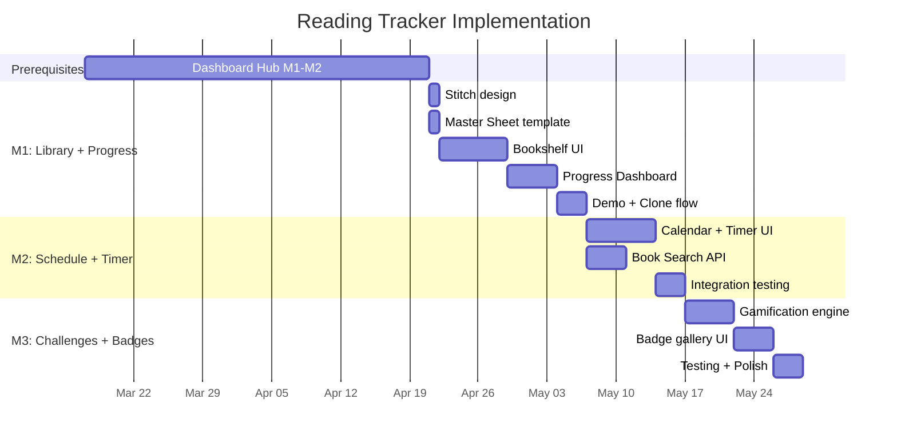

# Implementation Plan: Reading Tracker

> **Parent Project**: [Dashboard Hub](../dashboard-hub/implementation-plan.md)  
> **Prerequisites**: Dashboard Hub Milestones 1-2 must be complete (Foundation + Auth + Sheets Integration + Caching)

## Overview

This plan assumes Dashboard Hub's core infrastructure is already built (auth, Supabase, sheet_cache, Stripe). Reading Tracker is the **first premium product** ($9.99 one-time) deployed step-by-step across 3 milestones. Each milestone is independently shippable.

---

## Milestone 1: My Library + Progress Dashboard (P0)

**Goal**: A working bookshelf and progress dashboard — enough to sell the product.  
**Depends on**: Dashboard Hub M1-M2 complete  
**Estimated Effort**: 2-3 weeks

### Tasks

| # | Task | Effort | Notes |
|---|---|---|---|
| 1.1 | Design screens in Google Stitch (Bookshelf + Progress) | 3h | Use Stitch MCP → export Design DNA + React |
| 1.2 | Create Google Sheet Master Template (5 tabs: Library, Reading Log, Goals, Challenges, Badges) | 2h | Seed with sample data for demo mode |
| 1.3 | Add `reading-tracker` entry to Supabase `dashboards` table ($9.99, slug, SEO meta) | 1h | — |
| 1.4 | Build `/product/reading-tracker` SEO product page (ISR) | 4h | Storefront listing with screenshots/features |
| 1.5 | Build `/dashboard/reading-tracker/layout.tsx` — sidebar nav (Library, Progress, Schedule, Challenges) | 3h | shadcn/ui sidebar |
| 1.6 | Build `/dashboard/reading-tracker/library/page.tsx` — bookshelf grid | 8h | Server Component fetches cached Library tab |
| 1.7 | Build `bookshelf.tsx` — book cover grid with hover effects, tactile shelf styling | 6h | Client Component, CSS shelf effect |
| 1.8 | Build `book-modal.tsx` — add/edit book dialog (Title, Author, Cover URL, Genre, Status, Rating, Review) | 4h | shadcn/ui Dialog + Form |
| 1.9 | Build API route `/api/reading-tracker/add-book` — write-back to Library tab | 3h | Uses write-back pattern |
| 1.10 | Build `/dashboard/reading-tracker/progress/page.tsx` — stat cards + charts | 6h | Books Read, Streak, Hours Read |
| 1.11 | Build `goal-progress.tsx` — Recharts progress bars for annual/monthly goals | 4h | Reads Goals tab from cache |
| 1.12 | Build `activity-log.tsx` — recent sessions list | 3h | Reads Reading Log tab from cache |
| 1.13 | Build demo mode — show Library + Progress with pre-loaded sample data | 3h | For users who haven't connected a Sheet yet |
| 1.14 | Build one-click Sheet cloning flow (deep link) | 2h | `/spreadsheets/d/{ID}/copy` |
| 1.15 | Build Sheet connection UI — user pastes cloned Sheet URL | 2h | Stored in `sheet_connections` |
| 1.16 | End-to-end testing: purchase → clone Sheet → connect → see data | 4h | — |

**Deliverable**: Users can browse the store, buy the Reading Tracker ($9.99), clone the Master Sheet, connect it, add books, and see their progress dashboard.

**Definition of Done**:
- [ ] Bookshelf displays books from user's Google Sheet
- [ ] Add/edit book writes back to Google Sheet
- [ ] Progress dashboard shows stats and charts from cached data
- [ ] Demo mode works with sample data for non-connected users
- [ ] Purchase flow: Stripe → Webhook → instant access
- [ ] Product page is SEO-optimized (meta tags, structured data)

---

## Milestone 2: Reading Schedule + Timer + Vietnamese Book Search (P1)

**Goal**: Add engagement features — calendar, live timer, and book search.  
**Depends on**: M1 complete and stable  
**Estimated Effort**: 2-3 weeks

### Tasks

| # | Task | Effort | Notes |
|---|---|---|---|
| 2.1 | Design calendar + timer screens in Google Stitch | 2h | Extract Design DNA for consistency |
| 2.2 | Build `/dashboard/reading-tracker/schedule/page.tsx` — layout | 2h | — |
| 2.3 | Build `calendar.tsx` — monthly view with reading sessions | 6h | shadcn/ui Calendar + session markers |
| 2.4 | Build `timer.tsx` — live reading timer (client-side) | 6h | Start/Stop, book selector, page/notes input |
| 2.5 | Build API route `/api/reading-tracker/log-session` — write session to Reading Log tab | 3h | Write-back pattern |
| 2.6 | Build `schedule-modal.tsx` — plan future reading sessions | 3h | shadcn/ui Dialog + DatePicker |
| 2.7 | Build API route `/api/reading-tracker/book-search` — Vietnamese book search | 6h | Query Tiki.vn or Google Books API |
| 2.8 | Update `book-modal.tsx` — add search tab alongside manual entry | 3h | Search results auto-fill Title, Author, Cover URL |
| 2.9 | Timer edge cases: idle timeout, background tab behavior, session recovery | 4h | — |
| 2.10 | Integration testing: timer → log session → appears in calendar + progress stats | 3h | — |

**Deliverable**: Users can schedule reading, use a live timer to track sessions (auto-logged to their Sheet), and search Vietnamese books by title/author.

**Definition of Done**:
- [ ] Calendar shows past sessions and scheduled future sessions
- [ ] Timer logs sessions to Google Sheet on stop
- [ ] Book search returns results from Tiki.vn or Google Books
- [ ] Timer handles edge cases (idle, background tab)
- [ ] All new data synced to `sheet_cache`

---

## Milestone 3: Challenges & Badges (P2)

**Goal**: Add gamification for retention — challenges with progress tracking and a badge gallery.  
**Depends on**: M2 complete and stable  
**Estimated Effort**: 1-2 weeks

### Tasks

| # | Task | Effort | Notes |
|---|---|---|---|
| 3.1 | Design challenges + badges screens in Google Stitch | 2h | — |
| 3.2 | Build `/dashboard/reading-tracker/challenges/page.tsx` | 2h | Server Component |
| 3.3 | Build `challenge-list.tsx` — active challenge cards with progress bars | 4h | Reads Challenges tab from cache |
| 3.4 | Build `badge-gallery.tsx` — earned badges with unlock animations | 4h | CSS animations on new badges |
| 3.5 | Build gamification engine — calculate streaks, challenge progress, badge unlocks during sync | 6h | Runs in background sync cycle |
| 3.6 | Define initial badge set (10 badges) | 2h | See badge list below |
| 3.7 | Define initial challenge templates (5 challenges) | 1h | See challenge list below |
| 3.8 | Build API route `/api/reading-tracker/update-goals` — write Goals/Challenges changes | 2h | — |
| 3.9 | Seed Master Sheet with default challenges and empty Badges tab | 1h | — |
| 3.10 | End-to-end testing: read books → streak grows → challenges complete → badges unlock | 3h | — |

### Initial Badge Set

| Badge | Trigger | Emoji |
|---|---|---|
| First Book | Finish 1 book | 📖 |
| Bookworm | Finish 5 books | 📚 |
| 10 Books Club | Finish 10 books | 🏆 |
| Speed Reader | Finish a book in < 3 days | ⚡ |
| Night Owl | Log a session after 22:00 | 🦉 |
| Early Bird | Log a session before 07:00 | 🐦 |
| Marathon | Read for 3+ hours in one session | 🏃 |
| Streak 7 | 7-day reading streak | 🔥 |
| Streak 30 | 30-day reading streak | 💎 |
| Genre Explorer | Read books in 5+ different genres | 🌍 |

### Initial Challenge Templates

| Challenge | Type | Target |
|---|---|---|
| Monthly Reader | books | Read 3 books this month |
| Weekly Hours | hours | Read 10 hours this week |
| Streak Builder | streak | Maintain a 7-day streak |
| Genre Sampler | books | Read 2 books in a new genre |
| Weekend Warrior | hours | Read 5 hours on weekends |

**Deliverable**: Users see active challenges with progress, earn badges for milestones, and feel motivated to keep reading.

**Definition of Done**:
- [ ] Gamification engine correctly calculates streaks and badge unlocks
- [ ] Challenge progress updates during background sync
- [ ] Badge gallery shows earned badges with dates
- [ ] New badge unlock shows animation/notification
- [ ] All gamification state written back to user's Google Sheet

---

## Timeline Summary

> [!NOTE]
> Each milestone is independently shippable. M1 alone is enough to launch the product on the storefront. M2 and M3 add engagement/retention features.

> [!IMPORTANT]
> **Reading Tracker depends on Dashboard Hub M1-M2.** Auth, Supabase schema, sheet_cache, Stripe Webhooks, and the storefront must be working before any Reading Tracker development begins.
